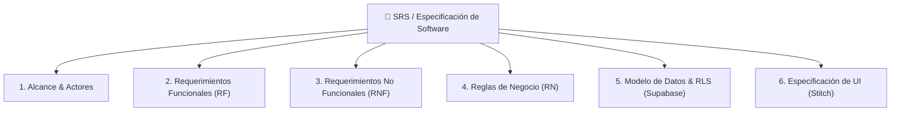
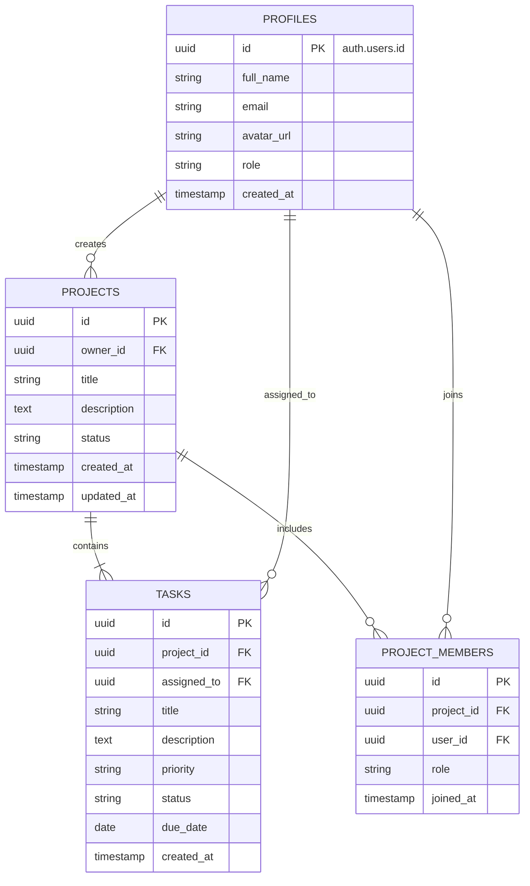

# 📋 Fase 2: Ingeniería de Requisitos y Arquitectura
## Estándares de SRS, Criterios de Aceptación Gherkin y Modelado Técnico

Para que una herramienta de IA generativa como **Google AI Studio** o **Google Stitch** construya una aplicación robusta y sin alucinaciones, la documentación de requisitos debe ser **precisa, estructurada y sin ambigüedades**.

Este documento define la estructura estándar que la Gema de Gemini ayuda a construir.

---

## 🏛️ Estructura Estándar del Documento de Requisitos (SRS / FRD)



---

## 📌 1. Definición de Requerimientos Funcionales (RF) con Gherkin

Cada funcionalidad del sistema debe estar identificada con un código único (`RF-01`, `RF-02`...), una descripción concisa, su prioridad (MoSCoW: Must, Should, Could, Won't) y sus **Criterios de Aceptación en formato BDD / Gherkin**.

### Ejemplo de Plantilla de Requerimiento:

| Campo | Detalle |
| :--- | :--- |
| **ID** | `RF-01` |
| **Nombre** | Autenticación y Registro de Usuarios con Supabase Auth |
| **Actor** | Usuario Nuevo / Usuario Registrado |
| **Prioridad** | **Must Have (Crítico)** |
| **Descripción** | El sistema debe permitir el registro e inicio de sesión mediante correo y contraseña o proveedores OAuth (Google), validando credenciales y creando automáticamente el perfil de usuario en la base de datos. |

#### Criterios de Aceptación (Gherkin):
```gherkin
Escenario: Registro exitoso de un nuevo usuario
  DADO que un visitante no autenticado se encuentra en la pantalla de registro
  CUANDO ingresa un correo electrónico válido, una contraseña segura (> 8 caracteres) y su nombre completo
  Y hace clic en "Crear Cuenta"
  ENTONCES el sistema registra el usuario en Supabase Auth
  Y crea una fila en la tabla pública 'profiles' con su user_id
  Y redirige al usuario al Dashboard principal mostrando un mensaje de bienvenida.

Escenario: Intento de inicio de sesión con credenciales inválidas
  DADO que el usuario está en la pantalla de Login
  CUANDO ingresa una contraseña incorrecta
  ENTONCES el sistema muestra un mensaje de error accesible "Credenciales incorrectas"
  Y mantiene los datos del formulario sin recargar la página.
```

---

## ⚡ 2. Requerimientos No Funcionales (RNF)

Los RNF establecen los estándares de calidad que Google AI Studio debe implementar en el código generado:

| ID | Categoría | Requerimiento Técnico |
| :--- | :--- | :--- |
| **RNF-01** | **Seguridad** | Todas las consultas a la base de datos deben ejecutarse bajo **Row Level Security (RLS)** en PostgreSQL/Supabase, garantizando que un usuario solo pueda leer o modificar sus propios registros. |
| **RNF-02** | **Rendimiento** | La aplicación debe ser una SPA (Single Page Application) reactiva con tiempos de respuesta de UI inferiores a **200 ms** para transiciones y < **1s** para llamadas a API. |
| **RNF-03** | **Responsividad** | El diseño generado en Stitch y AI Studio debe ser completamente adaptable (Mobile-First, Tablet, Desktop) usando rejillas y utilidades de Tailwind CSS. |
| **RNF-04** | **Accesibilidad** | Cumplimiento con estándares WCAG 2.1 AA (contraste de color, soporte para lectores de pantalla con etiquetas `aria-`, navegación por teclado). |
| **RNF-05** | **Resiliencia** | Implementación de estados de carga (*Skeleton Loaders*), manejo global de excepciones y notificaciones toast para retroalimentación al usuario. |

---

## ⚖️ 3. Reglas de Negocio (RN)

Las reglas de negocio restringen la lógica del software y previenen estados inconsistentes:

* **RN-01 (Unicidad de correo):** No pueden existir dos cuentas con la misma dirección de correo electrónico en el sistema.
* **RN-02 (Soft Delete / Integridad):** Los registros principales (ej. Proyectos, Clientes) no se eliminan físicamente de la base de datos si tienen registros dependientes; se utiliza una bandera `deleted_at TIMESTAMP` o borrado en cascada controlado.
* **RN-03 (Roles y Permisos):** Un usuario con rol `member` solo puede visualizar y editar sus tareas asignadas; solo los usuarios con rol `admin` o `owner` pueden gestionar la facturación o invitar nuevos miembros.

---

## 🗄️ 4. Modelo Entidad-Relación (Mermaid ERD)

El diagrama ERD generado por la Gema permite al aprendiz y a AI Studio comprender las relaciones entre entidades antes de generar el código SQL:



---

## 🚀 Conexión con las Siguientes Fases

Con esta documentación generada por la Gema:
1. Tomamos la lista de vistas y componentes UI y los llevamos a **[Fase 3: Google Stitch](./03_PROTOTIPADO_CON_GOOGLE_STITCH.md)** para generar los prototipos visuales.
2. Tomamos el modelo relacional y las reglas de seguridad para crear la base de datos en **[Fase 5: Supabase](./05_SUPABASE_DATABASE_Y_BACKEND.md)**.
3. Entregamos todo el paquete a **[Fase 4: Google AI Studio](./04_CONSTRUCCION_APP_AISTUDIO_Y_SUPABASE.md)** para generar la aplicación web interactiva.
