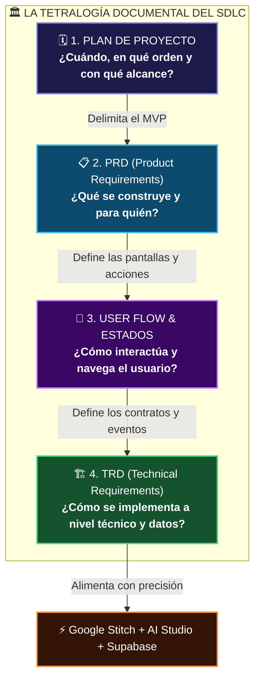
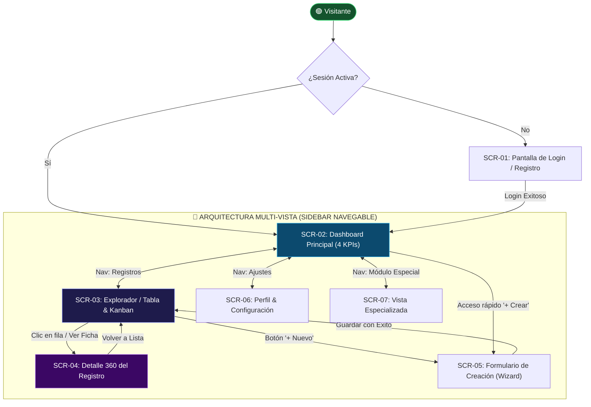
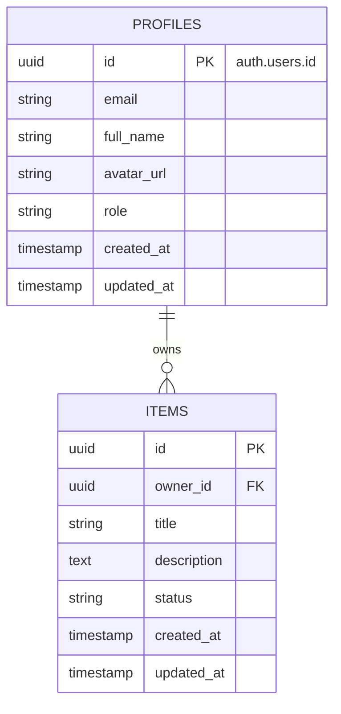

# 📋 Fase 2: Ingeniería de Requisitos y Arquitectura
## La Tetralogía Documental Canónica: Plan, PRD, User Flow y TRD

Para que una herramienta de IA generativa como **Google AI Studio**, **Google Stitch** o **Cursor** construya una aplicación robusta, segura y sin alucinaciones, la documentación de entrada no puede ser una simple lista desordenada de ideas.

En la ingeniería de software profesional, la especificación se estructura en **cuatro documentos canónicos e interconectados**, donde cada uno cumple un propósito vital y resuelve una pregunta fundamental:



---

## 🧭 ¿Por qué el aprendiz necesita CADA UNO de estos 4 documentos?

| Documento | Pregunta Central | Audiencia Principal | ¿Qué pasa si NO lo construyes con la IA? |
| :--- | :--- | :--- | :--- |
| **1. PLAN** | *¿Cuándo, qué entra en el MVP y en qué orden?* | Product Managers, Stakeholders, Desarrollador | La IA intenta codificar todo el sistema a la vez, se satura de tokens (*context drift*) y genera un código a medias e inestable. |
| **2. PRD** | *¿Qué problema resolvemos y cuáles son las reglas de negocio?* | Usuarios, Negocio, Diseñadores UX | La IA "alucina" funcionalidades irrelevantes, olvida casos límite (*edge cases*) y distorsiona el valor real del producto. |
| **3. USER FLOW** | *¿Cómo recorre el usuario la aplicación pantalla a pantalla?* | Diseñadores UI/UX, Frontend Developers | Las pantallas generadas en Google Stitch quedan huérfanas, sin botones de navegación, sin estados de carga (*loading/empty*) ni manejo de errores. |
| **4. TRD** | *¿Cuál es el modelo de base de datos, seguridad RLS y contratos?* | Backend Developers, Arquitectos, Supabase | Se generan bases de datos inseguras sin RLS, tipos inconsistentes en TypeScript y llamadas a API rotas. |

> 💡 **Del Papel a la Acción: ¿A dónde van los entregables derivados de esta Tetralogía?**  
> Una vez completados los 4 documentos de especificación (`01` al `04`), se generan los **3 entregables ejecutables** que van directamente a las plataformas de desarrollo:  
> 1. **`05_ESQUEMA_SUPABASE_COMPLETO.sql`** ➔ Se ejecuta en el **SQL Editor de Supabase** (`supabase.com/dashboard`) para crear las tablas y RLS.  
> 2. **`06_PROMPTS_GOOGLE_STITCH.md`** ➔ Se copia prompt por prompt en **Google Stitch** (`stitch.withgoogle.com`) para diseñar las pantallas.  
> 3. **`07_PROMPT_MAESTRO_AISTUDIO.md`** ➔ Se inyectan las claves de Supabase y se pega en **Google AI Studio** (`aistudio.google.com/apps`) para compilar la aplicación completa.

---

## 🗓️ 1. Documento 1: Plan de Proyecto (`01_PLAN_PROYECTO.md`)

El **Plan de Proyecto** es la brújula operativa. Establece los límites estrictos del MVP (*Minimum Viable Product*), las dependencias técnicas y la secuencia de construcción para no saturar a los modelos de lenguaje.

### Plantilla Estándar del Plan:
```markdown
# 🗓️ Plan de Ejecución del Proyecto: [NOMBRE DE LA APP]

## 1. Visión y Objetivo del MVP
- **Propósito:** [Descripción en una oración del valor que entrega el MVP]
- **Plazo estimado:** [Tiempo de desarrollo / Sprints]
- **Criterio de Éxito del MVP:** [Qué métrica o flujo define que la primera versión está lista]

## 2. Límites del Alcance (Scope Boundaries)
- **IN-SCOPE (Dentro del MVP):**
  * Autenticación segura de usuarios (Email / Contraseña vía Supabase Auth).
  * CRUD completo de la entidad principal ([Nombre de la entidad]).
  * Dashboard con 4 métricas calculadas en tiempo real.
  * Diseño responsive accesible (Mobile y Desktop).
- **OUT-OF-SCOPE (Fuera del MVP - Para Versión 2.0):**
  * Pagos con Stripe o pasarelas internacionales.
  * Notificaciones push móviles nativas.
  * Inteligencia artificial predictiva avanzada.

## 3. Matriz de Dependencias Críticas
1. **Paso 1 (Fundación de Datos):** DDL de Supabase y Políticas RLS deben estar ejecutadas antes de escribir frontend.
2. **Paso 2 (Auth & Perfiles):** Flujo de sesión de usuario debe funcionar antes de permitir crear registros vinculados a `auth.uid()`.
3. **Paso 3 (Prototipos UI):** Wireframes en Google Stitch aprobados antes de generar código en AI Studio.
4. **Paso 4 (Integración Fullstack):** Conexión del cliente Supabase con la interfaz reactiva en AI Studio.

## 4. Cronograma de Sprints de Construcción
- **Sprint 1 (Día 1):** Documentación completa (Plan, PRD, User Flow, TRD).
- **Sprint 2 (Día 1-2):** Base de Datos en Supabase (Tablas, RLS, Triggers) y Prototipado en Google Stitch.
- **Sprint 3 (Día 2-3):** Ensamblaje en Google AI Studio y pruebas E2E con Playwright.
```

---

## 📋 2. Documento 2: PRD (`02_PRD_PRODUCTO.md`)

El **PRD (Product Requirements Document)** define el comportamiento funcional de la solución desde la perspectiva del usuario y del negocio, utilizando el estándar **BDD / Gherkin** para eliminar cualquier ambigüedad.

### Plantilla Estándar del PRD:
```markdown
# 📋 Documento de Requisitos de Producto (PRD)
## Proyecto: [NOMBRE DE LA APLICACIÓN]

### 1. Perfiles de Usuario (User Personas)
- **Usuario Principal ([Rol]):** Persona que necesita [objetivo principal] de forma rápida y sin fricción técnica.
- **Administrador ([Rol]):** Persona responsable de monitorear métricas globales, gestionar usuarios y auditar el sistema.

### 2. Requerimientos Funcionales (RF) con Criterios Gherkin (BDD)

#### RF-01: Autenticación y Registro de Usuarios
- **Prioridad MoSCoW:** Must Have (Crítico)
- **Actor:** Visitante / Usuario Registrado
- **Descripción:** El sistema debe permitir crear cuentas y autenticarse con correo y contraseña.

```gherkin
Escenario: Registro exitoso de un nuevo usuario
  DADO que un visitante no autenticado se encuentra en la pantalla de registro
  CUANDO ingresa un correo electrónico válido, una contraseña segura (> 8 caracteres) y su nombre completo
  Y hace clic en "Crear Cuenta"
  ENTONCES el sistema registra el usuario en Supabase Auth
  Y crea una fila en la tabla pública 'profiles' con su user_id
  Y redirige al usuario al Dashboard principal mostrando un mensaje de bienvenida.

Escenario: Intento de inicio de sesión con credenciales inválidas
  DADO que el usuario está en la pantalla de Login
  CUANDO ingresa una contraseña incorrecta
  ENTONCES el sistema muestra un mensaje de error accesible "Credenciales incorrectas"
  Y mantiene los datos del formulario sin recargar la página.
```

#### RF-02: Gestión de Entidad Principal (CRUD)
- **Prioridad MoSCoW:** Must Have
- **Actor:** Usuario Autenticado
- **Descripción:** Creación, lectura con filtros, edición y borrado lógico de registros.

```gherkin
Escenario: Creación de un registro con campos obligatorios completos
  DADO que el usuario tiene sesión activa en el Dashboard
  CUANDO hace clic en "+ Nuevo Registro", completa el título y la descripción
  Y hace clic en "Guardar"
  ENTONCES el sistema persiste el registro en Supabase asociado a su 'owner_id'
  Y actualiza la tabla reactivamente con una notificación toast "✓ Registro creado exitosamente".
```

### 3. Reglas de Negocio (RN)
- **RN-01 (Unicidad):** No pueden existir dos cuentas con la misma dirección de correo electrónico.
- **RN-02 (Aislamiento de Datos):** Un usuario estándar bajo ninguna circunstancia puede ver o modificar los registros de otro usuario.
- **RN-03 (Borrado Seguro):** Los registros principales utilizan soft-delete o eliminación en cascada controlada.
```

---

## 🔀 3. Documento 3: User Flow, Catálogo de Pantallas e Interacción (`03_USER_FLOWS_UX.md`)

El **User Flow** es el mapa visual y contractual de navegación que conecta la intención del usuario con las pantallas de la aplicación. Es la entrada directa para **Google Stitch** y herramientas de prototipado.

> **💡 Regla Crítica contra el "Efecto Monovista":**  
> Si el User Flow solo describe el Dashboard, Google Stitch y AI Studio únicamente generarán una sola pantalla. Para construir una aplicación real y completa, el aprendiz debe definir obligatoriamente un **Catálogo de Pantallas (Screen Inventory)** con un mínimo de 5 a 8 vistas independientes antes de diseñar.

### 📱 Catálogo Canónico de Pantallas (Screen Inventory):
Toda aplicación web orientada a producción debe contar con al menos estas vistas desacopladas:
1. **SCR-01: Auth & Onboarding:** Vista dividida (*split-screen*) con formulario de Login / Registro y panel de presentación.
2. **SCR-02: Dashboard Principal:** Vista ejecutiva con 4 KPIs calculados en vivo, gráficos temporales y accesos rápidos.
3. **SCR-03: Explorador / Lista de Datos:** Tabla enriquecida con búsqueda en vivo, filtros facetados por estado y selector Lista/Kanban.
4. **SCR-04: Detalle 360 del Registro:** Ficha técnica profunda con sub-elementos relacionados, timeline de auditoría y acciones de ciclo de vida.
5. **SCR-05: Formulario de Creación (Wizard):** Editor guiado por pasos para registrar nuevos datos sin abrumar al usuario.
6. **SCR-06: Configuración & Perfil:** Administración de cuenta de usuario, preferencias de tema visual y seguridad.
7. **SCR-07: Vista Especializada:** Módulo del dominio específico (ej. Calendario, Telemedicina, Analítica avanzada o Reportes).



### Matriz de los 4 Estados de Interfaz (Obligatoria para CADA pantalla):
Para que la interfaz generada por Stitch y AI Studio sea profesional, el User Flow debe especificar los 4 estados para cada vista del catálogo:

1. **Estado Vacío (Empty State):** ¿Qué ve el usuario cuando aún no ha creado ningún registro o la búsqueda no arroja resultados? (Ej: Ilustración amigable + Botón CTA "+ Crear mi primer registro").
2. **Estado de Carga (Loading / Skeleton State):** ¿Cómo se visualiza la pantalla mientras los datos vienen de Supabase? (Ej: Placeholders pulsantes con gradiente Tailwind, sin bloquear la UI ni usar spinners toscos).
3. **Estado de Éxito (Success Feedback):** ¿Cómo sabe el usuario que su acción funcionó? (Ej: Notificación toast accesible en esquina inferior derecha + actualización reactiva inmediata de la tabla o dashboard).
4. **Estado de Error (Error / Edge Case):** ¿Qué ocurre si se pierde la conexión a internet o falla la base de datos? (Ej: Banner con botón "Reintentar" y mensaje claro sin jerga técnica).


---

## 🏗️ 4. Documento 4: TRD (`04_TRD_ARQUITECTURA_TECNICA.md`)

El **TRD (Technical Requirements Document)** es el plano de ingeniería. Define el stack con versiones exactas, el diagrama entidad-relación (ERD), el script SQL para Supabase con RLS y los contratos de datos en TypeScript.



### Plantilla Estándar del TRD:
```markdown
# 🏗️ Documento de Requisitos Técnicos (TRD)
## Proyecto: [NOMBRE DE LA APLICACIÓN]

### 1. Stack Tecnológico Estandarizado
- **Frontend SPA:** React 18/19 + Vite + TypeScript.
- **Estilos & UI:** Tailwind CSS (Dark Mode por defecto) + Lucide Icons + Radix UI Primitives.
- **Backend & Database:** Supabase PostgreSQL 15+ con Row Level Security (RLS) habilitado.
- **Autenticación:** Supabase Auth (JWT + PKCE flow).
- **Testing:** Playwright (E2E) + Vitest (Unitario).

### 2. Script DDL y Políticas de Seguridad RLS para Supabase
```sql
-- 1. Habilitar extensión UUID
CREATE EXTENSION IF NOT EXISTS "pgcrypto";

-- 2. Tabla de perfiles vinculada a auth.users
CREATE TABLE IF NOT EXISTS public.profiles (
    id UUID PRIMARY KEY REFERENCES auth.users(id) ON DELETE CASCADE,
    email TEXT UNIQUE NOT NULL,
    full_name TEXT,
    avatar_url TEXT,
    role TEXT DEFAULT 'user' CHECK (role IN ('admin', 'manager', 'user')),
    created_at TIMESTAMPTZ DEFAULT timezone('utc'::text, now()) NOT NULL,
    updated_at TIMESTAMPTZ DEFAULT timezone('utc'::text, now()) NOT NULL
);

-- 3. Tabla principal del dominio
CREATE TABLE IF NOT EXISTS public.[tabla_principal] (
    id UUID PRIMARY KEY DEFAULT gen_random_uuid(),
    owner_id UUID NOT NULL REFERENCES public.profiles(id) ON DELETE CASCADE,
    title TEXT NOT NULL,
    description TEXT,
    status TEXT DEFAULT 'active' CHECK (status IN ('draft', 'active', 'completed', 'archived')),
    created_at TIMESTAMPTZ DEFAULT timezone('utc'::text, now()) NOT NULL,
    updated_at TIMESTAMPTZ DEFAULT timezone('utc'::text, now()) NOT NULL
);

-- 4. Habilitar Row Level Security (RLS)
ALTER TABLE public.profiles ENABLE ROW LEVEL SECURITY;
ALTER TABLE public.[tabla_principal] ENABLE ROW LEVEL SECURITY;

-- 5. Políticas RLS estrictas vinculadas a auth.uid()
CREATE POLICY "Lectura solo de registros propios"
    ON public.[tabla_principal] FOR SELECT TO authenticated
    USING (auth.uid() = owner_id);

CREATE POLICY "Inserción vinculada al usuario autenticado"
    ON public.[tabla_principal] FOR INSERT TO authenticated
    WITH CHECK (auth.uid() = owner_id);

CREATE POLICY "Actualización solo de registros propios"
    ON public.[tabla_principal] FOR UPDATE TO authenticated
    USING (auth.uid() = owner_id);

CREATE POLICY "Eliminación solo de registros propios"
    ON public.[tabla_principal] FOR DELETE TO authenticated
    USING (auth.uid() = owner_id);
```

### 3. Requerimientos No Funcionales (RNF)
- **RNF-01 (Seguridad):** Cero llamadas con `service_role` en el cliente. RLS en el 100% de tablas.
- **RNF-02 (Rendimiento):** Render inicial < 500ms, transiciones de UI < 100ms, consultas SQL indexadas en llaves foráneas.
- **RNF-03 (Accesibilidad):** Cumplimiento WCAG 2.1 AA con contraste >= 4.5:1 y navegación completa por teclado.
```

---

## 🚀 Cómo se Conectan estos 4 Documentos con las Siguientes Fases

1. **`01_PLAN_PROYECTO.md`** se usa como checklist para verificar que no nos desviemos del alcance inicial.
2. **`02_PRD_PRODUCTO.md`** y **`03_USER_FLOWS_UX.md`** se entregan a **[Fase 3: Google Stitch](./03_PROTOTIPADO_CON_GOOGLE_STITCH.md)** para generar las vistas visuales exactas con todos sus estados.
3. **`04_TRD_ARQUITECTURA_TECNICA.md`** se ejecuta directamente en el SQL Editor de **[Fase 5: Supabase](./05_SUPABASE_DATABASE_Y_BACKEND.md)** para crear la base de datos real y protegida.
4. **Los 4 documentos combinados** se entregan a la Gema 4 y a **[Fase 4: Google AI Studio](./04_CONSTRUCCION_APP_AISTUDIO_Y_SUPABASE.md)** para compilar la aplicación fullstack en un solo intento exitoso.
