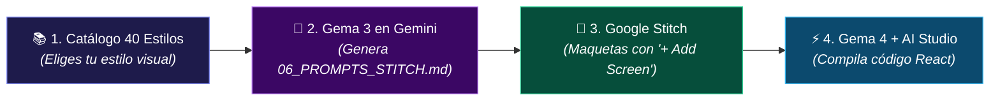
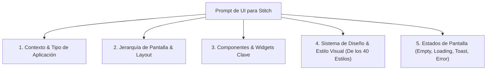

# 🎨 Fase 3: Prototipado y Diseño de UI con Google Stitch
## Cómo transformar requerimientos en interfaces visuales profesionales con `stitch.withgoogle.com`

**Google Stitch** ([stitch.withgoogle.com](https://stitch.withgoogle.com/?pli=1)) es la herramienta de diseño de interfaces de usuario impulsada por IA de Google. Permite generar pantallas, wireframes, sistemas de diseño y componentes frontend visualmente atractivos a partir de descripciones en lenguaje natural.

En este paso, tomamos las especificaciones generadas por la **Gema de Gemini** (PRD y User Flow) y las convertimos en **prompts de diseño para Stitch**, dotando a nuestra aplicación de una identidad estética rica, consistente y moderna antes de pasar al código en **Google AI Studio**.

> 📌 **DOCUMENTO EXACTO PARA ESTA FASE:** Únicamente **`06_PROMPTS_GOOGLE_STITCH.md`**  
> * **¿Cómo se usa en Stitch?** Google Stitch **NO tiene un botón para subir archivos**. La interacción es **copiar y pegar texto**. Abres `06_PROMPTS_GOOGLE_STITCH.md`, copias el **`PROMPT 1`** (Auth) y lo pegas. Luego haces clic en el botón **`+ Add Screen`**, copias el **`PROMPT 2`** (Dashboard) y lo pegas. Repites `+ Add Screen` hasta maquetar toda la suite.  
> * ❌ **Qué NUNCA debes subir a Stitch:** No subas scripts SQL (`.sql`), no subas el TRD técnico ni el PRD completo. Stitch solo comprende prompts visuales de pantalla individual.

---

## 🔗 El Cable a Tierra: Cómo se Conecta la Gema 3 con el Catálogo de 40 Estilos y Google Stitch

Para que no te pierdas entre herramientas, comprende la secuencia de relevos:



### 👣 Los 4 Momentos Exactos:
1. **Momento 1 (Selección Visual):** Revisa el catálogo de 40 estilos frontend (abajo en este documento o en el Módulo 5 de la guía web). Escoge el estilo que mejor se adapte a tu dominio (ej. `#13 Bento Grid` para SaaS, `#2 Glassmorphism` para Fintech, `#6 Material Design` para Salud).
2. **Momento 2 (Generación con Gema 3):** Abre tu **Gema 3** en Gemini. Sube a su sección *Conocimientos*:
   * `01_PLAN_PROYECTO.md`
   * `02_PRD_PRODUCTO.md`
   * `03_USER_FLOWS_UX.md`  
   Y envíale este mensaje exacto:
   > *"Hola Gema 3. He cargado mis documentos. Del Catálogo de 40 Estilos Frontend he seleccionado el **Estilo #[N]: [Nombre del Estilo]**. Por favor genera el archivo unificado `06_PROMPTS_GOOGLE_STITCH.md` con el Token de Identidad Visual compartido y la Suite Completa de Prompts individuales (PROMPT 1 al PROMPT 7) listos para copiar y pegar en Stitch con '+ Add Screen'."*
3. **Momento 3 (Maquetación en Google Stitch):** Guarda la respuesta de la Gema 3 como `06_PROMPTS_GOOGLE_STITCH.md`. Entra a [stitch.withgoogle.com](https://stitch.withgoogle.com), crea un nuevo proyecto, pega el `PROMPT 1`, haz clic en **`+ Add Screen`**, pega el `PROMPT 2` y repite con todas las pantallas.
4. **Momento 4 (Hacia AI Studio):** Sube el archivo `06_PROMPTS_GOOGLE_STITCH.md` a los *Conocimientos* de la **Gema 4** para que ensamble el código fuente en React respetando esta misma estética.

---

## 📐 Anatomía de un Prompt de UI para Google Stitch

Un prompt profesional para Stitch debe contener 5 dimensiones clave para evitar interfaces genéricas, planas o monótonas:



---

## 🛑 ¿Por qué Google Stitch generaba solo una vista? (El "Efecto Monovista" y su Solución)

Muchos aprendices y desarrolladores se encuentran con una sorpresa frustrante al usar **Google Stitch**:  
> *"Pegué mi prompt maestro en Stitch y solo me diseñó el Dashboard. ¿Dónde están la pantalla de login, la vista de detalles, el formulario y la configuración?"*

### La Causa Técnica:
**Google Stitch es un generador de interfaces orientado a pantallas individuales.** Cada prompt que envías a Stitch le ordena maquetar **una sola vista a la vez**. Si le entregas un prompt que describe 10 cosas distintas, el modelo priorizará la pantalla principal (el Dashboard) e ignorará el resto de vistas.

### La Solución: El Protocolo de Prototipado Multi-Pantalla
Para construir el prototipo completo de tu aplicación en Google Stitch, no debes enviar un prompt único, sino ejecutar el siguiente **flujo secuencial de pantallas**:

```mermaid
flowchart LR
    P1["Prompt 1: Auth & Onboarding"] --> S1["📱 Pantalla 1: Auth"]
    S1 --> BTN1["Clic '+ Add Screen'"]
    BTN1 --> P2["Prompt 2: Dashboard"]
    P2 --> S2["📱 Pantalla 2: Dashboard"]
    S2 --> BTN2["Clic '+ Add Screen'"]
    BTN2 --> P3["Prompt 3: Explorador"]
    P3 --> S3["📱 Pantalla 3: Lista / Kanban"]
    S3 --> BTN3["Clic '+ Add Screen'"]
    BTN3 --> P4["Prompt 4: Detalle 360"]
    P4 --> S4["📱 Pantalla 4: Ficha Detalle"]
    S4 --> BTN4["Clic '+ Add Screen'"]
    BTN4 --> P5["Prompt 5: Wizard / Form"]
    P5 --> S5["📱 Pantalla 5: Creación"]
    S5 --> BTN5["Clic '+ Add Screen'"]
    BTN5 --> P6["Prompt 6: Configuración"]
    P6 --> S6["📱 Pantalla 6: Ajustes / Perfil"]
```



### 📋 Paso a Paso para el Aprendiz en Google Stitch:
1. **Paso 1 (Crear Proyecto):** Entra a [stitch.withgoogle.com](https://stitch.withgoogle.com) y haz clic en **"New Project"**.
2. **Paso 2 (Generar Pantalla 1):** Pega el **Prompt 1** (Pantalla de Autenticación & Onboarding). Stitch generará la vista de login.
3. **Paso 3 (Agregar Nueva Pantalla):** En la barra superior o en el explorador lateral de pantallas de Stitch, haz clic en el botón **"+ Add Screen"** (o **"New Screen"**).
4. **Paso 4 (Generar Pantalla 2):** Pega el **Prompt 2** (Dashboard Principal). Stitch añadirá el Dashboard como una nueva pantalla independiente dentro del mismo proyecto.
5. **Paso 5 (Repetir el Flujo):** Haz clic en **"+ Add Screen"** y pega sucesivamente el **Prompt 3** (Explorador / Lista), **Prompt 4** (Detalle 360), **Prompt 5** (Formulario de Creación) y **Prompt 6** (Configuración).
6. **Paso 6 (Consistencia Visual Automática):** Al utilizar en todos los prompts el mismo estilo del catálogo de 40 estilos y los mismos colores, Stitch mantendrá la coherencia visual, el mismo Sidebar y los mismos componentes en todo el proyecto.

---

## 🪄 Estructura Maestra de cada Prompt en la Suite de Stitch

Utiliza esta estructura para CADA una de las pantallas individuales de tu suite:

```markdown
[ROL Y OBJETIVO DE LA PANTALLA]: Diseña la pantalla [Nombre de la Pantalla] para [Nombre de la App], enfocada en [Objetivo Específico de esta Vista].

[LAYOUT Y ESTRUCTURA]:
- Si es interna (Dashboard, Lista, Detalle, Form, Config): Sidebar lateral izquierdo persistente con ítem '[Nombre de la Pantalla]' en estado ACTIVO (resaltado).
- Header superior con breadcrumbs ('Inicio / [Sección] / [Vista]'), buscador global 'Ctrl+K' y perfil de usuario.
- Contenedor principal estructurado según la función de esta vista específica.

[COMPONENTES VISUALES PROPIOS DE ESTA VISTA]:
- [Listado detallado de widgets, tarjetas, tablas, formularios o gráficos de esta pantalla].

[SISTEMA DE DISEÑO Y ESTILO (OBLIGATORIO REPETIR EN TODAS LAS PANTALLAS)]:
- Estilo: [Elegir entre los 40 Estilos Visuales del Catálogo Maestro, ej. Bento Grid, Glassmorphism, etc.].
- Paleta de colores: [Fondo, tarjetas, acentos primarios, texto].
- Tipografía y bordes: [Fuentes, radios de curvatura, elevación].

[LOS 4 ESTADOS DE INTERFAZ DE ESTA PANTALLA]:
- Empty State: [Qué se muestra si no hay datos].
- Loading State: [Esqueleto animado específico de esta pantalla].
- Success Feedback: [Toast o feedback al completar acción].
- Error State: [Banner o alerta de error].
```

---

# 📚 Catálogo Maestro: 40 Estilos de Diseño Frontend para Google Stitch

Para dotar al aprendiz de la máxima variedad visual, presentamos el catálogo completo de **40 estilos de diseño de interfaz**, organizados en dos bloques de 20 estilos: **Estilos Principales/Fundacionales** y **Estilos Adicionales/Emergentes**. Cada estilo incluye su definición, características visuales, caso de uso ideal y el **snippet exacto** para incrustar en el prompt de Stitch.

---

## 🏛️ Bloque 1: 20 Estilos Principales de Diseño Frontend

### 1. Minimalismo (Minimalism)
* **Definición:** Diseño limpio, sobrio y esencial, enfocado en el contenido con generosos espacios en blanco (espacio negativo), tipografía refinada y ausencia de ruido visual.
* **Atributos:** Mucho espacio en blanco (`padding/gap` generoso), paleta neutra (blanco, gris suave `#f8fafc`, negro `#0f172a`), líneas finas de 1px y tipografía grotesca limpia.
* **Ideal para:** Portafolios de diseño, aplicaciones de notas, herramientas de lectura y plataformas de lujo o alta gama.
* **Snippet para Stitch:**
  ```text
  ESTILO: Minimalista extremo, máximo espacio negativo, paleta monocromática blanco/gris pizarra (#f8fafc, #0f172a), líneas sutiles de 1px (#e2e8f0), tipografía Inter muy ligera, cero sombras pesadas.
  ```

### 2. Glasmorfismo (Glassmorphism)
* **Definición:** Efectos de vidrio esmerilado translúcido con desenfoque de fondo (`backdrop-blur`), bordes brillantes semi-transparentes y superposición de capas sobre fondos o gradientes coloridos.
* **Atributos:** `backdrop-blur-md` o `lg`, fondos `rgba(255,255,255,0.08)` o `rgba(15,23,42,0.65)`, bordes `1px solid rgba(255,255,255,0.15)`, reflejos de luz y sombras difusas.
* **Ideal para:** Dashboards de analítica moderna, apps fintech premium, reproductores de música y paneles de control Web3.
* **Snippet para Stitch:**
  ```text
  ESTILO: Glassmorphism refinado, tarjetas con fondo translúcido semi-esmerilado (backdrop-blur-xl con rgba(30,41,59,0.7)), bordes sutiles iluminados (border-white/10), acentos de luz degradados en las esquinas.
  ```

### 3. Brutalismo (Brutalism)
* **Definición:** Estilo crudo, rebelde y directo, inspirado en la arquitectura brutalista. Utiliza tipografías gigantes, colores saturados de alto impacto, asimetría y bordes marcados sin suavizar.
* **Atributos:** Colores primarios puros (amarillo chillón `#facc15`, negro puro `#000000`, rojo eléctrico `#ef4444`), tipografía grotesca pesada en mayúsculas, cero curvas (`rounded-none`) y rejillas rotas.
* **Ideal para:** Marcas de moda urbana, festivales culturales, revistas de contracultura, agencias de diseño experimental.
* **Snippet para Stitch:**
  ```text
  ESTILO: Brutalismo digital puro, tipografías gigantescas y pesadas (Black/Bold), colores de alto contraste (amarillo ácido, negro profundo, blanco), bordes angulares sin redondeo, micro-bordes negros gruesos.
  ```

### 4. Neomorfismo (Neumorphism)
* **Definición:** Elementos extruidos suavemente desde el propio fondo mediante doble sombra suave (una sombra oscura y una luz clara opuesta), simulando botones y superficies moldeadas en plástico suave.
* **Atributos:** Mismo color para fondo y tarjetas (ej. `#e0e5ec` en claro o `#24272c` en oscuro), sombras `box-shadow` suaves dobles (relieve positivo y bajorrelieve `inset`), esquinas muy redondeadas.
* **Ideal para:** Interfaces de domótica / IoT, controles de audio, mandos a distancia virtuales y calculadoras especializadas.
* **Snippet para Stitch:**
  ```text
  ESTILO: Neumorphism suave, elementos extruidos del fondo mediante doble sombra suave (box-shadow dual con luz superior y sombra profunda), botones táctiles con estados presionados (inset shadow), bordes ultra redondeados (rounded-2xl).
  ```

### 5. Skeuomorfismo (Skeuomorphism)
* **Definición:** Emulación visual realista de texturas, materiales, reflejos e iluminación del mundo real (cuero cosido, metal cepillado, diales de volumen, lentes de cámara y papel).
* **Atributos:** Gradientes con brillo metálico, texturas realistas, biseles pronunciados, sombras proyectadas con ángulo de luz natural y detalles táctiles realistas.
* **Ideal para:** Aplicaciones de audio/música profesional (sintetizadores, mezcladores), herramientas fotográficas y editores de instrumentos.
* **Snippet para Stitch:**
  ```text
  ESTILO: Skeuomorfismo moderno, detalles táctiles realistas inspirados en hardware físico (perillas giratorias, texturas metálicas cepilladas, reflejos de luz direccional, bordes biselados con profundidad 3D).
  ```

### 6. Material Design
* **Definición:** El sistema de diseño emblemático de Google basado en el concepto de "papel digital inteligente", capas físicas que se elevan en el eje Z mediante sombras de elevación y ondas de interacción (ripple).
* **Atributos:** Elevaciones `dp` consistentes (0dp a 24dp), botones flotantes (FAB), paleta cromática basada en tonos primarios/secundarios con contrastes accesibles y animaciones con curvas naturales.
* **Ideal para:** Ecosistemas Google Workspace, aplicaciones empresariales Android/Web, suites de productividad y portales corporativos.
* **Snippet para Stitch:**
  ```text
  ESTILO: Material Design 3 (Material You), superficies en capas con elevación de sombras estandarizada (elevation-1 a 4), Floating Action Button (FAB) destacado, chips de selección, paleta tonal armónica.
  ```

### 7. Flat Design
* **Definición:** Diseño bidimensional completamente plano, sin sombras, ni gradientes, ni texturas tridimensionales. Prioriza la claridad visual, colores planos brillantes e iconografía geométrica.
* **Atributos:** Colores sólidos vibrantes (turquesa, coral, naranja, azul marino), iconos vectoriales simplificados, tipografía sans-serif limpia y botones planos de bloque.
* **Ideal para:** Aplicaciones educativas, herramientas infantiles, paneles de configuración rápida y aplicaciones ligeras de bajo consumo.
* **Snippet para Stitch:**
  ```text
  ESTILO: Flat Design 2D limpio, cero gradientes ni sombras complejas, colores sólidos vivos y contrastados, iconografía geométrica simplificada, botones rectangulares sólidos con tipografía sans-serif nítida.
  ```

### 8. Fluent Design
* **Definición:** El lenguaje de diseño de Microsoft enfocado en 5 elementos: luz (Light), profundidad (Depth), movimiento (Motion), material (Material / Acrylic) y escala (Scale).
* **Atributos:** Material acrílico con textura suave, efectos de iluminación en hover que siguen el cursor (*Reveal Highlight*), bordes con curvas sutiles y transiciones dinámicas conectadas.
* **Ideal para:** Suites ofimáticas, herramientas de desarrollo en Windows/Web, dashboards corporativos modernos y administradores de archivos.
* **Snippet para Stitch:**
  ```text
  ESTILO: Fluent Design System, transparencias acrílicas multicapa, efecto de luz direccional en hover (Reveal Highlight), profundidad sutil en capas, paleta neutra moderna con acentos azul Windows/Cian.
  ```

### 9. Cyberpunk
* **Definición:** Estética futurista de alta tecnología y distopía urbana, dominada por noches oscuras iluminadas por luces de neón vibrantes, efectos de interferencia visual (glitch) y mallas cibernéticas.
* **Atributos:** Fondos negro carbón (`#0a0a0f`), acentos en Cian Neón (`#00f0ff`), Magenta Eléctrico (`#ff003c`) y Amarillo Neón (`#fcee0a`), bordes cortados en diagonal (`clip-path`) y líneas de escaneo (*scanlines*).
* **Ideal para:** Videojuegos, plataformas de esports, comunidades cripto/Web3, tiendas de hardware gaming y herramientas para desarrolladores nocturnos.
* **Snippet para Stitch:**
  ```text
  ESTILO: Cyberpunk Sci-Fi de alto contraste, fondo ultra oscuro (#0a0a0f), resplandor neón (cyan #00f0ff y magenta #ff0055), esquinas cortadas en bisel poligonal, detalles de rejilla luminosa y badges tipo HUD cibernético.
  ```

### 10. Retro / Vintage
* **Definición:** Inspirado en las décadas de los 50, 70 y 80, con paletas de tonos sepia, mostaza, terracota y oliva, texturas de papel envejecido, sellos postales y tipografías con serifa clásica o display retro.
* **Atributos:** Tonos cálidos desaturados (beige crema, ocre, marrón cuero, verde bosque), bordes dobles ornamentales, texturas granuladas sutiles y tipografías estilo imprenta antigua.
* **Ideal para:** Cafeterías artesanales, tiendas de vinilos, cervecerías gourmet, marcas de ropa vintage y blogs de historia.
* **Snippet para Stitch:**
  ```text
  ESTILO: Retro Vintage cálido, paleta clásica en tonos crema (#fefae0), mostaza (#dda15e), terracota (#bc6c25) y verde oliva (#283618), marcos finos dobles, tipografía con serifa editorial clásica y etiquetas decorativas.
  ```

### 11. Y2K Aesthetic
* **Definición:** Estética nostálgica de finales de los años 90 y principios de los 2000, con brillos cromados, degradados chicle rosado/celeste, formas infladas, destellos de estrellas y estética rave futurista.
* **Atributos:** Gradientes rosa chicle (`#ff70a6`), morado lavanda y azul cielo, iconos de estrellas de 4 puntas (✦), botones con textura de burbuja brillante y fuentes redondeadas de estilo milenario.
* **Ideal para:** Aplicaciones de redes sociales juveniles, tiendas de moda Gen-Z, plataformas de música pop y comunidades de creadores de contenido.
* **Snippet para Stitch:**
  ```text
  ESTILO: Y2K Aesthetic nostálgico, gradientes rosa chicle (#ff70a6) y azul pastel brillante, destellos de estrellas (✦), formas curvas infladas con reflejos brillantes tipo burbuja, tipografía redondeada y lúdica.
  ```

### 12. Memphis Design
* **Definición:** Movimiento de diseño posmoderno de los 80 caracterizado por patrones geométricos repetitivos (triángulos, ondas de zigzag, puntos dispersos), colores vivos en conflicto armónico y composiciones alegres y asimétricas.
* **Atributos:** Paleta multicolor brillante (menta, coral, amarillo sol, violeta), fondos con patrones de confeti o líneas garabateadas, bordes negros contrastantes y formas abstractas libres.
* **Ideal para:** Herramientas creativas, aplicaciones para eventos, marketing infantil, talleres de innovación y festivales de arte.
* **Snippet para Stitch:**
  ```text
  ESTILO: Memphis Design ochentero, composiciones geométricas asimétricas con triángulos, zigzags y puntos dispersos, paleta multicolor viva (coral, menta, amarillo canario, violeta), patrones gráficos alegres.
  ```

### 13. Bento Grid (Apple / Vercel Style)
* **Definición:** Distribución modular inspirada en las cajas de comida bento japonesas, donde la pantalla se divide en tarjetas rectangulares de proporciones variadas (1x1, 2x1, 2x2) que agrupan información temática con gran armonía.
* **Atributos:** Grid CSS asimétrico con `gap` uniforme (16-24px), tarjetas con `rounded-2xl` o `3xl`, fondos en gris muy oscuro con bordes sutiles, micro-ilustraciones integradas y jerarquía limpia.
* **Ideal para:** Landing pages de productos tecnológicos, dashboards ejecutivos, páginas de "Features" de SaaS y portafolios modernos.
* **Snippet para Stitch:**
  ```text
  ESTILO: Bento Grid modular contemporáneo (estilo Apple/Vercel), rejilla asimétrica de tarjetas rectangulares redondeadas (rounded-2xl), bordes finos sutiles (border-slate-800), micro-gráficos y KPIs contextuales integrados en cada bloque.
  ```

### 14. Editorial / Magazine
* **Definición:** Inspirado en las revistas impresas de alta costura y periódicos de prestigio. La tipografía es la protagonista absoluta, con grandes titulares serifados, columnas periodísticas y diseño asimétrico elegante.
* **Atributos:** Tipografías Serif elegantes (Playfair Display, Bodoni, Garamond) combinadas con sans-serif para texto cuerpo, maquetación en múltiples columnas, líneas divisorias finas y citas destacadas (*pull quotes*).
* **Ideal para:** Publicaciones digitales, blogs de arquitectura, revistas de moda, portales de noticias culturales y newsletters de autor.
* **Snippet para Stitch:**
  ```text
  ESTILO: Editorial Magazine refinado, tipografía serifada de gran escala para titulares (Playfair/Bodoni), maquetación en 3 columnas asimétricas tipo revista impresa, paleta sobria marfil/negro con acento borgoña, líneas divisorias finas.
  ```

### 15. Organic / Natural
* **Definición:** Diseño inspirado en la biofilia y los elementos naturales, con formas onduladas, curvas botánicas, colores tierra y sensación de serenidad, sostenibilidad y armonía.
* **Atributos:** Curvas orgánicas fluidas (`border-radius` asimétrico o formas blob), paleta de colores terrosos (verde salvia, arcilla, beige lino, madera suave), texturas suaves de papel de algodón.
* **Ideal para:** Aplicaciones de meditación, bienestar y yoga, e-commerce de productos ecológicos, marcas de botánica y cosmética natural.
* **Snippet para Stitch:**
  ```text
  ESTILO: Orgánico y Natural (Biofílico), formas curvas y fluidas tipo pétalo, paleta de colores tierra y naturaleza (verde salvia #84a98c, arcilla terracota #cb997e, fondo lino crema #f8f7f4), atmósfera relajante y cálida.
  ```

### 16. Futurista (Sci-Fi / HUD UI)
* **Definición:** Interfaces de ciencia ficción de grado aeroespacial o militar (estilo Iron Man / Star Wars HUD), con indicadores de escaneo, coordenadas numéricas, anillos de datos circulares y líneas de telemetría.
* **Atributos:** Rejillas de coordenadas militares, anillos circulares de progreso con marcas de grados, fondos azul noche profundo o negro, tipografía monoespaciada (JetBrains Mono) y acentos en cian y ámbar.
* **Ideal para:** Monitoreo de satélites / IoT industrial, centros de operaciones de ciberseguridad (SOC), interfaces aeroespaciales y simuladores.
* **Snippet para Stitch:**
  ```text
  ESTILO: Futurista Sci-Fi HUD, telemetría técnica con coordenadas, anillos circulares de porcentaje tipo radar, rejillas de datos con tipografía monoespaciada (JetBrains Mono), fondo negro puro con acentos en cian (#00d2ff) y ámbar de alerta.
  ```

### 17. Dashboard / SaaS
* **Definición:** El estándar dorado del software como servicio (B2B SaaS). Diseñado para máxima densidad de información, velocidad operativa, legibilidad de métricas y facilidad para realizar acciones masivas.
* **Atributos:** Fila superior de 4 tarjetas KPIs con deltas porcentuales (verde/rojo), gráficos de líneas y barras con selector temporal, tabla interactiva con filtros facetados, sidebar colapsable y barra de búsqueda con comandos rápidos (Ctrl+K).
* **Ideal para:** Plataformas de CRM, ERPs, analíticas financieras, gestión de proyectos y paneles de administración de bases de datos.
* **Snippet para Stitch:**
  ```text
  ESTILO: Dashboard SaaS profesional de alta productividad, 4 tarjetas métricas con deltas de crecimiento, tabla de datos con filtros en tiempo real y paginación, barra lateral estructurada, paleta Slate/Indigo con badges de estado codificados por color.
  ```

### 18. Dark UI (Modo Oscuro Puro)
* **Definición:** Interfaz basada en fondos oscuros profundos (Slate 900, Zinc 950 o Negro OLED) con contrastes calibrados para reducir la fatiga visual, resaltar colores luminosos y conferir elegancia sobria.
* **Atributos:** Fondos `#0b0f19` y `#111827`, tarjetas `#1f2937`, bordes sutiles `#374151`, texto principal en blanco marfil `#f9fafb`, texto secundario en `#9ca3af` y acentos brillantes con glow sutil.
* **Ideal para:** Herramientas de programación, editores de video/audio, suites de trading financiero y plataformas de streaming nocturno.
* **Snippet para Stitch:**
  ```text
  ESTILO: Dark Mode premium calibrado, fondo ultra oscuro Slate 950 (#0b0f19), tarjetas en Slate 900 con bordes finos (#1e293b), alto contraste visual en tipografías, acentos en violeta/esmeralda luminoso, cero reflejos molestos.
  ```

### 19. Aurora / Gradient UI
* **Definición:** Diseño atmosférico inspirado en las auroras boreales, donde suaves gradientes multicolores desenfocados (*mesh blurs*) flotan de fondo generando una sensación de profundidad cósmica y dinamismo elegante.
* **Atributos:** Fondos con esferas de gradiente difuminadas (`filter: blur(80px)`), mezclas fluidas de violeta, rosa, cian y azul noche, tarjetas de contenido semi-transparentes que dejan pasar la luz.
* **Ideal para:** Aplicaciones de IA generativa, suites creativas, plataformas de música en streaming y lanzamientos de productos innovadores.
* **Snippet para Stitch:**
  ```text
  ESTILO: Aurora Gradient UI, fondos con halos luminosos difusos multicapa (degradados suaves en tonos violeta, azul cobalto y magenta), tarjetas translúcidas que capturan la luz de fondo, sensación de profundidad espacial y elegancia cósmica.
  ```

### 20. Motion / Interactive UI
* **Definición:** Interfaces donde el movimiento, las microanimaciones, la física elástica y las transiciones de estado continuas son el pilar fundamental que guía la atención del usuario.
* **Atributos:** Estados hover con escalado suave (`scale-105`), botones con respuesta de clic elástica, indicadores de progreso con animaciones fluidas, transiciones de vista continuas y micro-confirmaciones visuales.
* **Ideal para:** Aplicaciones móviles nativas/PWA, apps de hábitos y gamificación, herramientas de diseño interactivo y onboarding de usuarios.
* **Snippet para Stitch:**
  ```text
  ESTILO: Motion-Driven Interactive UI, componentes con microinteracciones visuales evidentes (estados hover reactivos con brillo suave, transiciones fluidas de pestaña, badges pulsantes, barras de progreso dinámicas con resorte elástico).
  ```

---

## 🚀 Bloque 2: Otros 20 Estilos Adicionales y Emergentes

### 21. Liquid UI
* **Definición:** Formas fluidas, orgánicas y ondulantes que transmiten constante dinamismo, simulando líquidos en movimiento continuo, gotas y corrientes de agua digital.
* **Atributos:** Curvas asimétricas generadas por bezier, ondas de fondo superpuestas con gradientes oceánicos, bordes con radios dinámicos y sensaciones de ligereza.
* **Ideal para:** Bebidas, marcas de hidratación, aplicaciones de bienestar mental, festivales de verano y experiencias sensoriales.
* **Snippet para Stitch:**
  ```text
  ESTILO: Liquid UI fluido y ondulante, curvas asimétricas de aspecto líquido, separadores de sección con olas dinámicas en gradientes azul océano y violeta suave, botones con formas orgánicas no rígidas.
  ```

### 22. Claymorphism
* **Definición:** Evolución del neomorfismo con aspecto 3D inflado y mate, que simula botones y tarjetas modelados en plastilina o arcilla digital suave y amigable.
* **Atributos:** Sombra exterior suave combinada con una sombra interior clara (`inset shadow`) en la parte superior y una sombra interior oscura en la base, esquinas muy redondeadas (`rounded-3xl`) y colores pastel cálidos.
* **Ideal para:** Aplicaciones infantiles, herramientas educativas interactivas, juegos casuales y apps de bienestar amigables.
* **Snippet para Stitch:**
  ```text
  ESTILO: Claymorphism 3D inflado, tarjetas y botones con volumen de arcilla/plastilina digital (sombras interiores y exteriores dobles que crean relieve redondeado), paleta en tonos pastel suaves (lila, menta, durazno), bordes rounded-3xl.
  ```

### 23. Pixel Art UI
* **Definición:** Estética nostálgica de la era de los videojuegos de 8 y 16 bits (NES, Game Boy, SNES), construida con cuadrículas de píxeles visibles, fuentes tipográficas bitmap y paletas de color indexadas.
* **Atributos:** Tipografía pixelada (Press Start 2P / VT323), bordes con escalones de píxeles sólidos, barras de salud/maná con bloques segmentados, avatares pixelados y cero suavizado de bordes (*anti-aliasing: none*).
* **Ideal para:** Videojuegos indie, plataformas de gamificación para desarrolladores, eventos de retro-gaming y comunidades de coleccionistas.
* **Snippet para Stitch:**
  ```text
  ESTILO: Pixel Art UI retro de 16 bits, tipografía tipográfica bitmap pixelada, bordes de botones con contornos negros pixelados sólidos, barras de estado en bloques segmentados tipo videojuego arcade, paleta de colores indexada vibrante.
  ```

### 24. Terminal / Hacker UI
* **Definición:** Inspirado en las consolas de comando CLI, terminales Unix/Linux de pantalla negra y pantallas de telemetría de hackers y administradores de sistemas.
* **Atributos:** Fondo negro mate profundo (`#0c0c0c`), texto verde fósforo (`#22c55e`) o ámbar (`#f59e0b`), tipografía monospace estricta, prompts `user@system:~$`, cursores de bloque parpadeantes y tablas en formato ASCII/bordes finos.
* **Ideal para:** Herramientas de DevOps, plataformas de ciberseguridad, monitoreo de servidores, APIs para desarrolladores y bots de trading algorítmico.
* **Snippet para Stitch:**
  ```text
  ESTILO: Terminal CLI Hacker UI, fondo negro consola (#0d1117), texto en verde fósforo brillante (#22c55e) y cian, tipografía monospace estricta (JetBrains Mono / Fira Code), prompt de comandos "root@sys:~#", cajas de logs con scroll.
  ```

### 25. Kinetic Typography (Tipografía Cinética)
* **Definición:** Diseño donde las palabras, letras y titulares gigantes en movimiento son la pieza visual central de toda la interfaz, reemplazando a las imágenes e ilustraciones tradicionales.
* **Atributos:** Fuentes display extra-pesadas (Druk, Bebas Neue, Syne), textos a escala masiva que cruzan la pantalla horizontalmente (marquesinas *marquee*), contrastes extremos y rotaciones angulares.
* **Ideal para:** Agencias de publicidad, estudios de tipografía, portafolios de creativos y campañas de branding de alto impacto.
* **Snippet para Stitch:**
  ```text
  ESTILO: Kinetic Typography protagonista, titulares a escala masiva con fuentes grotescas extra-pesadas, textos en franjas horizontales contrastadas, diseño tipográfico de alto voltaje visual donde las letras construyen la estructura.
  ```

### 26. Maximalismo (Maximalism)
* **Definición:** La antítesis del minimalismo: "Más es más". Una explosión de colores saturados, superposición de capas, texturas variadas, collages fotográficos y patrones visuales que buscan generar asombro y euforia.
* **Atributos:** Múltiples paletas de color combinadas sin miedo, stickers visuales dispersos, tipografías mixtas (serifa + sans + script), elementos sobrepuestos y gran densidad decorativa.
* **Ideal para:** Festivales de música electrónica, marcas de moda experimental, aplicaciones de streaming creativo y campañas juveniles.
* **Snippet para Stitch:**
  ```text
  ESTILO: Maximalismo visual audaz, saturación de color sin restricciones, elementos gráficos y stickers superpuestos, patrones contrastantes de fondo, energía vibrante y estética visual de alto voltaje festivo.
  ```

### 27. Hand-Drawn UI (Ilustrado a Mano)
* **Definición:** Interfaces con estética artesanal y humana, compuestas por líneas de boceto imperfectas, flechas garabateadas a mano, subrayados ondulados y fuentes caligráficas amigables.
* **Atributos:** Trazos de lápiz/marcador con ligera irregularidad, fondos con textura de papel de cuaderno o post-it, garabatos decorativos (estrellitas, flechas circulares) y botones con bordes ligeramente asimétricos.
* **Ideal para:** Aplicaciones de notas y lluvia de ideas, herramientas de whiteboard colaborativo (estilo Miro/Excalidraw), apps de recetas de cocina y proyectos comunitarios.
* **Snippet para Stitch:**
  ```text
  ESTILO: Hand-Drawn UI artesanal (estilo Excalidraw), trazos de boceto imperfectos a mano alzada, flechas y subrayados garabateados, tarjetas con aspecto de notas adhesivas, caligrafía limpia pero humana y cercana.
  ```

### 28. Monochromatic UI (Monocromático)
* **Definición:** Interfaz estructurada estrictamente a partir de una única familia de color (ej. sólo azules, sólo verdes o sólo terracotas), jugando con todas las gradaciones de luminosidad, tinte y sombra para lograr máxima armonía.
* **Atributos:** Un solo tono base (ej. Azul Cobalto `#1d4ed8`), con variaciones desde el tono 50 hasta el 950 en Tailwind, logrando jerarquía mediante peso de texto y luminosidad sin introducir colores distractores.
* **Ideal para:** Aplicaciones de enfoque profundo, herramientas de contabilidad sobria, suites médicas y marcas corporativas con identidad cromática estricta.
* **Snippet para Stitch:**
  ```text
  ESTILO: Monochromatic UI estricto en gama de azul cobalto/índigo (desde #0f172a oscuro hasta #38bdf8 claro), jerarquía lograda exclusivamente mediante matices, pesos de contraste y opacidades de un solo color maestro.
  ```

### 29. 3D UI (Interfaces con Volumen Tridimensional)
* **Definición:** Interfaces digitales que integran modelos, ilustraciones o iconos tridimensionales renderizados con perspectiva isométrica, sombras de caída realistas y profundidad de campo espacial.
* **Atributos:** Iconos e ilustraciones con volumen 3D brillante (estilo Spline / Blender), tarjetas con profundidad en capas superpuestas e iluminación direccional que simula un espacio volumétrico real.
* **Ideal para:** Metaversos, plataformas Web3, interfaces de videojuegos, tiendas de gadgets electrónicos y lanzamientos de hardware de última generación.
* **Snippet para Stitch:**
  ```text
  ESTILO: 3D UI tridimensional con volumen isométrico, iconos de widgets con aspecto de objetos 3D renderizados con reflejos suaves, tarjetas flotantes con sombras de profundidad de campo, estética envolvente e inmersiva.
  ```

### 30. AI / Generative UI (Interfaces Adaptativas con IA)
* **Definición:** Interfaces inteligentes y conversacionales donde los componentes, tarjetas y formularios se generan y reorganizan dinámicamente en tiempo real según la intención del usuario y la respuesta del modelo de lenguaje.
* **Atributos:** Contenedores de chat conversacionales fluidos, tarjetas de acción contextuales generadas al vuelo (*widgets on-demand*), indicadores de pensamiento/procesamiento de IA (`pulsing chips`) y atajos inteligentes sugeridos.
* **Ideal para:** Copilotos de software, asistentes de diagnóstico médico, agentes de atención al cliente avanzados y herramientas de búsqueda semántica.
* **Snippet para Stitch:**
  ```text
  ESTILO: AI Generative UI dinámica, área central tipo conversación multimodal con burbujas de respuesta que contienen tarjetas interactivas de acción rápida, indicadores de procesamiento neuronal (chips brillantes) y widgets contextuales.
  ```

### 31. Liquid Glass UI (Vidrio Líquido de Alta Refracción)
* **Definición:** La evolución avanzada del glassmorfismo: combina el vidrio esmerilado con refracción óptica realista, destellos cromados especulares en los bordes y transparencias hiperfluidas como agua cristalina sobre cristal.
* **Atributos:** Bordes con gradiente iridiscente fino (`1px solid linear-gradient(to bottom, rgba(255,255,255,0.6), rgba(255,255,255,0.05))`), reflejos de luz especular en esquinas y desenfoques ultra-profundos (`backdrop-blur-2xl`).
* **Ideal para:** Interfaces de aplicaciones de lujo, reproductores multimedia futuristas, dashboards de finanzas descentralizadas (DeFi) y portales de alta tecnología.
* **Snippet para Stitch:**
  ```text
  ESTILO: Liquid Glass UI hipermoderno, transparencias ultra-claras con refracción de luz realista, bordes con destellos cromados especulares finos, desenfoque profundo de fondo (backdrop-blur-2xl), estética cristalina de ultra-lujo.
  ```

### 32. Paper UI (Efecto Papel y Material Físico)
* **Definición:** Diseño inspirado en la papelería tangible: hojas de papel kraft o pergamino, esquinas ligeramente dobladas, carpetas de archivo con pestañas, textura sutil de fibra y sombras de pliegue natural.
* **Atributos:** Textura granulada suave de papel, bordes con sombras de elevación natural no computacional, colores crema y tostados suaves, separadores de carpetas con pestañas reales.
* **Ideal para:** Aplicaciones de diario personal, recetarios, editores literarios, herramientas de archivo documental y despachos jurídicos tradicionales digitalizados.
* **Snippet para Stitch:**
  ```text
  ESTILO: Paper UI táctil, tarjetas con estética de hojas de papel de archivo con sombras de pliegue natural, pestañas de carpetas superiores, textura suave de fibra de papel, paleta marfil cálido, carbón y marrón cuero suave.
  ```

### 33. Gradient Mesh UI (Mallas de Gradientes Complejos)
* **Definición:** Gradientes vectoriales multidireccionales con múltiples puntos de anclaje de color que se fusionan de manera suave, orgánica y vibrante, creando composiciones cromáticas complejas y modernas.
* **Atributos:** Transiciones continuas entre 4 o 5 colores que no siguen una línea recta sino una malla ondulante (ej. naranja quemado, fucsia, violeta profundo y azul petróleo), con tipografía blanca de alto contraste sobrepuesta.
* **Ideal para:** Plataformas de música, marcas de streaming audiovisual, conferencias de diseño y aplicaciones de creatividad digital.
* **Snippet para Stitch:**
  ```text
  ESTILO: Gradient Mesh UI vibrante, fondos con mallas complejas de degradados fluidos y multidireccionales (fucsia, violeta profundo, cian y naranja eléctrico), tarjetas oscuras con acentos de color extraídos de la malla.
  ```

### 34. Frosted UI (Vidrio Escarchado / Hielo)
* **Definición:** Estética gélida de vidrio congelado con textura de condensación y desenfoque blanco intenso, que transmite sensación de frescura, pureza invernal y calma serena.
* **Atributos:** Desenfoque blanquecino intenso (`backdrop-filter: blur(20px) brightness(1.1)`), bordes con aspecto de hielo escarchado en blanco hielo (`#e0f2fe`), sombras muy difusas y acentos en azul glacial.
* **Ideal para:** Aplicaciones de pronóstico del clima, plataformas de crioterapia/salud, marcas de bebidas frías y experiencias zen de invierno.
* **Snippet para Stitch:**
  ```text
  ESTILO: Frosted Ice UI gélido, tarjetas de vidrio escarchado con desenfoque denso blanquecino, bordes en blanco hielo cristalino (#e0f2fe), paleta azul glacial (#0284c7) y fondo con textura de condensación fría.
  ```

### 35. Neo-Brutalism (Neobrutalismo Moderno)
* **Definición:** La reinterpretación moderna y accesible del brutalismo: combina bordes negros gruesos (2 a 4px), sombras sólidas sin difuminar con desplazamiento marcado (*hard drop shadows 4px 4px black*), botones con relieve plano y colores llamativos.
* **Atributos:** `border: 3px solid #000000`, `box-shadow: 4px 4px 0px #000000`, colores vibrantes (verde lima `#a3e635`, amarillo sol `#fde047`, rosa chicle `#f472b6`, violeta), esquinas ligeramente redondeadas (`rounded-md` o `rounded-lg`).
* **Ideal para:** Herramientas para creadores de contenido (estilo Gumroad / Figma plugins), SaaS modernos de marketing, comunidades de desarrolladores y academias de tecnología.
* **Snippet para Stitch:**
  ```text
  ESTILO: Neo-Brutalismo moderno (estilo Gumroad), bordes negros sólidos y gruesos de 3px, sombras duras desplazadas sin difuminar (shadow-[4px_4px_0px_#000]), colores de alto impacto (lima brillante, amarillo, blanco puro), botones con relieve plano.
  ```

### 36. Scroll-Based Design (Scrollytelling)
* **Definición:** Diseño estructurado en torno al desplazamiento vertical u horizontal, donde cada avance del scroll activa revelaciones visuales progresivas, capas que se fijan (*sticky pinning*) y narrativas interactivas.
* **Atributos:** Secciones de pantalla completa (`h-screen`), barras de progreso de lectura fijas en el borde superior, tarjetas con efecto de apilamiento en scroll (*card stacking*) e indicadores de "Desliza para continuar".
* **Ideal para:** Páginas de presentación de producto, reportes anuales interactivos, historias de impacto social y lanzamientos de nuevas características.
* **Snippet para Stitch:**
  ```text
  ESTILO: Scroll-Based Design (Scrollytelling), diseño estructurado en paneles secuenciales de alto impacto con indicador visual de progreso de lectura, tarjetas apilables con fijación vertical y llamadas al scroll.
  ```

### 37. Microinteractions UI (Microinteracciones Centradas)
* **Definición:** Diseño enfocado milimétricamente en los detalles de respuesta háptica y visual: animaciones de checkmark al completar tareas, switches con rebote elástico, badges de notificación que laten y tooltips informativos placenteros.
* **Atributos:** Indicadores de estado vivos (puntos de pulso verde en tiempo real), botones con efectos de ondas o micro-iconos interactivos, barras de progreso con destellos de carga y confirmaciones sensoriales.
* **Ideal para:** Aplicaciones de productividad personal (To-Do apps), plataformas de hábitos, e-learning con medallas y herramientas financieras con confirmaciones críticas.
* **Snippet para Stitch:**
  ```text
  ESTILO: Microinteractions UI de alta fidelidad, elementos con feedback visual inmediato, checkmarks animados con rebote de éxito, toggles con físicas elásticas, badges pulsantes en tiempo real y tooltips enriquecidos.
  ```

### 38. Data Visualization UI (Centrado en Datos & Analítica)
* **Definición:** Interfaces diseñadas exclusivamente para transformar grandes volúmenes de datos complejos en gráficos, mapas de calor, sparklines y matrices numéricas claras, intuitivas y comparables.
* **Atributos:** Gráficos de series temporales enriquecidos con leyendas interactivas, mapas de calor cromáticos, barras de distribución de percentiles, micro-gráficos dentro de celdas de tablas (*sparklines*) y selectores de rangos de fecha rápidos.
* **Ideal para:** Plataformas de Business Intelligence (BI), analítica de trading y criptomonedas, monitoreo de telemetría de servidores y paneles de salud poblacional.
* **Snippet para Stitch:**
  ```text
  ESTILO: Data Visualization UI analítico denso, gráficos de líneas suavizadas con gradientes bajo la curva, tablas interactivas con sparklines integradas en cada fila, filtros temporales facetados y paleta de colores cromática accesible.
  ```

### 39. Voice UI (Interfaces de Voz & Audio)
* **Definición:** Interfaces diseñadas para la interacción vocal y por audio, dominadas por visualizadores de ondas sonoras dinámicas (*waveforms*), esferas orbe de energía pulsante que reaccionan al habla y transcriptores de texto en tiempo real.
* **Atributos:** Esfera central luminosa que reacciona a la frecuencia de voz, barras de espectro de audio animadas, etiquetas de estado ("Escuchando...", "Procesando respuesta...", "Hablando...") y controles de micrófono prominentes.
* **Ideal para:** Asistentes de voz con IA, aplicaciones de aprendizaje de idiomas con pronunciación, plataformas de podcasting y herramientas de accesibilidad auditiva.
* **Snippet para Stitch:**
  ```text
  ESTILO: Voice UI conversacional, esfera luminosa central pulsante que simula energía vocal reactiva, visualizador de ondas sonoras (waveform audio), contenedor de transcripción en tiempo real y botón de micrófono flotante con efecto glow.
  ```

### 40. Adaptive UI (Diseño Inteligente Adaptativo)
* **Definición:** Interfaces camaleónicas que ajustan su densidad de información, contraste, disposición de columnas y accesibilidad en función del contexto ambiental del usuario, el dispositivo y su nivel de experiencia.
* **Atributos:** Selector de densidad ("Compacta", "Normal", "Espaciosa"), conmutador automático de modo día/noche/alto contraste, reorganización inteligente de widgets según la frecuencia de uso del usuario.
* **Ideal para:** Sistemas empresariales multidevice, software hospitalario que cambia según la iluminación de la sala y herramientas de campo en movilidad.
* **Snippet para Stitch:**
  ```text
  ESTILO: Adaptive UI inteligente y contextual, layout modular con conmutador de densidad visual (Modo Compacto / Modo Expandido), soporte de alto contraste accesible y tarjetas reconfigurables según el rol del usuario.
  ```

---

## 🔀 Matriz de Fusión: Cómo Combinar Estilos en Google Stitch

En el desarrollo profesional, los mejores diseños suelen combinar **dos o tres estilos complementarios** para lograr una identidad única. A continuación, las combinaciones más exitosas:

| Combinación de Estilos | Estilo Base + Acentos | Resultado Visual | Caso de Uso Ideal |
| :--- | :--- | :--- | :--- |
| **Bento + Glassmorphism** | Bento Grid (13) + Glasmorfismo (2) | Rejilla asimétrica modular con tarjetas de vidrio esmerilado y luces difusas. | Landing de SaaS y Apps de IA |
| **Dark UI + Terminal** | Dark UI (18) + Terminal UI (24) | Fondo negro profundo con tipografías monoespaciadas y logs en verde/cian. | Plataformas DevOps y Ciberseguridad |
| **Neo-Brutalism + Microinteractions** | Neo-Brutalism (35) + Microinteractions (37) | Bordes gruesos y sombras sólidas con rebotes elásticos y feedback divertido. | Apps de Creadores y Cursos |
| **SaaS Dashboard + Data Viz** | Dashboard SaaS (17) + Data Visualization (38) | Panel de productividad denso con gráficos interactivos y sparklines en tablas. | Fintech y Business Intelligence |
| **Minimalismo + Editorial** | Minimalismo (1) + Editorial Magazine (14) | Mucho espacio negativo con tipografía serifada imponente y maquetación en columnas. | Blogs de Autor y Tiendas de Lujo |
| **Aurora + AI Generative** | Aurora UI (19) + AI Generative UI (30) | Fondo con luces cósmicas difusas y chat inteligente que genera tarjetas al vuelo. | Copilotos de IA y Apps Creativas |

---

## 🖼️ Ejemplo Completo: Suite Multi-Pantalla para Google Stitch (Caso "NexusFlow")

A continuación, la **Suite de Prompts Pantalla a Pantalla** lista para usar en **Google Stitch** ([stitch.withgoogle.com](https://stitch.withgoogle.com)) utilizando la combinación **Bento Grid + Glassmorphism + Dark UI**.

> **Instrucción para el Aprendiz:**  
> Pega el **Prompt 1** para generar la pantalla de Auth. Luego haz clic en el botón **'+ Add Screen'** y pega el **Prompt 2** (Dashboard). Repite **'+ Add Screen'** para los Prompts 3, 4, 5 y 6. ¡Tendrás las 6 pantallas dentro del mismo proyecto de Stitch!

---

### 🔹 Pantalla 1 (Stitch): Auth & Onboarding Split-Screen
```markdown
Diseña una pantalla de Login y Registro (Auth & Onboarding) con estética Bento Grid + Glassmorphism + Dark UI para "NexusFlow", plataforma SaaS de telemetría de microservicios.

ESTRUCTURA (SPLIT SCREEN 50/50):
1. Columna Izquierda (Brand & Impact):
   - Logo "NexusFlow" con nodo hexagonal brillante en cian (#06b6d4).
   - Título impactante: "Observabilidad y telemetría de microservicios en milisegundos".
   - Tarjeta en vidrio esmerilado flotante con métrica: "99.99% Uptime garantizado en +10M peticiones/seg".
   - Fondo oscuro profundo con aurora cósmica sutil en gradiente índigo y cian.
2. Columna Derecha (Formulario de Acceso):
   - Selector de pestañas: "Iniciar Sesión" y "Crear Cuenta".
   - Inputs con borde fino iluminado: Correo corporativo y Contraseña con toggle mostrar/ocultar.
   - Botón principal de acción con gradiente cian a violeta: "Entrar al Centro de Comando →".
   - Acceso rápido: "Ingresar con credenciales de prueba (Demo Sandbox)".

SISTEMA DE DISEÑO:
- Fondo Dark Slate (#090d16), tarjetas translúcidas (#131c2e con backdrop-blur-md), bordes (border-slate-700/60), acentos (#06b6d4 y #6366f1).
```

---

### 🔹 Pantalla 2 (Stitch): Dashboard Principal Bento Grid
```markdown
Diseña la pantalla de Dashboard Principal para "NexusFlow" con estilo Bento Grid + Glassmorphism + Dark UI.

ESTRUCTURA DE PANTALLA:
1. Sidebar Izquierdo:
   - Logo "NexusFlow" con icono hexagonal.
   - Navegación: Telemetría (ACTIVO - iluminado en cian), Servicios, Incidentes, Alertas, Ajustes.
   - Perfil en la base: Elena Ruiz (SRE Lead), avatar circular y badge online esmeralda.
2. Header Superior:
   - Buscador global "Buscar microservicio o cluster... (Ctrl + K)".
   - Botón destacado: "+ Conectar Cluster".
   - Selector temporal: Últimos 15 min, 1h, 24h, 7d.
3. Dashboard Central en BENTO GRID:
   - Bloque 1 (2x2): Gráfico de latencia global con curva luminosa y percentiles p50/p95/p99.
   - Bloque 2 (1x1): KPI "Uptime Global" -> 99.98% con badge circular esmeralda.
   - Bloque 3 (1x1): KPI "Peticiones / Seg" -> 4,820 req/s con micro-sparkline.
   - Bloque 4 (2x1): Tabla compacta de incidentes activos con etiquetas (Crítica, Media, Baja).
   - Bloque 5 (1x2): Consola de logs en vivo con tipografía monospace y selector de nivel (INFO, WARN, ERR).

SISTEMA DE DISEÑO:
- Mismo fondo (#090d16), tarjetas translúcidas (#131c2e), bordes iluminados y tipografía JetBrains Mono + Inter.
```

---

### 🔹 Pantalla 3 (Stitch): Explorador y Gestión de Microservicios (Tabla & Kanban)
```markdown
Diseña la pantalla de Explorador y Catálogo de Microservicios para "NexusFlow" con estilo Bento Grid + Glassmorphism + Dark UI.

ESTRUCTURA DE PANTALLA:
1. Sidebar Izquierdo: Idéntico al Dashboard, con el ítem "Servicios" en estado ACTIVO.
2. Header Superior: Breadcrumbs "NexusFlow / Catálogo de Servicios" y botón "+ Registrar Servicio".
3. Barra de Control de Inventario:
   - Buscador en tiempo real de servicios por nombre o tag.
   - Filtros desplegables: Entorno (Prod, Staging, Dev) y Estado de Salud (Saludable, Degradado, Crítico).
   - Conmutador de vista: "Modo Tabla" y "Modo Tarjetas de Topología".
4. Tabla Enriquecida de Servicios:
   - Columnas: Nombre del microservicio con icono de lenguaje (Go, Rust, Node), Estado con píldora brillante, Tasa de errores (%), Latencia p99 con sparkline dentro de la celda, Versión desplegada, Último despliegue y Menú de tres puntos (Ver Detalle, Reiniciar Pod, Métricas).
   - Paginación inferior: "10 de 36 microservicios activos".

SISTEMA DE DISEÑO:
- Misma paleta Dark Slate, tarjetas en vidrio esmerilado translúcido y acentos cian/violeta.
```

---

### 🔹 Pantalla 4 (Stitch): Vista de Detalle 360 del Microservicio
```markdown
Diseña la pantalla de Vista de Detalle 360 de un microservicio específico ("auth-service-v2") para "NexusFlow" con estilo Bento Grid + Glassmorphism + Dark UI.

ESTRUCTURA DE PANTALLA:
1. Header de Retorno:
   - Botón de retroceso: "← Volver al Catálogo de Servicios".
   - Migas de pan: "NexusFlow / Servicios / auth-service-v2".
   - Acciones: "Reiniciar Despliegue", "Editar Variables de Entorno", "Modo Mantenimiento".
2. Cabecera Hero del Servicio:
   - Nombre "auth-service-v2", badge verde pulsante "Saludable (Uptime 100%)", cluster "gke-us-east-1" y réplicas "8/8 pods activos".
3. Distribución Principal en Pestañas (Tabs):
   - Tab 1: "Telemetría & CPU/RAM" (Gráficos en tiempo real de consumo de memoria y CPU por pod).
   - Tab 2: "Trazas de Solicitud (Tracing)" (Waterfall de llamadas HTTP / gRPC con tiempos de respuesta).
   - Tab 3: "Historial de Despliegues" (Timeline de commits y versiones previas con botón de rollback).
   - Tab 4: "Logs del Contenedor" (Consola de streaming con búsqueda por regex).

SISTEMA DE DISEÑO:
- Misma identidad Bento Grid translúcido, bordes finos (#334155/60) y tipografía monoespaciada para trazas.
```

---

### 🔹 Pantalla 5 (Stitch): Wizard para Conectar Nuevo Cluster / Servicio
```markdown
Diseña la pantalla de Formulario Wizard de Creación "Conectar Nuevo Cluster de Microservicios" para "NexusFlow" con estilo Bento Grid + Glassmorphism + Dark UI.

ESTRUCTURA DE PANTALLA:
1. Header: Breadcrumbs "NexusFlow / Clusters / Conectar Nuevo" y botón "✕ Cancelar".
2. Stepper Superior con Indicador de Progreso:
   - Paso 1: "Proveedor de Cloud" (Completado con check esmeralda).
   - Paso 2: "Configuración del Cluster" (ACTIVO con anillo cian iluminado).
   - Paso 3: "Instalación del Agente de Telemetría" (Pendiente).
3. Área Central del Formulario (Tarjeta Bento Espaciosa):
   - Selectores visuales en cuadrícula para proveedor: GCP GKE, AWS EKS, Azure AKS o Kubernetes On-Premise.
   - Campos de configuración: Nombre del cluster, Región, Token de API de NexusFlow y límites de muestreo.
   - Bloque de código interactivo con comando `helm install nexusflow-agent` y botón de "Copiar al portapapeles".
4. Barra Inferior de Navegación:
   - Botón "← Paso Anterior" y Botón principal "+ Validar Conexión y Finalizar →".

SISTEMA DE DISEÑO:
- Mismo estilo Glassmorphism oscuro y acentos cian.
```

---

### 🔹 Pantalla 6 (Stitch): Pantalla de Configuración & Reglas de Alerta
```markdown
Diseña la pantalla de Configuración del Sistema y Reglas de Alerta para "NexusFlow" con estilo Bento Grid + Glassmorphism + Dark UI.

ESTRUCTURA DE PANTALLA:
1. Sidebar Izquierdo: Con el ítem "Ajustes" en estado ACTIVO.
2. Contenido Organizado en Pestañas Verticales:
   - Pestaña 1: "Perfil y Equipo" (Avatar, nombre de usuario, rol SRE y miembros del equipo).
   - Pestaña 2: "Reglas de Alerta" (Configurador de umbrales: si latencia p99 > 200ms durante 5m -> Notificar vía Slack y PagerDuty).
   - Pestaña 3: "Canales de Notificación" (Tarjetas de integración con Slack, Discord, Email y Webhooks con toggles on/off).
   - Pestaña 4: "Claves de API y Tokens" (Lista de tokens con botón para revocar o generar nueva clave).
3. Botón flotante: "Guardar Preferencias" con confirmación Toast.

SISTEMA DE DISEÑO:
- Coherencia total con las 5 pantallas anteriores.
```

---

## 📥 Extracción de Componentes de la Suite para Google AI Studio

Una vez que has generado las 6 pantallas en tu proyecto de **Google Stitch**:
1. **Verifica la suite completa:** Confirma que en el explorador de pantallas de Stitch aparezcan tus 6 vistas: Auth, Dashboard, Explorador de Servicios, Detalle del Servicio, Wizard de Creación y Configuración.
2. **Extrae los tokens de diseño unificados:** Anota la paleta de colores (`bg: #090d16`, `cards: #131c2e/70`, `accent: #06b6d4`), las clases de Tailwind (`backdrop-blur-md`, `rounded-2xl`, `border-slate-700/60`) y la tipografía (`Inter` y `JetBrains Mono`).
3. **Pasa a la siguiente fase:** Con todas las pantallas maquetadas y la base de datos de Supabase lista, ingresarás a **Google AI Studio Apps** para ensamblar la SPA multi-vista navegable completa.

➡️ Continuar a **[Fase 4: Construcción de la App en Google AI Studio](./04_CONSTRUCCION_APP_AISTUDIO_Y_SUPABASE.md)** o **[Fase 6: Importación de Stitch a AI Studio](./06_FASE_IMPORTACION_STITCH_A_AISTUDIO.md)**.


