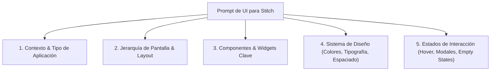

# 🎨 Fase 3: Prototipado y Diseño de UI con Google Stitch
## Cómo transformar requerimientos en interfaces visuales profesionales con `stitch.withgoogle.com`

**Google Stitch** ([stitch.withgoogle.com](https://stitch.withgoogle.com/?pli=1)) es la herramienta de diseño de interfaces de usuario impulsada por IA de Google. Permite generar pantallas, wireframes, sistemas de diseño y componentes frontend visualmente atractivos a partir de descripciones en lenguaje natural.

En este paso, tomamos las especificaciones generadas por la **Gema de Gemini** y las convertimos en **prompts de diseño para Stitch**, obteniendo la apariencia visual exacta que luego importaremos en **Google AI Studio**.

---

## 📐 Anatomía de un Prompt de UI para Google Stitch

Un buen prompt para Stitch debe contener 5 dimensiones clave para evitar diseños genéricos o planos:



---

## 🪄 Fórmula Maestra de Prompt para Stitch

Utiliza esta estructura cuando pidas a Stitch que diseñe tus pantallas:

```markdown
[ROL Y OBJETIVO DE LA PANTALLA]: Diseña una interfaz moderna tipo SaaS para [Nombre de la App], enfocada en [Objetivo Principal].

[LAYOUT Y ESTRUCTURA]:
- Barra lateral de navegación fija a la izquierda (Sidebar colapsable con logo, enlaces con iconos, perfil de usuario en el pie).
- Barra superior (Header) con barra de búsqueda global con atajo 'Cmd+K', notificaciones con badge de contador y selector de modo claro/oscuro.
- Área principal de contenido (Dashboard principal con rejilla de 12 columnas).

[COMPONENTES VISUALES]:
1. Fila de KPIs (4 tarjetas métricas con valores numéricos grandes, porcentaje de cambio en verde/rojo e iconos en badges circulares).
2. Gráfico principal interactivo (Curva de actividad de los últimos 30 días con selector de rango temporal).
3. Tabla de datos enriquecida con paginación, filtros por estado, búsqueda en tiempo real, avatares y columna de acciones rápidas (Editar, Eliminar, Ver detalle).
4. Panel lateral flotante o modal para creación rápida de nuevo registro.

[ESTILO VISUAL Y SISTEMA DE DISEÑO]:
- Paleta de colores: Fondo oscuro elegante (`#0f172a` / `#1e293b`), acentos en violeta/índigo (`#6366f1`), texto en slate claro (`#f8fafc`).
- Acabados: Glassmorphism suave (bordes sutiles `border-slate-700/50`, fondos semi-translúcidos con `backdrop-blur-md`).
- Tipografía: Moderna y limpia (Inter o Plus Jakarta Sans), jerarquía visual estricta.
- Microinteracciones: Efectos hover sutiles en tarjetas (`hover:border-indigo-500/50 transition-all duration-200`).
```

---

## 🖼️ Ejemplo Completo: Dashboard de Gestión de Proyectos

A continuación, un prompt listo para pegar directamente en **Google Stitch**:

```markdown
Crea una interfaz de usuario profesional y moderna para "DevTrack Pro", una plataforma SaaS de gestión ágil de proyectos y seguimiento de tareas para equipos de software.

Estructura de la pantalla:
1. Sidebar Izquierdo:
   - Logo "DevTrack Pro" con icono de cohete brillante.
   - Navegación: Dashboard (activo), Mis Proyectos, Tareas Pendientes, Calendario de Sprints, Analíticas, Configuración.
   - Perfil de usuario en la base con avatar, nombre "Alex Rivera", rol "Tech Lead" y botón de cerrar sesión.

2. Header Superior:
   - Barra de búsqueda con placeholder "Buscar tareas, sprints o miembros... (Ctrl + K)".
   - Botón principal de acción "+ Nueva Tarea" con gradiente índigo a púrpura.
   - Icono de notificaciones con punto indicador rojo y selector de tema.

3. Sección de Métricas (Grid 4 columnas):
   - Tarjeta 1: "Sprints Activos" -> Valor 3 (+1 vs mes anterior).
   - Tarjeta 2: "Tareas Completadas" -> Valor 142 (94% de cumplimiento).
   - Tarjeta 3: "Tiempo Medio de Ciclo" -> Valor 2.4 días (-18% más rápido).
   - Tarjeta 4: "Miembros Activos" -> Valor 18 desarrolladores.

4. Vista Principal de Tareas (Tablero Kanban / Tabla):
   - Selector de pestañas: "Vista Kanban", "Vista Lista", "Diagrama Gantt".
   - Filtro por Prioridad (Alta, Media, Baja), Estado (Por Hacer, En Progreso, En Revisión, Hecho) y Asignado.
   - Lista de tareas con etiquetas de colores, fecha de entrega con alerta si está próxima, avatares de miembros y barra de progreso.

Estilo:
- Dark Mode moderno y minimalista, paleta Slate/Indigo/Emerald.
- Sombras suaves, esquinas redondeadas (rounded-xl), tipografía clara y excelente espaciado.
```

---

## 📥 Extracción y Preparación para Google AI Studio

Una vez que Stitch genera la interfaz visual:
1. **Inspecciona los componentes:** Identifica los componentes modulares clave (Header, Sidebar, KPI Cards, DataTable, Modals, Forms).
2. **Copia los estilos y estructura:** Si Stitch te provee el código HTML/Tailwind o especificación de componentes, guárdalos.
3. **Pasa a la siguiente fase:** En la siguiente fase, usaremos este diseño visual junto con la lógica de base de datos de Supabase para generar la aplicación web interactiva en **Google AI Studio**.

➡️ Continuar a **[Fase 5: Base de Datos y Backend con Supabase](./05_SUPABASE_DATABASE_Y_BACKEND.md)** o **[Fase 4: Construcción de la App en Google AI Studio](./04_CONSTRUCCION_APP_AISTUDIO_Y_SUPABASE.md)**.
