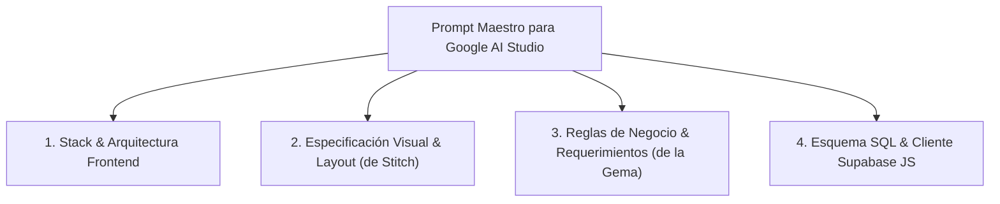

# ⚡ Fase 4: Construcción de la App en Google AI Studio con Supabase
## Cómo orquestar Requisitos, UI de Stitch y Backend de Supabase en `aistudio.google.com/apps`

**Google AI Studio Apps** ([aistudio.google.com/apps](https://aistudio.google.com/apps)) permite generar y ejecutar aplicaciones web interactivas completas a partir de prompts estructurados y modelos avanzados como Gemini 1.5 Pro / Flash.

En esta fase, integramos todos los artefactos creados en los pasos anteriores para que AI Studio genere una **aplicación web profesional, con autenticación, CRUD completo, diseño reactivo y persistencia real en Supabase**.

> 📌 **DOCUMENTO EXACTO PARA ESTA FASE:** Únicamente **`07_PROMPT_MAESTRO_AISTUDIO.md`**  
> * **¿Cómo se usa en Google AI Studio?**  
>   1. Abre `07_PROMPT_MAESTRO_AISTUDIO.md` en tu editor de texto.  
>   2. Reemplaza los placeholders `[TU_SUPABASE_URL]` y `[TU_SUPABASE_ANON_KEY]` con tus credenciales reales obtenidas de Supabase (*Project Settings ➔ API*).  
>   3. Entra a [aistudio.google.com/apps](https://aistudio.google.com/apps) y haz clic en **"Create App"** (o *New Application*).  
>   4. Pega el prompt completo en la caja de instrucciones del sistema y presiona **"Run / Build"**.  
> * ❌ **Qué NUNCA debes hacer aquí:** NO pegues el script SQL plano (`.sql`) directamente en AI Studio. El script SQL debe haberse ejecutado previamente en el SQL Editor de Supabase (Fase 5) para que las tablas y políticas RLS ya existan en la base de datos real.

---

## 🏗️ La Estructura de Entrada para Google AI Studio

Para que el modelo de AI Studio construya una aplicación de nivel empresarial sin omisiones ni errores, organizamos el prompt en 4 bloques:



---

## 📜 Prompt Maestro para Copiar y Pegar en Google AI Studio

Copia el siguiente prompt y personaliza las variables de tu proyecto:

```markdown
# OBJETIVO DE LA APLICACIÓN
Construye una aplicación web Single Page Application (SPA) profesional, completa, modular y lista para producción llamada "DevTrack Pro". La aplicación es una plataforma SaaS de gestión ágil de proyectos y tareas para equipos de ingeniería, conectada a una base de datos PostgreSQL en Supabase y diseñada con una arquitectura de navegación multi-vista fluida.

# STACK TECNOLÓGICO Y LIBRERÍAS
- Framework: React 18/19 SPA modular.
- Estilos: Tailwind CSS (diseño moderno Dark Mode con acentos en Índigo/Púrpura y Glassmorphism sutil).
- Iconografía: Lucide Icons (`lucide-react`).
- Cliente Backend: `@supabase/supabase-js` versión 2.x.
- Notificaciones: Sistema de notificaciones Toast accesibles para confirmar acciones o reportar errores.

# 1. ARQUITECTURA DE ENRUTAMIENTO MULTI-VISTA (ROUTER SPA EN REACT)
Para evitar que la app colapse en una sola pantalla, implementa un enrutador interno por máquina de estados reactiva en `App.jsx`:
- Estado de vista activa: `const [currentView, setCurrentView] = useState('dashboard');`
- Estados posibles:
  * `'auth'`: Si no existe sesión activa en Supabase Auth (renderiza pantalla de bienvenida y formulario).
  * `'dashboard'`: Panel ejecutivo con KPIs en tiempo real, gráficos de avance y actividad reciente.
  * `'projects-list'`: Explorador completo de proyectos con tabla interactiva, filtros por estado y vista tarjetas.
  * `'project-detail'`: Ficha técnica 360 del proyecto seleccionado, incluyendo el tablero Kanban de sus tareas asociadas.
  * `'project-create'`: Formulario de creación por pasos (Wizard) para registrar nuevos proyectos con validación.
  * `'settings'`: Configuración de perfil (`public.profiles`), conmutador de tema visual y seguridad.
- Estado de selección: `const [selectedProjectId, setSelectedProjectId] = useState(null);`
- Reglas de transición fluidas:
  * Clic en ítems del Sidebar -> `setCurrentView(vista)`.
  * Clic en una fila o tarjeta de proyecto -> `setSelectedProjectId(p.id)` y `setCurrentView('project-detail')`.
  * Clic en "+ Nuevo Proyecto" en Header o Sidebar -> `setCurrentView('project-create')`.
  * Clic en "← Volver a Proyectos" desde detalle o formulario -> `setCurrentView('projects-list')`.
  * Guardado exitoso -> `setCurrentView('projects-list')` con notificación Toast.

# 2. LAYOUT GLOBAL NAVEGABLE (SIDEBAR + HEADER)
- **Sidebar Izquierdo persistente:**
  * Logo "DevTrack Pro" con icono de cohete o capas brillante.
  * Navegación con enlaces activos claramente resaltados:
    - Dashboard (`LayoutDashboard`) -> `currentView === 'dashboard'`
    - Proyectos (`FolderKanban`) -> `currentView === 'projects-list'`
    - Nuevo Proyecto (`PlusCircle`) -> `currentView === 'project-create'`
    - Configuración (`Settings`) -> `currentView === 'settings'`
  * Perfil de usuario en la base: avatar, nombre (`profile.full_name`), rol y botón de logout (`LogOut`).
- **Header Superior:**
  * Migas de pan dinámicas (*breadcrumbs*): `Inicio / Proyectos / [Título]` según la vista activa.
  * Buscador rápido `Ctrl+K`.
  * Botón destacado de acción rápida: "+ Nuevo Proyecto".

# 3. COMPONENTES INDEPENDIENTES POR PANTALLA
Modula la aplicación en componentes independientes:
1. `AuthView`: Formulario de Login / Registro conectado a Supabase Auth.
2. `DashboardView`: 4 tarjetas KPI en vivo (Total Proyectos, Tareas Pendientes, Eficiencia %, Presupuesto), gráfico de avance y resumen.
3. `ProjectsListView`: Tabla con búsqueda en vivo, filtros por estado (`planning`, `active`, `completed`), paginación y botón para ver detalle.
4. `ProjectDetailView`: Carga el proyecto por `selectedProjectId`, muestra sus datos y renderiza el **Tablero Kanban interactivo** de tareas con columnas (Por Hacer, En Progreso, En Revisión, Completado) y cambio de estado en vivo.
5. `ProjectCreateView`: Formulario por pasos con validaciones (Título obligatorio > 5 chars, presupuesto positivo, fecha límite).
6. `SettingsView`: Formulario para editar nombre y avatar en `public.profiles`, y selector de tema claro/oscuro.

# 4. CONFIGURACIÓN Y CLIENTE DE SUPABASE
Utiliza las siguientes credenciales en `supabaseClient.js`:
- SUPABASE_URL: "https://[TU-PROYECTO].supabase.co"
- SUPABASE_ANON_KEY: "[TU-ANON-KEY-PUBLICA]"

```javascript
import { createClient } from '@supabase/supabase-js';
export const supabase = createClient(SUPABASE_URL, SUPABASE_ANON_KEY, {
  auth: { persistSession: true, autoRefreshToken: true, detectSessionInUrl: true }
});
```

# 5. ESQUEMA DE DATOS EN SUPABASE
La aplicación debe interactuar con:
1. `profiles`: `id (UUID PK)`, `email`, `full_name`, `avatar_url`, `role`, `created_at`
2. `projects`: `id (UUID PK)`, `owner_id (UUID FK -> profiles.id)`, `title`, `description`, `status`, `budget`, `created_at`
3. `tasks`: `id (UUID PK)`, `project_id (UUID FK -> projects.id)`, `assigned_to (UUID FK -> profiles.id)`, `title`, `description`, `priority`, `status`, `due_date`, `created_at`

# 6. EXPERIENCIA DE USUARIO Y LOS 4 ESTADOS
- *Skeleton Loaders* animados durante la resolución de promesas de Supabase.
- Notificaciones *Toast* flotantes para confirmar acciones (ej. "Proyecto creado con éxito").
- *Empty States* con ilustraciones y botón de acción cuando no existan registros.
- Manejo de excepciones de red y RLS (código 42501) con alertas amigables y botón de reintento.
- Código limpio, modular, sin variables globales y con tipado claro.
```

---

## 💻 Ejemplo de Implementación del Cliente Supabase

Para garantizar que el código generado en AI Studio sea modular y mantenible, la integración con Supabase se estructura así:

```javascript
// src/lib/supabaseClient.js
import { createClient } from '@supabase/supabase-js';

const supabaseUrl = import.meta.env.VITE_SUPABASE_URL || 'https://xyz.supabase.co';
const supabaseAnonKey = import.meta.env.VITE_SUPABASE_ANON_KEY || 'eyJhbGciOi...';

export const supabase = createClient(supabaseUrl, supabaseAnonKey);

// Helpers para operaciones frecuentes
export const fetchUserProjects = async (userId) => {
  const { data, error } = await supabase
    .from('projects')
    .select('*, tasks(*)')
    .eq('owner_id', userId)
    .order('created_at', { ascending: false });
    
  if (error) throw error;
  return data;
};

export const createProject = async (projectData) => {
  const { data, error } = await supabase
    .from('projects')
    .insert([projectData])
    .select()
    .single();
    
  if (error) throw error;
  return data;
};
```

---

## 🚀 Despliegue y Validación

1. Pega el prompt en **Google AI Studio Apps**.
2. Proporciona tus credenciales de Supabase en el panel de configuración o código.
3. Verifica la reactividad en tiempo real: crea un proyecto, agrega tareas y revisa que aparezcan instantáneamente reflejadas tanto en tu app como en la consola de Supabase.
