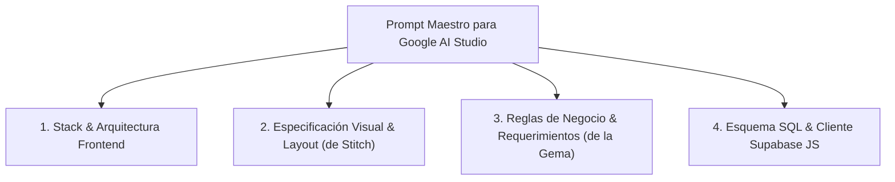

# ⚡ Fase 4: Construcción de la App en Google AI Studio con Supabase
## Cómo orquestar Requisitos, UI de Stitch y Backend de Supabase en `aistudio.google.com/apps`

**Google AI Studio Apps** ([aistudio.google.com/apps](https://aistudio.google.com/apps)) permite generar y ejecutar aplicaciones web interactivas completas a partir de prompts estructurados y modelos avanzados como Gemini 1.5 Pro / Flash.

En esta fase, integramos todos los artefactos creados en los pasos anteriores para que AI Studio genere una **aplicación web profesional, con autenticación, CRUD completo, diseño reactivo y persistencia real en Supabase**.

---

## 🏗️ La Estructura de Entrada para Google AI Studio

Para que el modelo de AI Studio construya una aplicación de nivel empresarial sin omisiones ni errores, organizamos el prompt en 4 bloques:



---

## 📜 Prompt Maestro para Copiar y Pegar en Google AI Studio

Copia el siguiente prompt y personaliza las variables de tu proyecto:

```markdown
# OBJETIVO DE LA APLICACIÓN
Construye una aplicación web Single Page Application (SPA) profesional, completa y lista para producción llamada "DevTrack Pro". La aplicación es una plataforma SaaS de gestión ágil de proyectos y tareas para equipos de ingeniería, conectada a una base de datos PostgreSQL en Supabase.

# STACK TECNOLÓGICO Y LIBRERÍAS
- Framework: React 18/19 (o Vanilla JS modular moderno con ES Modules y Tailwind CSS).
- Estilos: Tailwind CSS (diseño moderno Dark Mode con acentos en Índigo/Púrpura y Glassmorphism sutil).
- Iconografía: Lucide Icons (`lucide-react` o via CDN).
- Cliente Backend: `@supabase/supabase-js` versión 2.x.
- Notificaciones: Sistema de notificaciones Toast accesibles para confirmar acciones o reportar errores.

# CONFIGURACIÓN Y CLIENTE DE SUPABASE
Utiliza las siguientes variables de entorno o constantes configurables en un archivo `supabaseClient.js`:
- SUPABASE_URL: "https://[TU-PROYECTO].supabase.co"
- SUPABASE_ANON_KEY: "[TU-ANON-KEY-PUBLICA]"

El cliente debe inicializarse con:
```javascript
import { createClient } from '@supabase/supabase-js';
export const supabase = createClient(SUPABASE_URL, SUPABASE_ANON_KEY);
```

# GESTIÓN DE AUTENTICACIÓN Y ESTADO DE SESIÓN
1. Implementa un AuthProvider / Contexto de Usuario que escuche cambios en la sesión mediante `supabase.auth.onAuthStateChange`.
2. Vistas de Autenticación:
   - Modal o pantalla de Login con correo/contraseña.
   - Formulario de Registro que capture Nombre Completo, Correo y Contraseña.
   - Botón de Cierre de Sesión seguro.
3. Si el usuario no está autenticado, muestra una pantalla de bienvenida moderna con llamado a la acción para iniciar sesión. Si está autenticado, muestra el Dashboard principal con los datos del usuario activo.

# ESQUEMA DE DATOS EN SUPABASE
La aplicación debe interactuar con las siguientes tablas existentes:

1. `profiles`: `id (UUID PK)`, `email`, `full_name`, `avatar_url`, `role`, `created_at`
2. `projects`: `id (UUID PK)`, `owner_id (UUID FK -> profiles.id)`, `title`, `description`, `status`, `budget`, `created_at`
3. `tasks`: `id (UUID PK)`, `project_id (UUID FK -> projects.id)`, `assigned_to (UUID FK -> profiles.id)`, `title`, `description`, `priority`, `status`, `due_date`, `created_at`

# REQUERIMIENTOS FUNCIONALES (CRUD COMPLETO)
1. **Gestión de Proyectos:**
   - Listar todos los proyectos del usuario autenticado con filtros por estado (`planning`, `active`, `completed`).
   - Crear un nuevo proyecto mediante un formulario modal con validaciones.
   - Editar título, descripción y presupuesto de un proyecto existente.
   - Eliminar un proyecto con diálogo de confirmación.
2. **Gestión de Tareas:**
   - Visualizar las tareas del proyecto seleccionado en dos modos: Lista de Tareas y Tablero Kanban interactivo (columnas: Por Hacer, En Progreso, En Revisión, Hecho).
   - Crear una nueva tarea asignándola al proyecto activo con prioridad (`low`, `medium`, `high`, `urgent`) y fecha límite.
   - Cambiar el estado de una tarea arrastrándola o mediante un menú desplegable rápido.
   - Marcar tarea como completada y filtrar por prioridad.
3. **Métricas en Tiempo Real (KPI Cards):**
   - Total de proyectos activos.
   - Tareas completadas vs totales (con barra de progreso porcentual).
   - Tareas urgentes con vencimiento próximo.

# EXPERIENCIA DE USUARIO Y CALIDAD DE CÓDIGO
- Muestra *Skeleton Loaders* y estados de carga animados mientras las consultas a Supabase están en progreso.
- Gestiona los posibles errores de red o base de datos mostrando mensajes amigables al usuario con Toasts.
- Implementa *Empty States* ilustrados cuando no haya proyectos o tareas creadas.
- El código debe ser modular, limpio, sin variables globales no controladas y con tipado claro.
```

---

## 💻 Ejemplo de Implementación del Cliente Supabase

Para garantizar que el código generado en AI Studio sea modular y mantenible, la integración con Supabase se estructura así:

```javascript
// src/lib/supabaseClient.js
import { createClient } from '@supabase/supabase-js';

const supabaseUrl = import.meta.env.VITE_SUPABASE_URL || 'https://xyz.supabase.co';
const supabaseAnonKey = import.meta.env.VITE_SUPABASE_ANON_KEY || 'eyJhbGciOi...';

export const supabase = createClient(supabaseUrl, supabaseAnonKey);

// Helpers para operaciones frecuentes
export const fetchUserProjects = async (userId) => {
  const { data, error } = await supabase
    .from('projects')
    .select('*, tasks(*)')
    .eq('owner_id', userId)
    .order('created_at', { ascending: false });
    
  if (error) throw error;
  return data;
};

export const createProject = async (projectData) => {
  const { data, error } = await supabase
    .from('projects')
    .insert([projectData])
    .select()
    .single();
    
  if (error) throw error;
  return data;
};
```

---

## 🚀 Despliegue y Validación

1. Pega el prompt en **Google AI Studio Apps**.
2. Proporciona tus credenciales de Supabase en el panel de configuración o código.
3. Verifica la reactividad en tiempo real: crea un proyecto, agrega tareas y revisa que aparezcan instantáneamente reflejadas tanto en tu app como en la consola de Supabase.
