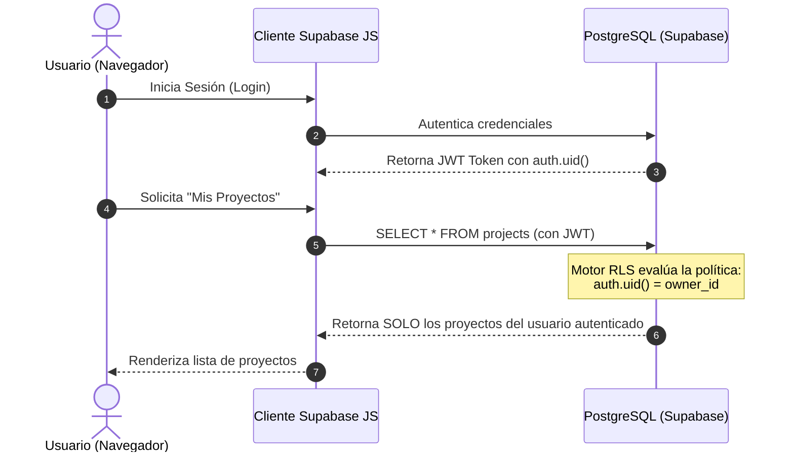

# 🐘 Fase 5: Base de Datos y Backend con Supabase
## Modelado SQL Relacional, Políticas RLS y Configuración de Backend

**Supabase** es la alternativa de código abierto a Firebase basada en **PostgreSQL**. Proporciona una base de datos relacional robusta, autenticación de usuarios integrada, almacenamiento de archivos (Storage), suscripciones en tiempo real (Realtime) y APIs REST/GraphQL generadas automáticamente.

Para que nuestra aplicación construida con **Google AI Studio** sea segura y profesional, debemos diseñar el esquema SQL siguiendo las mejores prácticas de la industria.

---

## 🔐 ¿Por qué es Crítico el Row Level Security (RLS)?

A diferencia de los backends tradicionales donde las consultas SQL se filtran en un servidor intermedio (ej. Express o Django), en aplicaciones frontend conectadas directamente a Supabase mediante `@supabase/supabase-js`, **la seguridad reside en la propia base de datos** a través de **RLS**.



> [!CAUTION]
> Si no habilitas **Row Level Security (RLS)** en tus tablas de Supabase, cualquier persona con tu clave pública `anon_key` podrá leer, modificar o borrar todos los datos de tu aplicación.

---

## 🛠️ Script SQL DDL Maestro para Supabase

Ejecuta el siguiente script en el **SQL Editor** de tu panel de Supabase ([supabase.com/dashboard](https://supabase.com/dashboard)):

```sql
-- 1. HABILITAR EXTENSIONES CRÍTICAS
CREATE EXTENSION IF NOT EXISTS "uuid-ossp";
CREATE EXTENSION IF NOT EXISTS "pgcrypto";

-- 2. TABLA DE PERFILES DE USUARIO (Vinculada a auth.users)
CREATE TABLE IF NOT EXISTS public.profiles (
    id UUID PRIMARY KEY REFERENCES auth.users(id) ON DELETE CASCADE,
    email TEXT UNIQUE NOT NULL,
    full_name TEXT,
    avatar_url TEXT,
    role TEXT DEFAULT 'developer' CHECK (role IN ('admin', 'manager', 'developer', 'client')),
    created_at TIMESTAMPTZ DEFAULT timezone('utc'::text, now()) NOT NULL,
    updated_at TIMESTAMPTZ DEFAULT timezone('utc'::text, now()) NOT NULL
);

-- 3. TABLA DE PROYECTOS
CREATE TABLE IF NOT EXISTS public.projects (
    id UUID PRIMARY KEY DEFAULT gen_random_uuid(),
    owner_id UUID NOT NULL REFERENCES public.profiles(id) ON DELETE CASCADE,
    title TEXT NOT NULL,
    description TEXT,
    status TEXT DEFAULT 'planning' CHECK (status IN ('planning', 'active', 'completed', 'paused')),
    budget NUMERIC(12,2) DEFAULT 0.00,
    created_at TIMESTAMPTZ DEFAULT timezone('utc'::text, now()) NOT NULL,
    updated_at TIMESTAMPTZ DEFAULT timezone('utc'::text, now()) NOT NULL
);

-- 4. TABLA DE TAREAS
CREATE TABLE IF NOT EXISTS public.tasks (
    id UUID PRIMARY KEY DEFAULT gen_random_uuid(),
    project_id UUID NOT NULL REFERENCES public.projects(id) ON DELETE CASCADE,
    assigned_to UUID REFERENCES public.profiles(id) ON DELETE SET NULL,
    title TEXT NOT NULL,
    description TEXT,
    priority TEXT DEFAULT 'medium' CHECK (priority IN ('low', 'medium', 'high', 'urgent')),
    status TEXT DEFAULT 'todo' CHECK (status IN ('todo', 'in_progress', 'review', 'done')),
    due_date DATE,
    created_at TIMESTAMPTZ DEFAULT timezone('utc'::text, now()) NOT NULL,
    updated_at TIMESTAMPTZ DEFAULT timezone('utc'::text, now()) NOT NULL
);

-- 5. TRIGGER AUTOMÁTICO PARA UPDATED_AT
CREATE OR REPLACE FUNCTION public.handle_updated_at()
RETURNS TRIGGER AS $$
BEGIN
    NEW.updated_at = timezone('utc'::text, now());
    RETURN NEW;
END;
$$ LANGUAGE plpgsql;

CREATE TRIGGER on_profiles_updated BEFORE UPDATE ON public.profiles FOR EACH ROW EXECUTE FUNCTION public.handle_updated_at();
CREATE TRIGGER on_projects_updated BEFORE UPDATE ON public.projects FOR EACH ROW EXECUTE FUNCTION public.handle_updated_at();
CREATE TRIGGER on_tasks_updated BEFORE UPDATE ON public.tasks FOR EACH ROW EXECUTE FUNCTION public.handle_updated_at();

-- 6. TRIGGER PARA CREACIÓN AUTOMÁTICA DE PERFIL AL REGISTRARSE EN AUTH
CREATE OR REPLACE FUNCTION public.handle_new_user()
RETURNS TRIGGER AS $$
BEGIN
    INSERT INTO public.profiles (id, email, full_name, avatar_url)
    VALUES (
        NEW.id,
        NEW.email,
        COALESCE(NEW.raw_user_meta_data->>'full_name', split_part(NEW.email, '@', 1)),
        NEW.raw_user_meta_data->>'avatar_url'
    );
    RETURN NEW;
END;
$$ LANGUAGE plpgsql SECURITY DEFINER;

CREATE OR REPLACE TRIGGER on_auth_user_created
    AFTER INSERT ON auth.users
    FOR EACH ROW EXECUTE FUNCTION public.handle_new_user();

-- 7. HABILITAR ROW LEVEL SECURITY (RLS)
ALTER TABLE public.profiles ENABLE ROW LEVEL SECURITY;
ALTER TABLE public.projects ENABLE ROW LEVEL SECURITY;
ALTER TABLE public.tasks ENABLE ROW LEVEL SECURITY;

-- 8. POLÍTICAS DE SEGURIDAD RLS PARA PROFILES
CREATE POLICY "Los usuarios pueden ver todos los perfiles públicos"
    ON public.profiles FOR SELECT
    TO authenticated
    USING (true);

CREATE POLICY "Los usuarios pueden actualizar su propio perfil"
    ON public.profiles FOR UPDATE
    TO authenticated
    USING (auth.uid() = id);

-- 9. POLÍTICAS DE SEGURIDAD RLS PARA PROJECTS
CREATE POLICY "Los usuarios pueden ver proyectos donde son dueños"
    ON public.projects FOR SELECT
    TO authenticated
    USING (auth.uid() = owner_id);

CREATE POLICY "Los usuarios pueden crear proyectos asignándose como dueño"
    ON public.projects FOR INSERT
    TO authenticated
    WITH CHECK (auth.uid() = owner_id);

CREATE POLICY "Los dueños pueden modificar sus proyectos"
    ON public.projects FOR UPDATE
    TO authenticated
    USING (auth.uid() = owner_id);

CREATE POLICY "Los dueños pueden eliminar sus proyectos"
    ON public.projects FOR DELETE
    TO authenticated
    USING (auth.uid() = owner_id);

-- 10. POLÍTICAS DE SEGURIDAD RLS PARA TASKS
CREATE POLICY "Los usuarios pueden ver tareas de sus proyectos"
    ON public.tasks FOR SELECT
    TO authenticated
    USING (
        EXISTS (
            SELECT 1 FROM public.projects
            WHERE projects.id = tasks.project_id
            AND projects.owner_id = auth.uid()
        )
    );

CREATE POLICY "Los usuarios pueden crear tareas en sus proyectos"
    ON public.tasks FOR INSERT
    TO authenticated
    WITH CHECK (
        EXISTS (
            SELECT 1 FROM public.projects
            WHERE projects.id = tasks.project_id
            AND projects.owner_id = auth.uid()
        )
    );

CREATE POLICY "Los usuarios pueden actualizar tareas de sus proyectos"
    ON public.tasks FOR UPDATE
    TO authenticated
    USING (
        EXISTS (
            SELECT 1 FROM public.projects
            WHERE projects.id = tasks.project_id
            AND projects.owner_id = auth.uid()
        )
    );

CREATE POLICY "Los usuarios pueden eliminar tareas de sus proyectos"
    ON public.tasks FOR DELETE
    TO authenticated
    USING (
        EXISTS (
            SELECT 1 FROM public.projects
            WHERE projects.id = tasks.project_id
            AND projects.owner_id = auth.uid()
        )
    );
```

---

## 🔑 Obtención de Variables de Entorno en Supabase

En tu panel de Supabase:
1. Ve a **Project Settings** ➔ **API**.
2. Copia la **Project URL** (ej. `https://xyzcompany.supabase.co`).
3. Copia la **`anon` `public` key** (clave pública segura para el frontend).

Estas dos variables son las únicas que necesitarás proveer a Google AI Studio para que la aplicación funcione en tiempo real.

---

## ⚠️ Configuración Crítica de Autenticación para Entornos Sandbox

Para que el aprendiz pueda probar el registro y login en AI Studio sin quedar esperando un correo de confirmación:
1. En el panel de Supabase, navega a **Authentication** ➔ **Providers** ➔ **Email**.
2. Desactiva la opción **"Confirm email"** (ponla en `OFF`).
3. Guarda los cambios.

> **💡 Beneficio:** Esto permite que cualquier usuario registrado mediante `supabase.auth.signUp()` obtenga una sesión activa inmediata con su respectivo `auth.uid()`, activando el trigger de `public.profiles` de forma instantánea.

