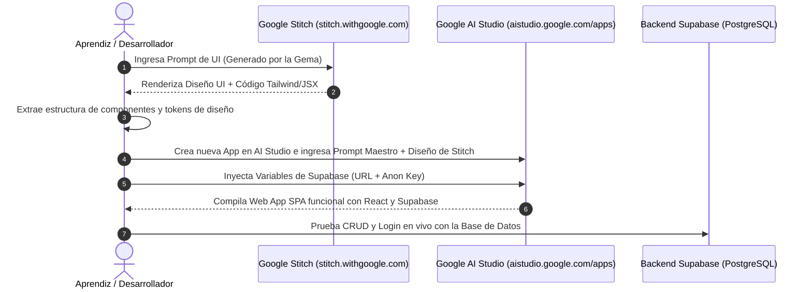

# 🔄 Guía de Importación: De Google Stitch a Google AI Studio
## Cómo trasladar el diseño de `stitch.withgoogle.com` a `aistudio.google.com/apps`

Una vez que has generado la interfaz de usuario en **Google Stitch**, el siguiente paso crítico es trasladar esa estructura visual y sistema de componentes a **Google AI Studio Apps** para dotarla de lógica reactiva y conexión en tiempo real a **Supabase**.

---

## 🧭 Flujo de Transferencia Visual a Código Funcional



---

## 🛠️ Paso a Paso: Cómo Exportar desde Google Stitch

1. **En Google Stitch (`stitch.withgoogle.com`):**
   - Una vez que Stitch genera tu pantalla (ej. Dashboard o Tablero Kanban), haz clic en el botón de **"View Code" / "Inspect"** o copia el árbol de componentes generado.
   - Si Stitch te proporciona el código HTML / Tailwind / JSX, cópialo en tu portapapeles.
   - Si Stitch te proporciona una previsualización visual o interactiva, identifica los bloques principales:
     * **Sidebar:** Enlaces, logo, perfil de usuario.
     * **Header:** Barra de búsqueda, notificaciones, botón de acción primaria.
     * **KPI Grid:** 4 tarjetas de métricas con iconos y badges de estado.
     * **Área Central:** Tabla interactiva, tablero Kanban o formularios modales.

2. **En Google AI Studio (`aistudio.google.com/apps`):**
   - Inicia sesión con tu cuenta de Google en [aistudio.google.com/apps](https://aistudio.google.com/apps).
   - Haz clic en **"Create App"** o **"New Web App"**.
   - En la caja de instrucciones o prompt principal, pega el **Prompt de Ensamble Maestro** que se muestra a continuación.

---

## 📜 Prompt Base para que el Aprendiz Cree su Primer Proyecto en AI Studio

Copia esta plantilla base para ordenar a Google AI Studio que construya la aplicación incorporando el diseño de Stitch y la conexión a Supabase:

```markdown
# OBJETIVO DEL PROYECTO
Construye la aplicación web SPA profesional "[NOMBRE_DEL_PROYECTO]" utilizando React 18/19, Tailwind CSS y Lucide Icons, conectada a una base de datos PostgreSQL en Supabase.

# 1. DISEÑO VISUAL Y COMPONENTES (IMPORTADO DE GOOGLE STITCH)
Replica con total fidelidad la siguiente estructura visual generada en Google Stitch:
- Estilo: Dark Mode moderno con paleta Slate (bg: '#0f172a', cards: '#1e293b', border: '#334155'), acentos en Índigo ('#6366f1') y texto claro ('#f8fafc').
- Sidebar Izquierdo:
  * Logo con icono brillante y nombre del proyecto.
  * Navegación con enlaces interactivos: Dashboard, Mis Registros, Analíticas, Configuración.
  * Perfil del usuario activo en el pie con botón para cerrar sesión.
- Header Superior:
  * Buscador rápido con atajo de teclado 'Ctrl+K'.
  * Notificaciones con indicador numérico.
  * Botón principal "+ Nuevo Registro" con gradiente moderno.
- Dashboard Principal:
  * 4 Tarjetas de Métricas (KPIs) con valores dinámicos calculados desde Supabase.
  * Vista principal conmutables entre Lista de Datos y Tablero Kanban.
  * Modal flotante con formulario validado para crear y editar registros.

# 2. CONEXIÓN A SUPABASE Y VARIABLES DE ENTORNO
Configura el cliente oficial de Supabase con las siguientes credenciales:
```javascript
import { createClient } from '@supabase/supabase-js';

const SUPABASE_URL = "https://desxxxxxxxxxswwwwc.supabase.co";
const SUPABASE_ANON_KEY = "sb_publishable_BG-ADvvcccccccxxxxxxxxxxxxxxxxxxxxxxxxxx";

export const supabase = createClient(SUPABASE_URL, SUPABASE_ANON_KEY);
```

# 3. GESTIÓN DE AUTENTICACIÓN
- Si el usuario no ha iniciado sesión, muestra una pantalla de bienvenida moderna con formulario de Login y Registro (email y contraseña) conectado a `supabase.auth.signInWithPassword` y `supabase.auth.signUp`.
- Si el usuario está autenticado, renderiza el Dashboard principal con sus datos personales y escucha el estado de la sesión mediante `supabase.auth.onAuthStateChange`.

# 4. OPERACIONES CRUD EN TIEMPO REAL
- Consultar proyectos: `supabase.from('projects').select('*, tasks(*)').order('created_at', { ascending: false })`
- Crear nuevo proyecto: `supabase.from('projects').insert([{ title, description, owner_id: user.id, status: 'planning' }])`
- Actualizar estado de tarea: `supabase.from('tasks').update({ status: nuevoEstado }).eq('id', taskId)`
- Eliminar proyecto: `supabase.from('projects').delete().eq('id', projectId)`

# 5. EXPERIENCIA DE USUARIO (UX) Y MANEJO DE ERRORES
- Implementa Skeleton Loaders mientras cargan los datos.
- Muestra notificaciones Toast para confirmar acciones (ej. "Proyecto creado con éxito", "Error al guardar").
- Maneja excepciones de red y errores de RLS (código 42501) con alertas accesibles y botón de reintento.
- Añade diálogos de confirmación antes de eliminar cualquier elemento.
```

---

## ⚠️ Paso Previo Crítico: Configurar Auth en Supabase Sandbox

Antes de probar el registro en AI Studio:
1. Ve a tu panel de Supabase ➔ **Authentication** ➔ **Providers** ➔ **Email**.
2. Desactiva la opción **"Confirm email"** (ponla en `OFF`).
3. Haz clic en **Save**.

> **¿Por qué es vital?** Por defecto, Supabase exige confirmar el correo mediante un enlace. Al desactivar esta opción durante el desarrollo, el aprendiz puede registrar un usuario de prueba (ej. `test@example.com`) e iniciar sesión de inmediato en AI Studio sin quedar bloqueado.

## 🎨 Guía de Traducción: De Tokens de Estilo de Stitch a Clases Tailwind en AI Studio

Cuando lleves el diseño generado en Google Stitch a Google AI Studio, utiliza esta tabla de equivalencias de Tailwind CSS según el estilo visual que hayas elegido del catálogo de 40 estilos:

| Estilo Visual de Stitch | Clases Clave de Tailwind CSS para AI Studio | Efecto Visual Resultante |
| :--- | :--- | :--- |
| **Glasmorfismo / Liquid Glass** | `bg-slate-900/60 backdrop-blur-xl border border-white/10 shadow-2xl rounded-2xl` | Vidrio esmerilado translúcido con reflejos sutiles. |
| **Bento Grid** | `grid grid-cols-1 md:grid-cols-3 lg:grid-cols-4 gap-4 auto-rows-auto rounded-2xl` | Rejilla asimétrica modular tipo Apple/Vercel. |
| **Neo-Brutalism** | `border-[3px] border-black shadow-[4px_4px_0px_#000] font-black rounded-lg bg-yellow-300` | Bordes negros gruesos y sombras sólidas sin difuminar. |
| **Terminal / Hacker UI** | `bg-[#0d1117] text-emerald-400 font-mono border border-emerald-500/30 rounded-md` | Consola CLI con texto verde fósforo y tipografía mono. |
| **Cyberpunk** | `bg-[#0a0a0f] border-cyan-500/60 shadow-[0_0_20px_rgba(6,182,212,0.3)] text-cyan-300` | Fondo negro carbón con resplandor neón cian/magenta. |
| **Claymorphism** | `rounded-3xl bg-indigo-100 shadow-[inset_0_4px_8px_rgba(255,255,255,0.6),0_12px_24px_rgba(99,102,241,0.2)]` | Relieve 3D inflado de arcilla suave en tonos pastel. |
| **Aurora / Gradient UI** | `bg-gradient-to-br from-indigo-950 via-slate-900 to-purple-950 shadow-indigo-500/20` | Fondos atmosféricos profundos con halos difusos. |
| **Minimalismo** | `bg-white dark:bg-slate-950 text-slate-900 dark:text-slate-100 p-8 border border-slate-200 dark:border-slate-800` | Espacio negativo amplio, líneas finas y sobriedad. |

---

## 🩹 Protocolo de Parches Quirúrgicos para Aprendices en AI Studio

Cuando algo no funcione o quieras mejorar un componente, **NO le pidas a AI Studio que reescriba toda la aplicación**. Usa prompts quirúrgicos específicos:

* **Para corregir diseño de Stitch:**  
  *"En el componente `KpiGrid`, ajusta las tarjetas para que tengan fondo `#1e293b`, borde `#334155` y efecto `backdrop-blur-sm` manteniendo intactas las props de datos."*

* **Para solucionar errores de RLS o inserción:**  
  *"Revisa la función `handleCreateProject`: asegúrate de obtener el `user.id` con `supabase.auth.getUser()` y asignarlo explícitamente a `owner_id` antes del `insert`."*

* **Para agregar estados de carga:**  
  *"En la vista de `ProjectsList`, muestra un `SkeletonCard` de 3 filas animadas mientras `loading === true` antes de renderizar la tabla."*


