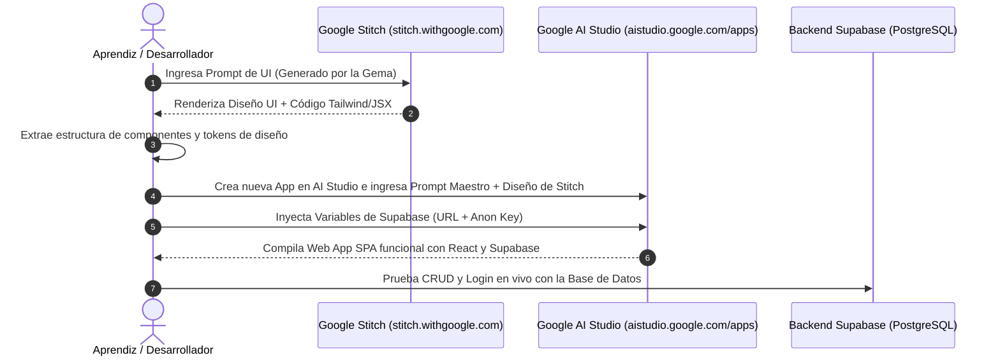

# 🔄 Guía de Importación: De Google Stitch a Google AI Studio
## Cómo trasladar el diseño de `stitch.withgoogle.com` a `aistudio.google.com/apps`

Una vez que has generado la interfaz de usuario en **Google Stitch**, el siguiente paso crítico es trasladar esa estructura visual y sistema de componentes a **Google AI Studio Apps** para dotarla de lógica reactiva y conexión en tiempo real a **Supabase**.

---

## 🧭 Flujo de Transferencia Visual a Código Funcional



---

## 🛠️ Paso a Paso: Cómo Exportar desde Google Stitch

1. **En Google Stitch (`stitch.withgoogle.com`):**
   - Una vez que Stitch genera tu pantalla (ej. Dashboard o Tablero Kanban), haz clic en el botón de **"View Code" / "Inspect"** o copia el árbol de componentes generado.
   - Si Stitch te proporciona el código HTML / Tailwind / JSX, cópialo en tu portapapeles.
   - Si Stitch te proporciona una previsualización visual o interactiva, identifica los bloques principales:
     * **Sidebar:** Enlaces, logo, perfil de usuario.
     * **Header:** Barra de búsqueda, notificaciones, botón de acción primaria.
     * **KPI Grid:** 4 tarjetas de métricas con iconos y badges de estado.
     * **Área Central:** Tabla interactiva, tablero Kanban o formularios modales.

2. **En Google AI Studio (`aistudio.google.com/apps`):**
   - Inicia sesión con tu cuenta de Google en [aistudio.google.com/apps](https://aistudio.google.com/apps).
   - Haz clic en **"Create App"** o **"New Web App"**.
   - En la caja de instrucciones o prompt principal, pega el **Prompt de Ensamble Maestro** que se muestra a continuación.

---

## 📜 Prompt Base para que el Aprendiz Cree su Primer Proyecto en AI Studio

Copia esta plantilla base para ordenar a Google AI Studio que construya la aplicación incorporando el diseño de Stitch y la conexión a Supabase:

```markdown
# OBJETIVO DEL PROYECTO
Construye la aplicación web SPA profesional "[NOMBRE_DEL_PROYECTO]" utilizando React 18/19, Tailwind CSS y Lucide Icons, conectada a una base de datos PostgreSQL en Supabase.

# 1. DISEÑO VISUAL Y COMPONENTES (IMPORTADO DE GOOGLE STITCH)
Replica con total fidelidad la siguiente estructura visual generada en Google Stitch:
- Estilo: Dark Mode moderno con paleta Slate (bg: '#0f172a', cards: '#1e293b', border: '#334155'), acentos en Índigo ('#6366f1') y texto claro ('#f8fafc').
- Sidebar Izquierdo:
  * Logo con icono brillante y nombre del proyecto.
  * Navegación con enlaces interactivos: Dashboard, Mis Registros, Analíticas, Configuración.
  * Perfil del usuario activo en el pie con botón para cerrar sesión.
- Header Superior:
  * Buscador rápido con atajo de teclado 'Ctrl+K'.
  * Notificaciones con indicador numérico.
  * Botón principal "+ Nuevo Registro" con gradiente moderno.
- Dashboard Principal:
  * 4 Tarjetas de Métricas (KPIs) con valores dinámicos calculados desde Supabase.
  * Vista principal conmutables entre Lista de Datos y Tablero Kanban.
  * Modal flotante con formulario validado para crear y editar registros.

# 2. CONEXIÓN A SUPABASE Y VARIABLES DE ENTORNO
Configura el cliente oficial de Supabase con las siguientes credenciales:
```javascript
import { createClient } from '@supabase/supabase-js';

const SUPABASE_URL = "https://desxxxxxxxxxswwwwc.supabase.co";
const SUPABASE_ANON_KEY = "sb_publishable_BG-ADvvcccccccxxxxxxxxxxxxxxxxxxxxxxxxxx";

export const supabase = createClient(SUPABASE_URL, SUPABASE_ANON_KEY);
```

# 3. GESTIÓN DE AUTENTICACIÓN
- Si el usuario no ha iniciado sesión, muestra una pantalla de bienvenida moderna con formulario de Login y Registro (email y contraseña) conectado a `supabase.auth.signInWithPassword` y `supabase.auth.signUp`.
- Si el usuario está autenticado, renderiza el Dashboard principal con sus datos personales y escucha el estado de la sesión mediante `supabase.auth.onAuthStateChange`.

# 4. OPERACIONES CRUD EN TIEMPO REAL
- Consultar registros: `supabase.from('items').select('*')` filtrando por el usuario autenticado.
- Crear nuevo registro: `supabase.from('items').insert([...])`.
- Actualizar estado: `supabase.from('items').update({ status: nuevoEstado }).eq('id', itemId)`.
- Eliminar registro: `supabase.from('items').delete().eq('id', itemId)`.

# 5. EXPERIENCIA DE USUARIO (UX)
- Implementa Skeleton Loaders mientras cargan los datos.
- Muestra notificaciones Toast para confirmar acciones (ej. "Registro creado con éxito", "Error al guardar").
- Añade diálogos de confirmación antes de eliminar cualquier elemento.
```

---

## 💡 Consejos de Iteración para Aprendices en AI Studio

* **Si un componente no se ve como en Stitch:** Escribe en el chat de AI Studio: *"Ajusta la tarjeta de KPI para que tenga el fondo semi-translúcido con backdrop-blur y el borde índigo suave exactamente como el diseño de Stitch."*
* **Si una consulta a Supabase falla:** Revisa en la consola del navegador si Supabase retorna un error de **Row Level Security (RLS)**. Si es así, asegúrate de que el usuario haya iniciado sesión y que la tabla tenga la política `USING (auth.uid() = user_id)`.
