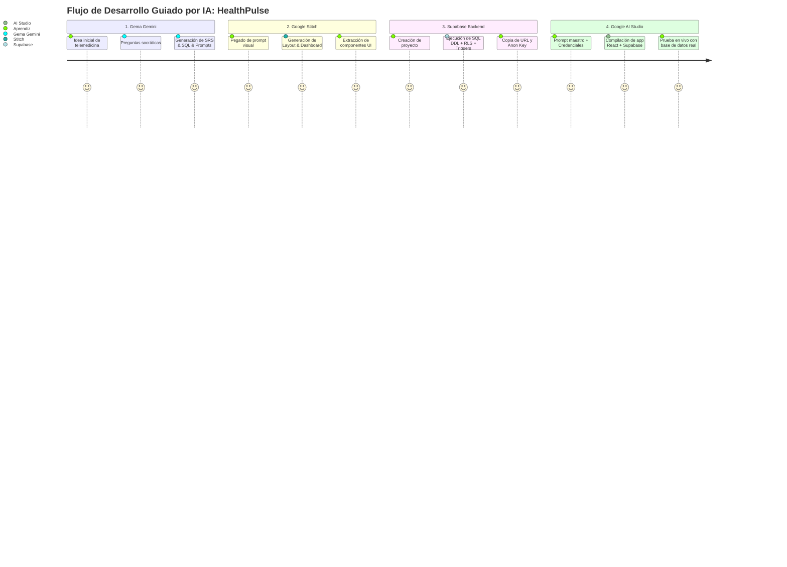

# 🌟 Caso de Estudio Completo End-to-End
## Proyecto Real: "HealthPulse — Plataforma SaaS de Citas Médicas y Telemedicina"

En este caso de estudio práctico, recorreremos las fases del pipeline de principio a fin, mostrando los artefactos exactos generados en cada herramienta para construir una aplicación médica profesional de nivel de producción.

---

## 🧭 Resumen del Flujo de Trabajo



---

## 1️⃣ Interacción con la Gema de Gemini (Fase de Requisitos)

**Entrada del Aprendiz:**
> "Quiero crear una aplicación web para que clínicas pequeñas y médicos independientes gestionen citas médicas, historial clínico de pacientes y consultas virtuales."

**Salida Sintetizada por la Gema (Documento de Requisitos SRS + Gherkin):**

### Requerimientos Funcionales (RF)
* **RF-01 (Registro y Roles):** Autenticación con Supabase Auth asignando roles `doctor`, `patient` o `admin`.
* **RF-02 (Gestión de Citas):** Los pacientes agendan citas seleccionando médico, especialidad y franja horaria. Los médicos confirman, reprograman o cancelan.
* **RF-03 (Historial Clínico Digital):** El médico crea y actualiza notas médicas, diagnósticos (código CIE-10) y recetas digitales para cada paciente.
* **RF-04 (Panel de Telemedicina):** Generación de enlace a videoconsulta y seguimiento del estado de la sesión (En espera, En curso, Finalizada).
* **RF-05 (Métricas Clínicas):** Dashboard médico con 4 KPIs: Citas de hoy, Pacientes activos, Ingresos mensuales y Calificación promedio.

### Criterios de Aceptación Gherkin (Muestra):
```gherkin
Escenario: Paciente agenda cita médica con éxito
  DADO que un paciente autenticado selecciona al "Dr. Carlos Mendoza"
  Y elige la fecha "2026-09-15" a las "10:00 AM" en modalidad "telemedicine"
  CUANDO hace clic en "Confirmar Cita"
  ENTONCES el sistema crea el registro en la tabla 'appointments' con estado 'pending'
  Y genera el enlace único para la videoconsulta
  Y envía una notificación toast de confirmación al paciente.

Escenario: Intento de agendar en un horario ya ocupado
  DADO que otro paciente ya tiene confirmada la cita en la misma fecha y hora
  CUANDO el paciente intenta seleccionar ese bloque
  ENTONCES el sistema muestra el bloque deshabilitado en gris con etiqueta "No disponible"
  Y previene la inserción duplicada en la base de datos.
```

---

## 2️⃣ Suite de Prompts Multi-Pantalla para Google Stitch (`stitch.withgoogle.com`)

> **💡 Protocolo de Prototipado para el Aprendiz:**  
> En [stitch.withgoogle.com](https://stitch.withgoogle.com), ingresa el **Prompt 1** (Auth). Luego haz clic en el botón **'+ Add Screen'** e ingresa el **Prompt 2** (Dashboard). Repite **'+ Add Screen'** para los Prompts 3, 4, 5 y 6. Así construirás la experiencia médica multi-vista completa con identidad unificada.

---

### 🔹 Pantalla 1 (Stitch): Auth & Onboarding con Selección de Rol (SCR-01)
```markdown
Diseña una pantalla de Login y Registro médica con estética Glassmorphism + Dark Mode para "HealthPulse Telemed".

ESTRUCTURA (SPLIT-SCREEN 50/50):
1. Columna Izquierda (Propuesta de Valor Médica):
   - Logo estilizado con cruz médica moderna en gradiente Cian (#06b6d4) a Esmeralda (#10b981) y nombre "HealthPulse".
   - Titular: "Telemedicina y gestión clínica inteligente en tiempo real".
   - Tarjeta flotante translúcida: "Plataforma certificada con estándar HIPAA y cifrado end-to-end".
   - Fondo Slate 950 (#0a0e17) con halos de luz difusos en verde esmeralda y cian.
2. Columna Derecha (Formulario de Acceso y Registro):
   - Selector de Rol: Selector visual entre "Soy Médico / Especialista" y "Soy Paciente".
   - Selector de pestañas: "Iniciar Sesión" y "Crear Cuenta".
   - Campos: Correo electrónico, Contraseña segura, Nombre completo y Especialidad (si es médico).
   - Botón principal de acción con gradiente Cian/Esmeralda: "Ingresar a mi Portal Clínico →".

SISTEMA DE DISEÑO:
- Fondo Slate 900 (#0f172a), tarjetas Slate 800 (#1e293b con backdrop-blur-md), acentos en Cian (#06b6d4) y Esmeralda (#10b981).
```

---

### 🔹 Pantalla 2 (Stitch): Dashboard Principal del Doctor (SCR-02)
```markdown
Diseña la pantalla de Dashboard Principal del Doctor para "HealthPulse Telemed".

ESTRUCTURA DE PANTALLA:
1. Sidebar Izquierdo:
   - Logo "HealthPulse" con cruz en gradiente Cian a Esmeralda.
   - Navegación con iconos Lucide: Dashboard (ACTIVO - iluminado), Agenda de Citas, Expedientes de Pacientes, Nueva Consulta, Ajustes de Clínica.
   - Perfil en la base: avatar del Dr. Carlos Mendoza, especialidad "Medicina Interna", badge "Verificado" y botón de logout.
2. Header Superior:
   - Buscador rápido: "Buscar paciente por nombre o documento... (Ctrl + K)".
   - Botón primario de acción: "+ Agendar Cita" con gradiente Cian/Esmeralda.
   - Indicador de notificaciones y selector de tema claro/oscuro.
3. Fila de 4 Tarjetas KPIs:
   - "Citas Hoy": Valor 8 (6 confirmadas, 2 pendientes), icono Calendar.
   - "Pacientes Activos": Valor 154 (+12 este mes), icono Users.
   - "Ingresos del Mes": Valor $4,250 USD (+8.5%), icono DollarSign.
   - "Calificación": Valor 4.9 / 5 estrellas (120 reseñas), icono Star.
4. Sección Central (Dos Columnas):
   - Columna Izquierda (70%): Calendario semanal interactivo de citas con código de colores (Confirmada: Verde, Pendiente: Ámbar, Telemedicina: Azul).
   - Columna Derecha (30%): Panel "Próximos Pacientes en Espera" con foto, motivo de consulta, hora y botón destacado "Iniciar Videoconsulta" con icono Video.

SISTEMA DE DISEÑO:
- Mismo estilo Glassmorphism refinado, bordes finos (#334155), esquinas rounded-xl y tipografía Inter.
```

---

### 🔹 Pantalla 3 (Stitch): Explorador / Agenda de Citas Médicas (SCR-03)
```markdown
Diseña la pantalla de Explorador y Agenda Completa de Citas para "HealthPulse Telemed".

ESTRUCTURA DE PANTALLA:
1. Sidebar Izquierdo: Idéntico al Dashboard, con el ítem "Agenda de Citas" en estado ACTIVO.
2. Header Superior: Breadcrumbs "HealthPulse / Agenda y Turnos" y botón "+ Agendar Cita".
3. Barra de Control y Filtros Clínicos:
   - Buscador de citas por nombre de paciente o fecha.
   - Filtro por modalidad: "Todas", "Presencial", "Telemedicina".
   - Filtro por estado: "Confirmadas", "Pendientes", "Completadas", "Canceladas".
   - Conmutador de vista: "Vista Calendario Semanal" y "Vista Tabla de Turnos".
4. Tabla de Citas del Día / Semana:
   - Columnas: Paciente (avatar + nombre + edad), Fecha y Hora, Tipo de Consulta (badge con icono Video o Edificio), Motivo de consulta, Estado y Acciones (Iniciar Consulta, Reprogramar, Cancelar).
   - Paginador inferior con resumen de citas filtradas.

SISTEMA DE DISEÑO:
- Coherencia visual absoluta con las pantallas 1 y 2.
```

---

### 🔹 Pantalla 4 (Stitch): Expediente Clínico y Detalle 360 del Paciente (SCR-04)
```markdown
Diseña la pantalla de Expediente Clínico 360 de un Paciente ("Laura Sofía Restrepo, 34 años") para "HealthPulse Telemed".

ESTRUCTURA DE PANTALLA:
1. Header con Navegación de Retorno:
   - Botón: "← Volver a Lista de Pacientes".
   - Migas de pan: "HealthPulse / Pacientes / Laura Sofía Restrepo".
   - Botones: "Editar Datos", "+ Agregar Nota Médica", "Descargar Expediente PDF".
2. Cabecera Hero del Paciente:
   - Avatar grande, nombre completo, documento de identidad, tipo de sangre (O+), alergias destacadas en badge rojo ("Penicilina") y teléfono de emergencia.
3. Distribución Principal en Pestañas (Tabs):
   - Tab 1: "Historial de Consultas" (Línea de tiempo cronológica con diagnósticos CIE-10 previos y notas clínicas).
   - Tab 2: "Recetas y Prescripciones" (Lista de medicamentos activos, dosis, frecuencia y vigencia).
   - Tab 3: "Exámenes y Laboratorios" (Tarjetas de resultados con estado "Normal / Alterado" y botón para previsualizar).
   - Tab 4: "Antecedentes y Alergias" (Formulario estructurado de antecedentes patológicos y familiares).

SISTEMA DE DISEÑO:
- Misma paleta médica Slate con acentos esmeralda y tipografía de alta legibilidad.
```

---

### 🔹 Pantalla 5 (Stitch): Wizard para Agendar Nueva Cita / Consulta (SCR-05)
```markdown
Diseña la pantalla de Formulario Wizard para Agendar Cita Médica en "HealthPulse Telemed".

ESTRUCTURA DE PANTALLA:
1. Header: Breadcrumbs "HealthPulse / Citas / Agendar Nueva" y botón "✕ Cancelar".
2. Stepper Superior (Progreso en 3 Pasos):
   - Paso 1: "Seleccionar Paciente & Modalidad" (Completado con check verde).
   - Paso 2: "Especialista & Horario" (ACTIVO con anillo iluminado en Cian).
   - Paso 3: "Motivo & Confirmación" (Pendiente).
3. Área Central del Formulario (Tarjeta espaciosa en vidrio esmerilado):
   - Selector de Modalidad: Dos tarjetas visuales clickeables: "Consulta Presencial en Sede" vs "Videoconsulta Online".
   - Selector de Médico y Especialidad con avatares y valor de la consulta.
   - Selector visual de fecha interactivo con cuadrícula de franjas horarias disponibles en verde ("09:00 AM", "10:30 AM", "02:00 PM").
   - Campo de texto para motivo de consulta y síntomas principales.
4. Barra Inferior: Botón "Atrás" y Botón primario destacado "+ Confirmar y Agendar Cita".

SISTEMA DE DISEÑO:
- Mismo estilo Glassmorphism y paleta institucional.
```

---

### 🔹 Pantalla 6 (Stitch): Configuración de Clínica y Perfil Médico (SCR-06)
```markdown
Diseña la pantalla de Configuración de la Clínica y Perfil Médico para "HealthPulse Telemed".

ESTRUCTURA DE PANTALLA:
1. Sidebar Izquierdo: Con el ítem "Ajustes de Clínica" en estado ACTIVO.
2. Contenido en Pestañas:
   - Pestaña 1: "Perfil Profesional" (Foto médica, nombre, número de registro médico, especialidades y biografía).
   - Pestaña 2: "Horarios de Atención" (Configurador de días de la semana con rangos de hora mañana/tarde y duración de consulta).
   - Pestaña 3: "Tarifas y Telemedicina" (Valores de consulta presencial vs videoconsulta y enlace de sala virtual).
   - Pestaña 4: "Seguridad y Notificaciones" (Alertas por SMS/Email y cambio de contraseña).
3. Botón flotante: "Guardar Cambios Clínicos" con confirmación Toast accesible.

SISTEMA DE DISEÑO:
- Coherencia total con todas las pantallas previas.
```

---

---

## 3️⃣ Script SQL DDL Ejecutado en Supabase

```sql
-- =============================================================================
-- ESQUEMA DDL Y POLÍTICAS RLS: HEALTHPULSE TELEMED
-- =============================================================================

CREATE EXTENSION IF NOT EXISTS "pgcrypto";

-- 1. Trigger para updated_at automático
CREATE OR REPLACE FUNCTION public.handle_updated_at()
RETURNS TRIGGER AS $$
BEGIN
    NEW.updated_at = timezone('utc'::text, now());
    RETURN NEW;
END;
$$ LANGUAGE plpgsql;

-- 2. Trigger para crear perfil automáticamente al registrarse en Supabase Auth
CREATE OR REPLACE FUNCTION public.handle_new_user()
RETURNS TRIGGER AS $$
BEGIN
    INSERT INTO public.profiles (id, email, full_name, role, avatar_url)
    VALUES (
        NEW.id,
        NEW.email,
        COALESCE(NEW.raw_user_meta_data->>'full_name', split_part(NEW.email, '@', 1)),
        COALESCE(NEW.raw_user_meta_data->>'role', 'patient'),
        NEW.raw_user_meta_data->>'avatar_url'
    );
    RETURN NEW;
END;
$$ LANGUAGE plpgsql SECURITY DEFINER;

CREATE OR REPLACE TRIGGER on_auth_user_created
    AFTER INSERT ON auth.users
    FOR EACH ROW EXECUTE FUNCTION public.handle_new_user();

-- 3. Tabla: Perfiles de Usuario (Médicos, Pacientes, Admins)
CREATE TABLE IF NOT EXISTS public.profiles (
    id UUID PRIMARY KEY REFERENCES auth.users(id) ON DELETE CASCADE,
    email TEXT UNIQUE NOT NULL,
    full_name TEXT NOT NULL,
    role TEXT DEFAULT 'patient' CHECK (role IN ('doctor', 'patient', 'admin')),
    specialty TEXT,
    phone TEXT,
    avatar_url TEXT,
    created_at TIMESTAMPTZ DEFAULT timezone('utc'::text, now()) NOT NULL,
    updated_at TIMESTAMPTZ DEFAULT timezone('utc'::text, now()) NOT NULL
);
CREATE TRIGGER on_profiles_updated BEFORE UPDATE ON public.profiles
    FOR EACH ROW EXECUTE FUNCTION public.handle_updated_at();

-- 4. Tabla: Citas Médicas
CREATE TABLE IF NOT EXISTS public.appointments (
    id UUID PRIMARY KEY DEFAULT gen_random_uuid(),
    doctor_id UUID NOT NULL REFERENCES public.profiles(id) ON DELETE CASCADE,
    patient_id UUID NOT NULL REFERENCES public.profiles(id) ON DELETE CASCADE,
    appointment_date TIMESTAMPTZ NOT NULL,
    status TEXT DEFAULT 'pending' CHECK (status IN ('pending', 'confirmed', 'completed', 'cancelled')),
    type TEXT DEFAULT 'in_person' CHECK (type IN ('in_person', 'telemedicine')),
    meeting_link TEXT,
    notes TEXT,
    created_at TIMESTAMPTZ DEFAULT timezone('utc'::text, now()) NOT NULL,
    updated_at TIMESTAMPTZ DEFAULT timezone('utc'::text, now()) NOT NULL
);
CREATE TRIGGER on_appointments_updated BEFORE UPDATE ON public.appointments
    FOR EACH ROW EXECUTE FUNCTION public.handle_updated_at();
CREATE INDEX IF NOT EXISTS idx_appointments_doctor ON public.appointments(doctor_id);
CREATE INDEX IF NOT EXISTS idx_appointments_patient ON public.appointments(patient_id);
CREATE INDEX IF NOT EXISTS idx_appointments_date ON public.appointments(appointment_date);

-- 5. Tabla: Historial Clínico Digital
CREATE TABLE IF NOT EXISTS public.medical_records (
    id UUID PRIMARY KEY DEFAULT gen_random_uuid(),
    patient_id UUID NOT NULL REFERENCES public.profiles(id) ON DELETE CASCADE,
    doctor_id UUID NOT NULL REFERENCES public.profiles(id) ON DELETE CASCADE,
    appointment_id UUID REFERENCES public.appointments(id) ON DELETE SET NULL,
    diagnosis TEXT NOT NULL,
    prescription TEXT,
    treatment_plan TEXT,
    created_at TIMESTAMPTZ DEFAULT timezone('utc'::text, now()) NOT NULL,
    updated_at TIMESTAMPTZ DEFAULT timezone('utc'::text, now()) NOT NULL
);
CREATE TRIGGER on_medical_records_updated BEFORE UPDATE ON public.medical_records
    FOR EACH ROW EXECUTE FUNCTION public.handle_updated_at();
CREATE INDEX IF NOT EXISTS idx_medical_records_patient ON public.medical_records(patient_id);

-- 6. HABILITACIÓN DE ROW LEVEL SECURITY (RLS)
ALTER TABLE public.profiles ENABLE ROW LEVEL SECURITY;
ALTER TABLE public.appointments ENABLE ROW LEVEL SECURITY;
ALTER TABLE public.medical_records ENABLE ROW LEVEL SECURITY;

-- 7. POLÍTICAS RLS PARA PROFILES
CREATE POLICY "Perfiles visibles para usuarios autenticados"
    ON public.profiles FOR SELECT TO authenticated USING (true);

CREATE POLICY "Usuarios actualizan su propio perfil"
    ON public.profiles FOR UPDATE TO authenticated USING (auth.uid() = id);

-- 8. POLÍTICAS RLS PARA APPOINTMENTS
CREATE POLICY "Ver citas donde participa el usuario"
    ON public.appointments FOR SELECT TO authenticated
    USING (auth.uid() = doctor_id OR auth.uid() = patient_id);

CREATE POLICY "Crear citas médicas"
    ON public.appointments FOR INSERT TO authenticated
    WITH CHECK (auth.uid() = patient_id OR auth.uid() = doctor_id);

CREATE POLICY "Actualizar citas propias"
    ON public.appointments FOR UPDATE TO authenticated
    USING (auth.uid() = doctor_id OR auth.uid() = patient_id);

CREATE POLICY "Eliminar o cancelar citas propias"
    ON public.appointments FOR DELETE TO authenticated
    USING (auth.uid() = doctor_id OR auth.uid() = patient_id);

-- 9. POLÍTICAS RLS PARA MEDICAL_RECORDS
CREATE POLICY "Pacientes y médicos ven historial correspondiente"
    ON public.medical_records FOR SELECT TO authenticated
    USING (auth.uid() = patient_id OR auth.uid() = doctor_id);

CREATE POLICY "Solo médicos autorizados registran historial"
    ON public.medical_records FOR INSERT TO authenticated
    WITH CHECK (
        auth.uid() = doctor_id AND
        EXISTS (SELECT 1 FROM public.profiles WHERE id = auth.uid() AND role = 'doctor')
    );

CREATE POLICY "Médicos actualizan registros creados por ellos"
    ON public.medical_records FOR UPDATE TO authenticated
    USING (auth.uid() = doctor_id);
```

---

## 4️⃣ Prompt Maestro Multi-Vista para Google AI Studio (`aistudio.google.com/apps`)

```markdown
# OBJETIVO DE LA APLICACIÓN
Construye la aplicación web SPA completa, modular y lista para producción "HealthPulse Telemed" utilizando React 18/19, Tailwind CSS, Lucide Icons y el cliente oficial de '@supabase/supabase-js' versión 2.x. La aplicación es una plataforma de telemedicina y gestión clínica para doctores y pacientes, conectada a PostgreSQL en Supabase y estructurada con una arquitectura de navegación multi-vista fluida.

# 1. ARQUITECTURA DE ENRUTAMIENTO MULTI-VISTA (ROUTER SPA EN REACT)
Implementa un enrutador por estado reactivo en `App.jsx` para evitar colapsar la app en una sola pantalla:
- Estado de vista activa: `const [currentView, setCurrentView] = useState('dashboard');`
- Estados posibles:
  * `'auth'`: Login / Registro si no hay sesión en Supabase Auth.
  * `'dashboard'`: Panel principal del doctor con KPIs, resumen del día y pacientes en espera.
  * `'appointments'`: Agenda interactiva con vista calendario y tabla de turnos.
  * `'patient-detail'`: Expediente clínico 360 del paciente seleccionado (`selectedPatientId`).
  * `'appointment-create'`: Formulario wizard para agendar una nueva cita médica.
  * `'settings'`: Configuración de horarios de clínica, tarifas y perfil médico.
- Estado de selección: `const [selectedPatientId, setSelectedPatientId] = useState(null);`
- Reglas de transición:
  * Clic en ítem del Sidebar -> `setCurrentView(vista)`.
  * Clic en paciente o cita -> `setSelectedPatientId(p.id)` y `setCurrentView('patient-detail')`.
  * Clic en "+ Agendar Cita" -> `setCurrentView('appointment-create')`.
  * Clic en "← Volver a Citas" desde detalle o formulario -> `setCurrentView('appointments')`.

# 2. SIDEBAR Y HEADER PERSISTENTES
- **Sidebar Izquierdo:**
  * Logo médico "HealthPulse" con cruz en gradiente Cian (#06b6d4) a Esmeralda (#10b981).
  * Enlaces activos claramente resaltados:
    - Dashboard (`LayoutDashboard`) -> `currentView === 'dashboard'`
    - Agenda de Citas (`Calendar`) -> `currentView === 'appointments'`
    - Nueva Consulta (`PlusCircle`) -> `currentView === 'appointment-create'`
    - Ajustes de Clínica (`Settings`) -> `currentView === 'settings'`
  * Perfil del médico activo en la base (Dr. Carlos Mendoza, "Medicina Interna") y botón de logout (`LogOut`).
- **Header Superior:**
  * Migas de pan dinámicas (*breadcrumbs*): `HealthPulse / [Sección] / [Vista]`.
  * Buscador rápido de pacientes `Ctrl+K`.
  * Botón de acción rápida: "+ Agendar Cita".

# 3. COMPONENTES INDEPENDIENTES POR PANTALLA
1. `AuthView`: Login / Registro con selector de rol (Médico o Paciente) conectado a Supabase Auth.
2. `DashboardView`: 4 tarjetas KPI dinámicas (Citas Hoy, Pacientes Activos, Ingresos del Mes, Calificación), calendario semanal resumido y panel de pacientes en espera con botón de teleconsulta.
3. `AppointmentsView`: Explorador completo de citas con filtros por modalidad (presencial/telemedicina) y estado, más toggle tabla/calendario.
4. `PatientDetailView`: Carga el expediente del paciente por `selectedPatientId`, tabs de Historial Médico, Recetas activas, Exámenes y botón para agregar notas clínicas.
5. `AppointmentCreateView`: Wizard de 3 pasos (Paciente, Doctor/Especialidad y Fecha/Horario) con validaciones e inserción en tabla `appointments`.
6. `SettingsView`: Formulario de configuración de horarios de atención, valores de consulta y perfil médico en `public.profiles`.

# 4. CONFIGURACIÓN Y CLIENTE DE SUPABASE
```javascript
import { createClient } from '@supabase/supabase-js';

const SUPABASE_URL = "https://xyz-healthpulse.supabase.co";
const SUPABASE_ANON_KEY = "eyJhbGciOi...";

export const supabase = createClient(SUPABASE_URL, SUPABASE_ANON_KEY, {
  auth: { persistSession: true, autoRefreshToken: true, detectSessionInUrl: true }
});
```

# 5. ESQUEMA DE DATOS
Interactúa con las tablas existentes en Supabase:
- `profiles`: `id (UUID PK)`, `email`, `full_name`, `role ('doctor'|'patient'|'admin')`, `specialty`, `phone`, `avatar_url`
- `appointments`: `id (UUID PK)`, `doctor_id (FK)`, `patient_id (FK)`, `appointment_date`, `status ('pending'|'confirmed'|'completed'|'cancelled')`, `type ('in_person'|'telemedicine')`, `meeting_link`, `notes`
- `medical_records`: `id (UUID PK)`, `patient_id (FK)`, `doctor_id (FK)`, `diagnosis`, `prescription`, `treatment_plan`

# 6. EXPERIENCIA DE USUARIO Y LOS 4 ESTADOS
- Skeleton Loaders durante la carga de consultas a Supabase en cada vista.
- Notificaciones Toast ante cada acción ("✓ Cita agendada con éxito", "✓ Historial guardado").
- Diálogos de confirmación antes de cancelar citas.
- Estilo Dark Mode elegante con paleta Slate 900, acentos en Cian (#06b6d4) y Esmeralda (#10b981).
```

---

## ✅ Resultado Final

El aprendiz obtiene una **aplicación web médica completa, con persistencia real en Supabase, autenticación segura por roles, consultas protegidas por RLS y una interfaz visual de alta gama**, desarrollada de forma estructurada y sin alucinaciones gracias al pipeline guiado por IA.
