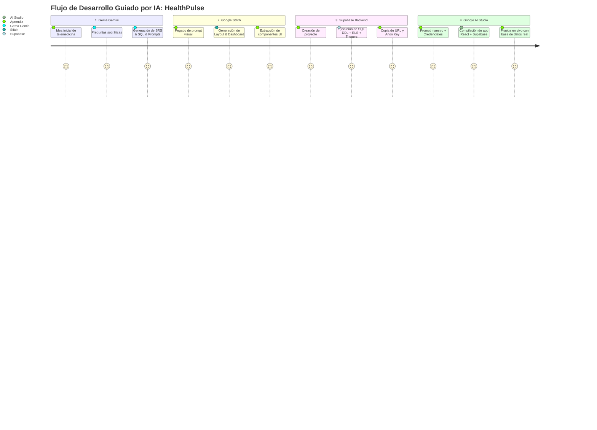

# 🌟 Caso de Estudio Completo End-to-End
## Proyecto Real: "HealthPulse — Plataforma SaaS de Citas Médicas y Telemedicina"

En este caso de estudio práctico, recorreremos las fases del pipeline de principio a fin, mostrando los artefactos exactos generados en cada herramienta para construir una aplicación médica profesional de nivel de producción.

---

## 🧭 Resumen del Flujo de Trabajo



---

## 1️⃣ Interacción con la Gema de Gemini (Fase de Requisitos)

**Entrada del Aprendiz:**
> "Quiero crear una aplicación web para que clínicas pequeñas y médicos independientes gestionen citas médicas, historial clínico de pacientes y consultas virtuales."

**Salida Sintetizada por la Gema (Documento de Requisitos SRS + Gherkin):**

### Requerimientos Funcionales (RF)
* **RF-01 (Registro y Roles):** Autenticación con Supabase Auth asignando roles `doctor`, `patient` o `admin`.
* **RF-02 (Gestión de Citas):** Los pacientes agendan citas seleccionando médico, especialidad y franja horaria. Los médicos confirman, reprograman o cancelan.
* **RF-03 (Historial Clínico Digital):** El médico crea y actualiza notas médicas, diagnósticos (código CIE-10) y recetas digitales para cada paciente.
* **RF-04 (Panel de Telemedicina):** Generación de enlace a videoconsulta y seguimiento del estado de la sesión (En espera, En curso, Finalizada).
* **RF-05 (Métricas Clínicas):** Dashboard médico con 4 KPIs: Citas de hoy, Pacientes activos, Ingresos mensuales y Calificación promedio.

### Criterios de Aceptación Gherkin (Muestra):
```gherkin
Escenario: Paciente agenda cita médica con éxito
  DADO que un paciente autenticado selecciona al "Dr. Carlos Mendoza"
  Y elige la fecha "2026-09-15" a las "10:00 AM" en modalidad "telemedicine"
  CUANDO hace clic en "Confirmar Cita"
  ENTONCES el sistema crea el registro en la tabla 'appointments' con estado 'pending'
  Y genera el enlace único para la videoconsulta
  Y envía una notificación toast de confirmación al paciente.

Escenario: Intento de agendar en un horario ya ocupado
  DADO que otro paciente ya tiene confirmada la cita en la misma fecha y hora
  CUANDO el paciente intenta seleccionar ese bloque
  ENTONCES el sistema muestra el bloque deshabilitado en gris con etiqueta "No disponible"
  Y previene la inserción duplicada en la base de datos.
```

---

## 2️⃣ Prompt Generado para Google Stitch (`stitch.withgoogle.com`)

```markdown
Diseña una interfaz web moderna, limpia, accesible y de alta confianza para "HealthPulse Telemed", una plataforma SaaS médica para doctores, clínicas y pacientes.

ESTRUCTURA DE PANTALLA (DASHBOARD DEL DOCTOR):
1. Sidebar Izquierdo:
   - Logo médico estilizado con cruz moderna en gradiente Cian (#06b6d4) a Esmeralda (#10b981) y nombre "HealthPulse".
   - Navegación con iconos Lucide: Dashboard (activo), Agenda de Citas, Expedientes Clínicos, Videoconsultas, Facturación, Configuración.
   - Perfil en el pie: avatar del Dr. Carlos Mendoza, especialidad "Medicina Interna", badge "Verificado" y botón de cerrar sesión.

2. Header Superior:
   - Buscador rápido con placeholder "Buscar paciente por nombre o documento... (Ctrl + K)".
   - Botón principal de acción: "+ Agendar Cita" con gradiente Cian/Esmeralda.
   - Indicador de notificaciones con punto de alerta y selector de tema claro/oscuro.

3. Fila Superior de Métricas (4 Tarjetas KPIs):
   - Tarjeta 1: "Citas Hoy" → Valor 8 (6 confirmadas, 2 pendientes), icono Calendar.
   - Tarjeta 2: "Pacientes Activos" → Valor 154 (+12 este mes), icono Users.
   - Tarjeta 3: "Ingresos del Mes" → Valor $4,250 USD (+8.5%), icono DollarSign.
   - Tarjeta 4: "Calificación Promedio" → Valor 4.9 / 5 estrellas (120 reseñas), icono Star.

4. Sección Central (Dos Columnas):
   - Columna Izquierda (70%): Calendario semanal interactivo de citas con código de colores según estado (Confirmada: Verde, Pendiente: Ámbar, Teleconsulta: Azul).
   - Columna Derecha (30%): Panel "Próximos Pacientes en Espera" con foto, motivo de consulta, hora y botón destacado "Iniciar Videoconsulta" con icono Video.

5. Modales Flotantes:
   - Modal de Registro de Cita: formulario con selector de paciente, médico, especialidad, fecha/hora y tipo (presencial/telemedicina).
   - Modal de Historial Clínico: editor de diagnóstico, receta médica y plan de tratamiento.

SISTEMA DE DISEÑO:
- Paleta: Fondo Slate 900 (#0f172a), tarjetas Slate 800 (#1e293b), bordes (#334155), acentos en Cian (#06b6d4) y Esmeralda (#10b981), texto (#f8fafc).
- Acabados: Glassmorphism sutil (backdrop-blur-md), esquinas rounded-xl, microinteracciones hover suaves.
- Tipografía: Inter / Plus Jakarta Sans con excelente contraste para el entorno médico.
```

---

## 3️⃣ Script SQL DDL Ejecutado en Supabase

```sql
-- =============================================================================
-- ESQUEMA DDL Y POLÍTICAS RLS: HEALTHPULSE TELEMED
-- =============================================================================

CREATE EXTENSION IF NOT EXISTS "pgcrypto";

-- 1. Trigger para updated_at automático
CREATE OR REPLACE FUNCTION public.handle_updated_at()
RETURNS TRIGGER AS $$
BEGIN
    NEW.updated_at = timezone('utc'::text, now());
    RETURN NEW;
END;
$$ LANGUAGE plpgsql;

-- 2. Trigger para crear perfil automáticamente al registrarse en Supabase Auth
CREATE OR REPLACE FUNCTION public.handle_new_user()
RETURNS TRIGGER AS $$
BEGIN
    INSERT INTO public.profiles (id, email, full_name, role, avatar_url)
    VALUES (
        NEW.id,
        NEW.email,
        COALESCE(NEW.raw_user_meta_data->>'full_name', split_part(NEW.email, '@', 1)),
        COALESCE(NEW.raw_user_meta_data->>'role', 'patient'),
        NEW.raw_user_meta_data->>'avatar_url'
    );
    RETURN NEW;
END;
$$ LANGUAGE plpgsql SECURITY DEFINER;

CREATE OR REPLACE TRIGGER on_auth_user_created
    AFTER INSERT ON auth.users
    FOR EACH ROW EXECUTE FUNCTION public.handle_new_user();

-- 3. Tabla: Perfiles de Usuario (Médicos, Pacientes, Admins)
CREATE TABLE IF NOT EXISTS public.profiles (
    id UUID PRIMARY KEY REFERENCES auth.users(id) ON DELETE CASCADE,
    email TEXT UNIQUE NOT NULL,
    full_name TEXT NOT NULL,
    role TEXT DEFAULT 'patient' CHECK (role IN ('doctor', 'patient', 'admin')),
    specialty TEXT,
    phone TEXT,
    avatar_url TEXT,
    created_at TIMESTAMPTZ DEFAULT timezone('utc'::text, now()) NOT NULL,
    updated_at TIMESTAMPTZ DEFAULT timezone('utc'::text, now()) NOT NULL
);
CREATE TRIGGER on_profiles_updated BEFORE UPDATE ON public.profiles
    FOR EACH ROW EXECUTE FUNCTION public.handle_updated_at();

-- 4. Tabla: Citas Médicas
CREATE TABLE IF NOT EXISTS public.appointments (
    id UUID PRIMARY KEY DEFAULT gen_random_uuid(),
    doctor_id UUID NOT NULL REFERENCES public.profiles(id) ON DELETE CASCADE,
    patient_id UUID NOT NULL REFERENCES public.profiles(id) ON DELETE CASCADE,
    appointment_date TIMESTAMPTZ NOT NULL,
    status TEXT DEFAULT 'pending' CHECK (status IN ('pending', 'confirmed', 'completed', 'cancelled')),
    type TEXT DEFAULT 'in_person' CHECK (type IN ('in_person', 'telemedicine')),
    meeting_link TEXT,
    notes TEXT,
    created_at TIMESTAMPTZ DEFAULT timezone('utc'::text, now()) NOT NULL,
    updated_at TIMESTAMPTZ DEFAULT timezone('utc'::text, now()) NOT NULL
);
CREATE TRIGGER on_appointments_updated BEFORE UPDATE ON public.appointments
    FOR EACH ROW EXECUTE FUNCTION public.handle_updated_at();
CREATE INDEX IF NOT EXISTS idx_appointments_doctor ON public.appointments(doctor_id);
CREATE INDEX IF NOT EXISTS idx_appointments_patient ON public.appointments(patient_id);
CREATE INDEX IF NOT EXISTS idx_appointments_date ON public.appointments(appointment_date);

-- 5. Tabla: Historial Clínico Digital
CREATE TABLE IF NOT EXISTS public.medical_records (
    id UUID PRIMARY KEY DEFAULT gen_random_uuid(),
    patient_id UUID NOT NULL REFERENCES public.profiles(id) ON DELETE CASCADE,
    doctor_id UUID NOT NULL REFERENCES public.profiles(id) ON DELETE CASCADE,
    appointment_id UUID REFERENCES public.appointments(id) ON DELETE SET NULL,
    diagnosis TEXT NOT NULL,
    prescription TEXT,
    treatment_plan TEXT,
    created_at TIMESTAMPTZ DEFAULT timezone('utc'::text, now()) NOT NULL,
    updated_at TIMESTAMPTZ DEFAULT timezone('utc'::text, now()) NOT NULL
);
CREATE TRIGGER on_medical_records_updated BEFORE UPDATE ON public.medical_records
    FOR EACH ROW EXECUTE FUNCTION public.handle_updated_at();
CREATE INDEX IF NOT EXISTS idx_medical_records_patient ON public.medical_records(patient_id);

-- 6. HABILITACIÓN DE ROW LEVEL SECURITY (RLS)
ALTER TABLE public.profiles ENABLE ROW LEVEL SECURITY;
ALTER TABLE public.appointments ENABLE ROW LEVEL SECURITY;
ALTER TABLE public.medical_records ENABLE ROW LEVEL SECURITY;

-- 7. POLÍTICAS RLS PARA PROFILES
CREATE POLICY "Perfiles visibles para usuarios autenticados"
    ON public.profiles FOR SELECT TO authenticated USING (true);

CREATE POLICY "Usuarios actualizan su propio perfil"
    ON public.profiles FOR UPDATE TO authenticated USING (auth.uid() = id);

-- 8. POLÍTICAS RLS PARA APPOINTMENTS
CREATE POLICY "Ver citas donde participa el usuario"
    ON public.appointments FOR SELECT TO authenticated
    USING (auth.uid() = doctor_id OR auth.uid() = patient_id);

CREATE POLICY "Crear citas médicas"
    ON public.appointments FOR INSERT TO authenticated
    WITH CHECK (auth.uid() = patient_id OR auth.uid() = doctor_id);

CREATE POLICY "Actualizar citas propias"
    ON public.appointments FOR UPDATE TO authenticated
    USING (auth.uid() = doctor_id OR auth.uid() = patient_id);

CREATE POLICY "Eliminar o cancelar citas propias"
    ON public.appointments FOR DELETE TO authenticated
    USING (auth.uid() = doctor_id OR auth.uid() = patient_id);

-- 9. POLÍTICAS RLS PARA MEDICAL_RECORDS
CREATE POLICY "Pacientes y médicos ven historial correspondiente"
    ON public.medical_records FOR SELECT TO authenticated
    USING (auth.uid() = patient_id OR auth.uid() = doctor_id);

CREATE POLICY "Solo médicos autorizados registran historial"
    ON public.medical_records FOR INSERT TO authenticated
    WITH CHECK (
        auth.uid() = doctor_id AND
        EXISTS (SELECT 1 FROM public.profiles WHERE id = auth.uid() AND role = 'doctor')
    );

CREATE POLICY "Médicos actualizan registros creados por ellos"
    ON public.medical_records FOR UPDATE TO authenticated
    USING (auth.uid() = doctor_id);
```

---

## 4️⃣ Prompt Maestro para Google AI Studio (`aistudio.google.com/apps`)

```markdown
# OBJETIVO DE LA APLICACIÓN
Construye la aplicación web SPA completa y lista para producción "HealthPulse Telemed" utilizando React 18/19, Tailwind CSS, Lucide Icons y el cliente oficial de '@supabase/supabase-js' versión 2.x. La aplicación es una plataforma de citas médicas y telemedicina para clínicas, doctores y pacientes, conectada a PostgreSQL en Supabase.

# CONFIGURACIÓN Y CLIENTE DE SUPABASE
Crea el archivo 'src/lib/supabaseClient.js':
```javascript
import { createClient } from '@supabase/supabase-js';

const SUPABASE_URL = "https://xyz-healthpulse.supabase.co";
const SUPABASE_ANON_KEY = "eyJhbGciOi...";

export const supabase = createClient(SUPABASE_URL, SUPABASE_ANON_KEY, {
  auth: { persistSession: true, autoRefreshToken: true, detectSessionInUrl: true }
});
```

# AUTENTICACIÓN Y ROLES
1. Implementa un AuthProvider que escuche 'supabase.auth.onAuthStateChange'.
2. Pantalla de Login y Registro que permita registrarse como Médico o como Paciente.
3. Si el usuario no está autenticado, muestra la página de bienvenida con Login/Registro. Si está autenticado, renderiza el Dashboard correspondiente a su rol.

# ESQUEMA DE DATOS
Interactúa con las tablas existentes en Supabase:
- `profiles`: `id (UUID PK)`, `email`, `full_name`, `role ('doctor'|'patient'|'admin')`, `specialty`, `phone`, `avatar_url`
- `appointments`: `id (UUID PK)`, `doctor_id (FK)`, `patient_id (FK)`, `appointment_date`, `status ('pending'|'confirmed'|'completed'|'cancelled')`, `type ('in_person'|'telemedicine')`, `meeting_link`, `notes`
- `medical_records`: `id (UUID PK)`, `patient_id (FK)`, `doctor_id (FK)`, `diagnosis`, `prescription`, `treatment_plan`

# COMPONENTES Y VISTAS (DISEÑO STITCH)
1. **Sidebar:** Logo médico en gradiente Cian/Esmeralda, navegación con iconos, perfil del doctor activo y botón de logout.
2. **Header:** Buscador reactivo de pacientes (Ctrl+K), botón "+ Agendar Cita" y notificaciones.
3. **4 Tarjetas KPIs dinámicas:** Citas de Hoy, Pacientes Activos, Ingresos del Mes, Calificación.
4. **Agenda Interactiva:** Calendario semanal con citas coloreadas por estado y filtros rápidos.
5. **Panel Lateral:** Lista de pacientes en espera con botón para iniciar teleconsulta.
6. **Modales:** Agendar Cita y Crear Nota de Historial Clínico con validación de campos obligatorios.

# EXPERIENCIA DE USUARIO
- Skeleton Loaders durante la carga de consultas a Supabase.
- Notificaciones Toast ante cada acción exitosa ("✓ Cita agendada con éxito", "✓ Historial guardado") y ante errores.
- Diálogos de confirmación antes de cancelar citas.
- Estilo Dark Mode elegante con paleta Slate 900, acentos en Cian (#06b6d4) y Esmeralda (#10b981).
```

---

## ✅ Resultado Final

El aprendiz obtiene una **aplicación web médica completa, con persistencia real en Supabase, autenticación segura por roles, consultas protegidas por RLS y una interfaz visual de alta gama**, desarrollada de forma estructurada y sin alucinaciones gracias al pipeline guiado por IA.
