# 🛠️ Ecosistema Profesional de Herramientas para el Ciclo de Vida del Software (SDLC)
## Integración de Herramientas de Nivel Empresarial: Desde la Concepción hasta el Monitoreo en Producción

Para que un proyecto de software pase de ser un prototipo a una **aplicación web empresarial, escalable, segura y mantenible**, el pipeline con **Gemini Gems ➔ Stitch ➔ AI Studio ➔ Supabase** puede complementarse con herramientas clave de la industria que cubren las 7 fases del **Ciclo de Vida del Desarrollo de Software (SDLC)**.

---

## 🗺️ Mapa Integral del SDLC con IA y Herramientas Profesionales

```mermaid
flowchart TD
    subgraph F1["1. Planificación & Requisitos"]
        T1["💎 Gemini Gems (SRS)"]
        T2["📊 Eraser.io / Mermaid.js"]
        T3["🎯 Linear / GitHub Projects"]
    end

    subgraph F2["2. UI/UX & Prototipado"]
        T4["🎨 Google Stitch (Wireframes)"]
        T5["⚡ v0.dev / Figma AI"]
        T6["🧩 shadcn/ui & Tailwind CSS"]
    end

    subgraph F3["3. Modelado & Base de Datos"]
        T7["🐘 Supabase PostgreSQL & RLS"]
        T8["📐 Drizzle ORM / Prisma"]
        T9["🗄️ Supabase CLI (Migraciones)"]
    end

    subgraph F4["4. Construcción & IDE"]
        T10["⚡ Google AI Studio (Compilación)"]
        T11["💻 Cursor / VS Code / Antigravity"]
        T12["🔷 TypeScript (Type-Safety)"]
    end

    subgraph F5["5. Testing & QA Automatizado"]
        T13["🎭 Playwright (Pruebas E2E)"]
        T14["⚡ Vitest (Pruebas Unitarias)"]
        T15["🛡️ Biome / ESLint / SonarQube"]
    end

    subgraph F6["6. CI/CD & Despliegue Cloud"]
        T16["🐙 GitHub Actions (Pipelines)"]
        T17["▲ Vercel / Cloudflare Pages"]
        T18["🐳 Docker (Contenedores)"]
    end

    subgraph F7["7. Observabilidad & Seguridad"]
        T19["🚨 Sentry (Detección de Errores)"]
        T20["🦔 PostHog (Analítica de Producto)"]
        T21["🔒 OWASP ZAP & Dependabot"]
    end

    F1 --> F2 --> F3 --> F4 --> F5 --> F6 --> F7

    style F1 fill:#1e1b4b,stroke:#818cf8,stroke-width:2px,color:#fff
    style F2 fill:#14532d,stroke:#4ade80,stroke-width:2px,color:#fff
    style F3 fill:#3b0764,stroke:#c084fc,stroke-width:2px,color:#fff
    style F4 fill:#0c4a6e,stroke:#38bdf8,stroke-width:2px,color:#fff
    style F5 fill:#701a75,stroke:#f472b6,stroke-width:2px,color:#fff
    style F6 fill:#1e3a8a,stroke:#60a5fa,stroke-width:2px,color:#fff
    style F7 fill:#450a0a,stroke:#f87171,stroke-width:2px,color:#fff
```



---

## 🔍 Desglose por Fase del SDLC: Herramientas, Propósito e Integración

### 1️⃣ Fase 1: Descubrimiento, Requisitos y Gestión Ágil
* **Mermaid.js / Eraser.io:**
  * *Propósito:* Generación de diagramas de arquitectura C4, flujo de datos (DFD) y modelos Entidad-Relación (ERD) en formato de texto embebible directamente en los archivos `.md`.
  * *Cómo se integra:* La Gema de Gemini genera el bloque ` ```mermaid ` directamente dentro de `01_SRS_REQUISITOS.md`.
* **Linear / GitHub Projects:**
  * *Propósito:* Gestión visual del backlog ágil (Scrum/Kanban).
  * *Cómo se integra:* Se importan las Historias de Usuario generadas por la Gema como *Issues* con etiquetas de prioridad (`Must Have`, `Should Have`).

---

### 2️⃣ Fase 2: Prototipado, UI/UX y Sistema de Diseño
* **Google Stitch (`stitch.withgoogle.com`):**
  * *Propósito:* Generación acelerada de wireframes interactivos y distribución espacial inicial.
* **shadcn/ui + Tailwind CSS:**
  * *Propósito:* Componentes accesibles (Radix UI) no empaquetados como librerías cerradas, sino integrados en tu código fuente, garantizando personalización total y cumplimiento WCAG 2.1 AA.
* **Lucide Icons:**
  * *Propósito:* Conjunto de más de 1,400 iconos consistentes, ligeros y accesibles.

---

### 3️⃣ Fase 3: Arquitectura de Datos y Backend
* **Supabase (PostgreSQL, Auth, Storage, Realtime):**
  * *Propósito:* Backend serverless con base de datos relacional y seguridad a nivel de fila (**RLS**).
* **Supabase CLI (`supabase gen types typescript`):**
  * *Propósito:* Generar automáticamente los tipos TypeScript de todas las tablas y vistas de Supabase.
  * *Comando:*
    ```bash
    npx supabase gen types typescript --project-id desxxxxxxxxxswwwwc > src/types/supabase.ts
    ```
  * *Beneficio:* Autocompletado inteligente y prevención de errores de nombres de columna en el frontend.
* **Drizzle ORM o Prisma Client:**
  * *Propósito:* Type-safety absoluto para consultas complejas o migraciones de base de datos.

---

### 4️⃣ Fase 4: Desarrollo, IDEs con IA y Type-Safety
* **Google AI Studio (`aistudio.google.com/apps`):**
  * *Propósito:* Compilación y prototipado rápido de la aplicación web completa con Gemini 1.5 Pro.
* **Cursor / Windsurf / Visual Studio Code con Extensiones IA:**
  * *Propósito:* Entorno de desarrollo local profesional donde se descarga el código de AI Studio para refinamiento, refactorización y depuración continua.
* **TypeScript:**
  * *Propósito:* Código robusto, libre de errores de tipo en tiempo de compilación.

---

### 5️⃣ Fase 5: Testing, QA y Aseguramiento de Calidad
* **Vitest:**
  * *Propósito:* Pruebas unitarias ultrarrápidas para validar utilidades, hooks de autenticación y lógica de negocio.
* **Playwright:**
  * *Propósito:* Pruebas End-to-End (E2E) que simulan el navegador real del usuario (ej. Registro ➔ Login ➔ Creación de registro ➔ Verificación de permisos RLS).
  * *Ejemplo de prueba Playwright:*
    ```typescript
    import { test, expect } from '@playwright/test';

    test('debe permitir login y mostrar el dashboard', async ({ page }) => {
      await page.goto('http://localhost:3000/login');
      await page.fill('input[type="email"]', 'dev@example.com');
      await page.fill('input[type="password"]', 'Password123!');
      await page.click('button[type="submit"]');
      await expect(page.locator('h1')).toContainText('Dashboard');
    });
    ```
* **Biome / ESLint + Prettier:**
  * *Propósito:* Análisis estático de código para evitar variables sin usar, fugas de memoria o malas prácticas de React.

---

### 6️⃣ Fase 6: CI/CD, Contenedores y Despliegue en la Nube
* **GitHub Actions:**
  * *Propósito:* Automatizar el pipeline cada vez que se hace un `git push` a la rama `main`:
    1. Ejecutar Linter (`npm run lint`).
    2. Ejecutar Pruebas Unitarias (`npm test`).
    3. Ejecutar Pruebas E2E con Playwright.
    4. Compilar el proyecto (`npm run build`).
* **Vercel / Cloudflare Pages / Netlify:**
  * *Propósito:* Alojamiento global en CDN edge con despliegues automáticos por rama (Preview Deployments) y certificados SSL gratuitos.
  * *Configuración:* Se inyectan las variables `VITE_SUPABASE_URL` y `VITE_SUPABASE_ANON_KEY` en el panel de Vercel.
* **Docker:**
  * *Propósito:* Crear contenedores reproducibles para testing local o despliegue de microservicios complementarios.

---

### 7️⃣ Fase 7: Observabilidad, Analítica y Seguridad Continua
* **Sentry (`@sentry/react`):**
  * *Propósito:* Captura automática de errores en producción con trazabilidad del stack trace y contexto del usuario.
* **PostHog:**
  * *Propósito:* Analítica de producto sin comprometer la privacidad, mapas de calor (Heatmaps) y repetición de sesiones (Session Replay) para entender el comportamiento real del usuario.
* **Dependabot & Snyk:**
  * *Propósito:* Detección automática de vulnerabilidades y librerías desactualizadas en el archivo `package.json`.
* **OWASP ZAP:**
  * *Propósito:* Escaneo de seguridad web para detectar fallos de inyección SQL, Cross-Site Scripting (XSS) o headers HTTP inseguros.

---

## 📋 Resumen: La Matriz Tecnológica de un Proyecto Profesional

| Fase del SDLC | Herramienta Recomendada | Rol en el Proyecto |
| :--- | :--- | :--- |
| **1. Requisitos** | **Gemini Gems + Mermaid.js** | Extracción socrática del SRS y diagramas C4/ERD. |
| **2. UI/UX** | **Google Stitch + shadcn/ui** | Prototipado visual y componentes Tailwind accesibles. |
| **3. Backend & DB** | **Supabase (PostgreSQL + RLS)** | Persistencia relacional, Auth y Storage en la nube. |
| **4. Desarrollo** | **Google AI Studio + Cursor / TS** | Compilación de la SPA con tipado estricto. |
| **5. Testing & QA** | **Playwright + Vitest** | Pruebas automáticas E2E y unitarias con CI. |
| **6. CI/CD** | **GitHub Actions + Vercel** | Despliegue continuo con Zero-Downtime. |
| **7. Monitoreo** | **Sentry + PostHog** | Monitoreo de excepciones y analítica de uso en vivo. |
