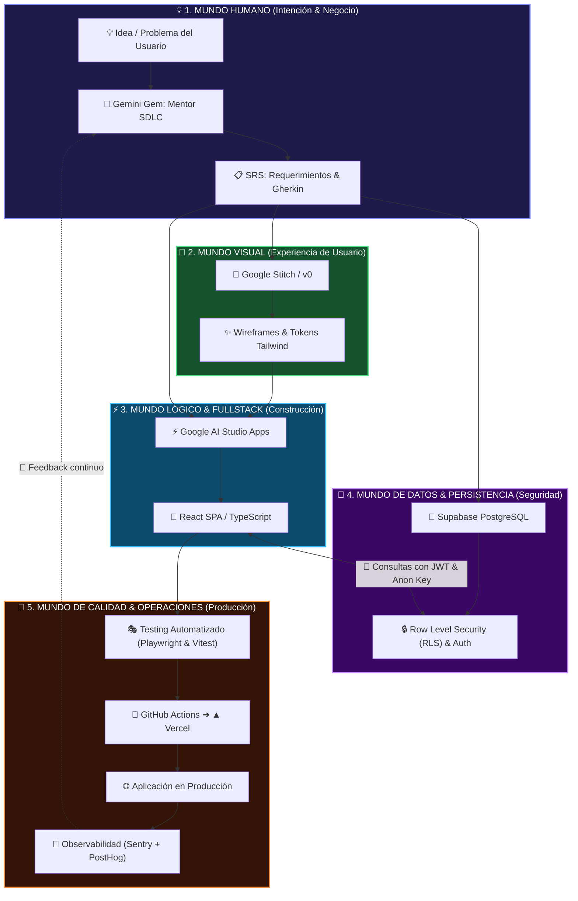
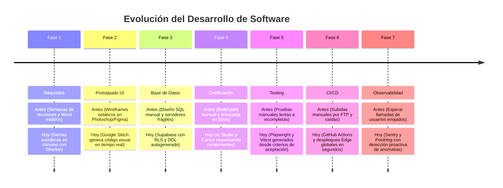

# 🌌 Visión Holística del Software y las 7 Fases del SDLC
## De la Idea a la Producción: Cómo la Inteligencia Artificial Transformó la Creación de Software

Para convertirse en un **Arquitecto y Desarrollador de Software Profesional**, es fundamental no ver el código como líneas aisladas, sino como parte de un **organismo vivo e interconectado**.

Esta guía proporciona la **visión macro y holística** del ciclo de vida del software, comparando el paradigma tradicional con la revolución de la **Ingeniería de Software Asistida por IA**.

---

## 🧭 1. El Macro-Cosmos Holístico del Software

Un sistema de software moderno no es un archivo suelto: es un ecosistema continuo donde cada fase alimenta y valida a la siguiente:

---

## ⚡ 2. Las 7 Fases del SDLC: El Gran Salto Evolutivo (Antes vs Hoy con IA)

---

## 📊 Matriz Comparativa Detallada: Las 7 Fases del SDLC

| Fase SDLC | 👴 Cómo se hacía ANTES (Flujo Tradicional) | 🚀 Cómo se hace HOY (Flujo Guiado con IA) | Impacto Holístico |
| :--- | :--- | :--- | :--- |
| **1. Requisitos & Planificación** | Documentos Word de 100 páginas ambiguos, desactualizados a los 3 días. Semanas de debate. | **Gemas de Gemini** que extraen requerimientos socráticamente, generando SRS formal, criterios Gherkin y diagramas C4 en minutos. | **Claridad Total:** No se escribe una sola línea de código sin entender el "por qué". |
| **2. Diseño UI/UX & Prototipos** | Diseñador pasaba semanas en Photoshop/Figma; los programadores tenían que "re-programar" el diseño desde cero. | **Google Stitch & v0** generan componentes interactivos en lenguaje natural con Tailwind CSS y accesibilidad Radix UI. | **Fidelidad Inmediata:** La interfaz nace lista para conectarse al código real. |
| **3. Arquitectura & Base de Datos** | Servidores dedicados difíciles de escalar, scripts SQL manuales y vulnerabilidades graves por falta de aislamiento. | **Supabase PostgreSQL** con Row Level Security (**RLS**), Auth integrado, llaves UUID y triggers automáticos. | **Seguridad por Diseño:** Cada usuario solo accede a sus propios datos a nivel de motor SQL. |
| **4. Desarrollo & Codificación** | Escribir cientos de líneas de código repetitivo (*boilerplate*), memorizar librerías y lidiar con errores de sintaxis. | **Google AI Studio + Cursor**: La IA genera la estructura reactiva, clientes de base de datos y tipado estricto con TypeScript. | **Velocidad y Foco:** El desarrollador se enfoca en resolver la lógica de negocio y la arquitectura. |
| **5. Testing & Aseguramiento de Calidad** | Pruebas manuales haciendo clics en la pantalla; el testing automatizado se omitía por "falta de tiempo". | **Playwright + Vitest** generados automáticamente a partir de los criterios Gherkin de la Fase 1. | **Confianza y Resiliencia:** Se valida todo el flujo de usuario en cada cambio sin esfuerzo manual. |
| **6. CI/CD & Despliegue en la Nube** | Subir archivos por FTP arrastrando carpetas a un servidor; caídas frecuentes del sistema en producción. | **GitHub Actions + Vercel / Cloudflare**: Pipeline que ejecuta tests y despliega a servidores globales en menos de 60 segundos. | **Despliegue Continuo:** Cero tiempo de inactividad (*Zero-Downtime*) y reversión instantánea. |
| **7. Observabilidad & Mantenimiento** | Revisar logs gigantescos en servidores cuando el cliente reportaba que el sistema falló. | **Sentry + PostHog**: Detección automática de errores en vivo con grabación de sesiones y análisis de causa raíz con IA. | **Evolución Proactiva:** Se corrigen fallos antes de que el usuario los note. |

---

## 🧠 3. Pensamiento Sistémico para el Aprendiz: La Regla de la Trazabilidad

Para pensar como un arquitecto senior, nunca veas una fase como un silo independiente:

> [!TIP]
> **Principio de Trazabilidad Total:**
> *"Cada componente en pantalla debe satisfacer un Requerimiento Funcional, guardar datos en una Tabla con RLS y estar cubierto por una Prueba Automatizada."*
