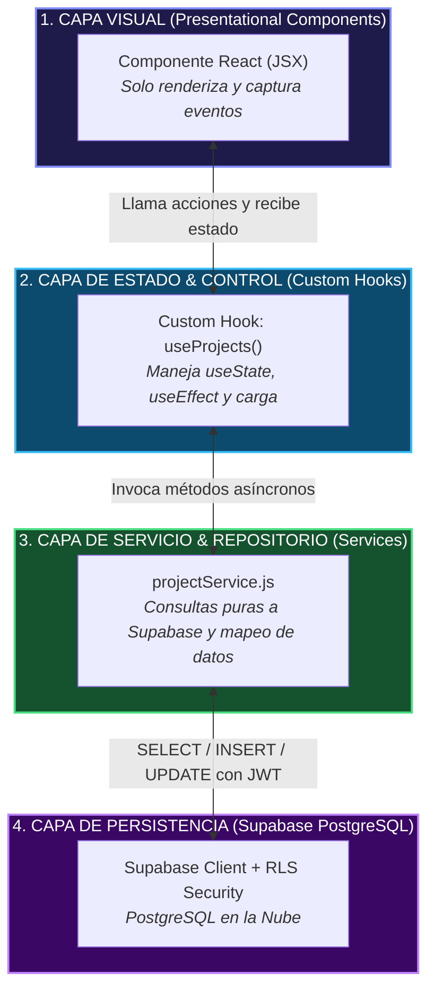
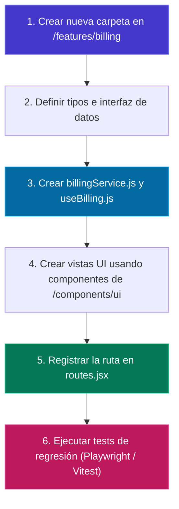
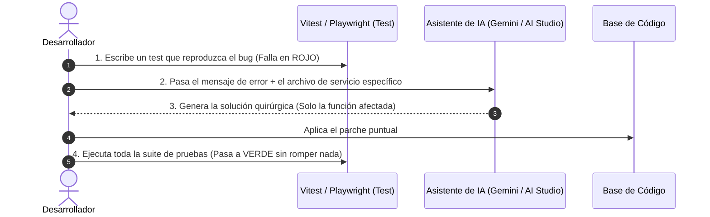

# 🏗️ Arquitectura Modular, Escalabilidad y Mantenimiento a Largo Plazo
## Cómo hacer que tu proyecto crezca sin romperse, evitar archivos gigantes y mantener la calidad

Un error común al construir software con IA es terminar con **"Archivos Monolíticos Monstruosos" (God Files)** de más de 800 líneas donde la lógica de la base de datos, la interfaz de usuario, la validación y el estado global están mezclados. Esto hace que cualquier cambio futuro rompa funcionalidades existentes.

Esta guía enseña cómo estructurar el proyecto de forma **altamente modular, escalable y mantenible**, aplicando patrones de diseño profesionales y manteniendo una base de datos de alta calidad en **Supabase**.

---

## 🏛️ 1. Arquitectura Basada en Features (Feature-Driven Structure)

En lugar de agrupar archivos por tipo técnico (`/components`, `/hooks`, `/pages`), organizamos el código por **Dominio de Negocio (Features)**. Cada módulo es autónomo e independiente:

```
src/
├── app/                      # Configuración global, Router y Providers
│   ├── App.jsx
│   ├── routes.jsx
│   └── main.jsx
├── assets/                   # Iconos, imágenes, fuentes globales
├── components/ui/            # Componentes atómicos reutilizables (Button, Modal, Input, Badge)
├── lib/                      # Configuración de clientes (Supabase, Sentry, Analytics)
│   └── supabaseClient.js
├── features/                 # MÓDULOS DE NEGOCIO AISLADOS
│   ├── auth/                 # Módulo de Autenticación
│   │   ├── components/       # LoginForm.jsx, RegisterModal.jsx
│   │   ├── hooks/            # useAuth.js
│   │   ├── services/         # authService.js
│   │   └── types/            # auth.types.ts
│   ├── projects/             # Módulo de Proyectos
│   │   ├── components/       # ProjectCard.jsx, ProjectList.jsx, ProjectFormModal.jsx
│   │   ├── hooks/            # useProjects.js
│   │   ├── services/         # projectService.js
│   │   └── types/            # project.types.ts
│   └── tasks/                # Módulo de Tareas (Kanban)
│       ├── components/       # KanbanBoard.jsx, TaskItem.jsx
│       ├── hooks/            # useTasks.js
│       └── services/         # taskService.js
└── types/                    # Tipos globales generados por Supabase CLI
```

> [!IMPORTANT]
> **La Regla de los 150 Líneas:**
> Ningún archivo debe superar las **150-200 líneas de código**. Si un componente crece más allá, se divide en subcomponentes atómicos (`ProjectCardHeader.jsx`, `ProjectCardStats.jsx`) o se extrae la lógica a un Custom Hook.

---

## 📐 2. Patrones de Diseño Esenciales para Frontend + Supabase



### Patrón 1: Service / Repository Pattern (Aislamiento de Supabase)
Nunca escribas `supabase.from(...)` dentro de un botón o vista JSX. Centralízalo en un archivo de servicio:

```javascript
// src/features/projects/services/projectService.js
import { supabase } from '../../../lib/supabaseClient';

export const projectService = {
  async getAll() {
    const { data, error } = await supabase
      .from('projects')
      .select('*, tasks(count)')
      .order('created_at', { ascending: false });

    if (error) throw new Error(`[projectService.getAll] ${error.message}`);
    return data;
  },

  async create(projectData, userId) {
    const { data, error } = await supabase
      .from('projects')
      .insert([{ ...projectData, owner_id: userId }])
      .select()
      .single();

    if (error) throw new Error(`[projectService.create] ${error.message}`);
    return data;
  },

  async delete(projectId) {
    const { error } = await supabase
      .from('projects')
      .delete()
      .eq('id', projectId);

    if (error) throw new Error(`[projectService.delete] ${error.message}`);
    return true;
  }
};
```

### Patrón 2: Custom Hook Pattern (Control de Estado y Ciclo de Vida)
El hook conecta el servicio con el estado local de React:

```javascript
// src/features/projects/hooks/useProjects.js
import { useState, useEffect, useCallback } from 'react';
import { projectService } from '../services/projectService';
import { useAuth } from '../../auth/hooks/useAuth';

export function useProjects() {
  const { user } = useAuth();
  const [projects, setProjects] = useState([]);
  const [loading, setLoading] = useState(true);
  const [error, setError] = useState(null);

  const fetchProjects = useCallback(async () => {
    if (!user) return;
    try {
      setLoading(true);
      setError(null);
      const data = await projectService.getAll();
      setProjects(data);
    } catch (err) {
      setError(err.message);
    } finally {
      setLoading(false);
    }
  }, [user]);

  useEffect(() => {
    fetchProjects();
  }, [fetchProjects]);

  const addProject = async (projectData) => {
    const newProject = await projectService.create(projectData, user.id);
    setProjects(prev => [newProject, ...prev]);
    return newProject;
  };

  return { projects, loading, error, refresh: fetchProjects, addProject };
}
```

---

## 🧩 3. Cómo Agregar Nuevos Módulos sin Romper lo Existente

Para añadir una nueva funcionalidad (ej. un módulo de **Facturación** o **Reportes**):



### Principio Abierto/Cerrado (OCP):
* **Abierto para extensión:** Puedes crear `/features/analytics` con sus propios componentes y hooks sin alterar `/features/projects`.
* **Cerrado para modificación:** No necesitas editar el código interno de los módulos existentes, solo importar el nuevo módulo en el enrutador (`routes.jsx`).

---

## 🐞 4. Protocolo de Corrección de Bugs con IA (Zero-Regression Workflow)

Cuando surja un fallo, no le pidas a la IA que reescriba todo el archivo. Sigue este protocolo quirúrgico de 4 pasos:



1. **Aislar el Bug:** Identifica en cuál de las 4 capas reside el problema (¿Es visual en el componente?, ¿Es de estado en el hook?, ¿Es de consulta en el servicio?, ¿O es una política RLS bloqueando en Supabase?).
2. **Reproducción Controlada:** Crea una prueba mínima o inspecciona la respuesta en la pestaña de red del navegador.
3. **Prompt Quirúrgico a la IA:**
   > *"Tengo este error en `projectService.js`: 'violates foreign key constraint'. Aquí está únicamente la función `create` y el esquema SQL. Corrige exclusivamente la función sin alterar los tipos ni los otros métodos."*
4. **Verificación de Regresión:** Ejecuta `npm test` para confirmar que las funcionalidades anteriores siguen operando al 100%.

---

## 🐘 5. Escalabilidad y Cero-Downtime en la Base de Datos (Supabase)

A medida que el proyecto crece de 1,000 a 1,000,000 de registros con una misma base de datos, aplica estas 4 reglas de calidad:

### 1. Migraciones Declarativas con Supabase CLI
Nunca hagas cambios manuales directos en producción. Utiliza el sistema de migraciones:
```bash
# Crear nueva migración versionada
npx supabase migration new add_billing_module

# Aplicar migraciones localmente y sincronizar con la nube
npx supabase db push
```

### 2. Índices Estratégicos en Llaves Foráneas y Filtros Frecuentes
En PostgreSQL, las llaves foráneas no se indexan automáticamente. Añade índices para consultas instantáneas:
```sql
-- Índices para acelerar búsquedas y filtros comunes
CREATE INDEX IF NOT EXISTS idx_projects_owner_id ON public.projects(owner_id);
CREATE INDEX IF NOT EXISTS idx_tasks_project_id ON public.tasks(project_id);
CREATE INDEX IF NOT EXISTS idx_tasks_status ON public.tasks(status);
```

### 3. Vistas y Funciones Almacenadas (RPCs) para Consultas Pesadas
Para reportes o cálculos que involucran múltiples tablas, traslada el procesamiento al motor SQL en lugar de saturar la memoria del navegador:
```sql
-- Función RPC en Supabase para obtener estadísticas en una sola llamada
CREATE OR REPLACE FUNCTION public.get_project_stats(p_project_id UUID)
RETURNS JSON AS $$
DECLARE
    result JSON;
BEGIN
    SELECT json_build_object(
        'total_tasks', COUNT(*),
        'completed_tasks', COUNT(*) FILTER (WHERE status = 'done'),
        'urgent_tasks', COUNT(*) FILTER (WHERE priority = 'urgent')
    ) INTO result
    FROM public.tasks
    WHERE project_id = p_project_id;

    RETURN result;
END;
$$ LANGUAGE plpgsql SECURITY DEFINER;
```

Desde tu frontend, invocas la función con una sola línea:
```javascript
const { data, error } = await supabase.rpc('get_project_stats', { p_project_id: projectId });
```

---

## 📋 Lista de Chequeo de Calidad y Escalabilidad para el Aprendiz

- [ ] ¿Los archivos tienen menos de 200 líneas?
- [ ] ¿La lógica de llamadas a Supabase está en `/services` y no dentro de los componentes JSX?
- [ ] ¿El estado de la vista se maneja mediante Custom Hooks en `/hooks`?
- [ ] ¿Cada tabla en Supabase tiene **Row Level Security (RLS)** activado?
- [ ] ¿Las llaves foráneas tienen índices `CREATE INDEX`?
- [ ] ¿Existe una suite de pruebas automáticas (`npm test`) que valide que los módulos anteriores no se rompieron?
- [ ] ¿Los tipos TypeScript están sincronizados con la base de datos mediante `supabase gen types`?
