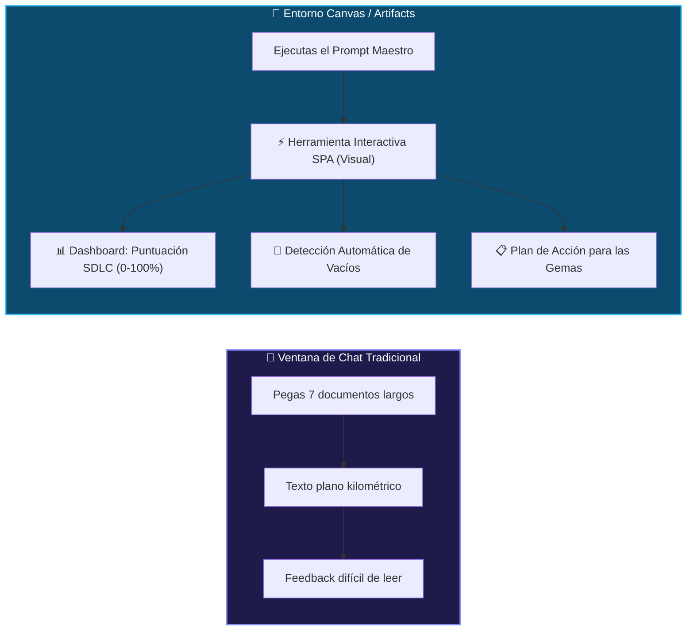
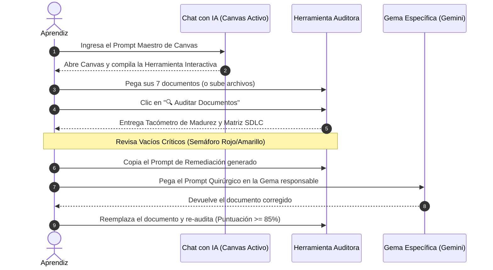

# 🎛️ Módulo 12: Creación de Herramienta en Canvas para Evaluación Integral de Documentación SDLC
## Cómo usar Canvas en tu chat de IA para auditar, puntuar y detectar vacíos en tus 7 artefactos antes de codificar

Al trabajar con Inteligencia Artificial generativa, el error más costoso es pasar directamente a la etapa de codificación (Google AI Studio, Cursor o v0) con documentación incompleta, ambigua o desarticulada. Cuando la documentación tiene vacíos, la IA "inventa" o "alucina" comportamientos, genera bases de datos inseguras sin aislamiento Row Level Security (RLS), olvida estados de error y produce código espagueti.

En este módulo aprenderás a **crear y desplegar una Herramienta Interactiva de Auditoría en Canvas** directamente desde tu ventana de chat (utilizando **ChatGPT Canvas**, **Claude Artifacts** o **Gemini**). Esta herramienta evaluará la calidad de toda la documentación generada por las Gemas, verificará que abarque el **Ciclo Completo de Vida del Desarrollo de Software (las 7 fases del SDLC)** y te indicará con precisión milimétrica **qué le hace falta a tu proyecto antes de escribir una sola línea de código**.

---

## 🧭 1. ¿Qué es Canvas en el Chat y por qué usarlo para evaluar?



### ¿Qué es Canvas?
**Canvas** (disponible en ChatGPT como modo Canvas, en Claude como Artifacts y en Google AI Studio como panel de prototipado rápido) es una interfaz de trabajo colaborativo que se abre en paralelo a tu chat. A diferencia de una respuesta de texto convencional, Canvas permite:
1. **Ejecutar aplicaciones interactivas en vivo:** La IA genera código (HTML5, Tailwind CSS y JavaScript) que se renderiza y funciona inmediatamente como una aplicación web completa en tu navegador.
2. **Edición quirúrgica lado a lado:** Puedes ajustar parámetros de auditoría, ponderaciones y reglas de negocio sin perder el hilo de la conversación.
3. **Persistencia de sesión:** Puedes volver a tu chat en cualquier momento, ingresar nuevos artefactos actualizados y reevaluar tu proyecto reactivamente.

---

## 📐 2. Las 7 Fases del SDLC evaluadas por la Herramienta

La herramienta audita que tus documentos cubran holísticamente el ciclo de vida del software, distribuyendo la puntuación en una escala de **0 a 100 puntos**:

| # | Fase del SDLC | Artefactos Evaluados | Qué verifica la Herramienta en tus Documentos | Peso |
| :-: | :--- | :--- | :--- | :-: |
| **1** | **Planificación & Requisitos** | `01_PLAN_PROYECTO.md`<br/>`02_PRD_PRODUCTO.md` | • Límites claros: In-Scope vs Out-of-Scope explícitos.<br/>• User Personas con problemas reales y metas.<br/>• Requerimientos Funcionales (RF) con escenarios **Gherkin BDD** (`Dado que... Cuando... Entonces...`). | **20%** |
| **2** | **Diseño UI/UX & Flujos** | `03_USER_FLOWS_UX.md`<br/>`06_PROMPTS_GOOGLE_STITCH.md` | • Catálogo de Pantallas (*Screen Inventory*) de 5 a 8 vistas.<br/>• Diagrama Mermaid de navegación.<br/>• **Obligatoriedad de los 4 Estados de UI** en cada pantalla (*Empty State*, *Loading Skeleton*, *Success Feedback*, *Error Alert & Retry*). | **20%** |
| **3** | **Arquitectura & Base de Datos** | `04_TRD_ARQUITECTURA_TECNICA.md`<br/>`05_ESQUEMA_SUPABASE_COMPLETO.sql` | • Diagrama ERD relacional con tipos de datos.<br/>• Claves primarias `UUID` (`gen_random_uuid()`).<br/>• **Row Level Security (RLS) habilitado al 100%**.<br/>• Políticas de aislamiento vinculadas a `auth.uid()` (`owner_id = auth.uid()`).<br/>• Triggers automáticos (`handle_updated_at`, `handle_new_user`). | **25%** |
| **4** | **Desarrollo Fullstack** | `07_PROMPT_MAESTRO_AISTUDIO.md` | • Estructura modular basada en Features.<br/>• Cliente Supabase singleton (`supabaseClient.js`).<br/>• Contratos de datos tipados y separación estricta entre capa UI, hooks y servicios. | **15%** |
| **5** | **Testing & Aseguramiento (QA)** | `02_PRD_PRODUCTO.md`<br/>`04_TRD_ARQUITECTURA_TECNICA.md` | • Casos de prueba derivados directamente de los escenarios Gherkin.<br/>• Estrategia de pruebas E2E (Playwright) y pruebas unitarias (Vitest). | **10%** |
| **6** | **Despliegue & CI/CD** | `01_PLAN_PROYECTO.md`<br/>`04_TRD_ARQUITECTURA_TECNICA.md` | • Matriz de variables de entorno (`SUPABASE_URL`, `SUPABASE_ANON_KEY`).<br/>• Prohibición absoluta de exponer la clave `service_role`.<br/>• Estrategia de despliegue continuo (Vercel / Supabase). | **5%** |
| **7** | **Mantenimiento & Observabilidad** | `04_TRD_ARQUITECTURA_TECNICA.md`<br/>`11_ARQUITECTURA_MODULAR.md` | • Monitoreo de errores con Sentry / logs estructurados.<br/>• Regla de oro de modularidad (componentes menores a 200 líneas).<br/>• Prevención de archivos monstruosos (*God Files*). | **5%** |

---

## ⚡ 3. El Prompt Maestro Completo para crear la Herramienta en Canvas

Copia y pega este prompt en tu chat con IA (asegurándote de que el modo **Canvas** o **Artifacts** esté activo). El modelo compilará inmediatamente la aplicación interactiva:

````markdown
# DIRECTIVA DE CREACIÓN: HERRAMIENTA AUDITORA INTERACTIVA SDLC EN CANVAS

Actúa como un **Arquitecto de Software Principal y Auditor de Calidad SDLC**. 
Crea en Canvas una **aplicación web interactiva completa (Single-Page Application)** en un solo bloque de código (HTML5 + Tailwind CSS CDN + JavaScript moderno Vanilla) que funcione como una **Consola de Auditoría y Evaluación Integral de Documentación SDLC**.

## PROPÓSITO DE LA HERRAMIENTA
La herramienta permitirá al aprendiz de software evaluar los 7 artefactos canónicos generados por la cadena de Gemas de Gemini:
1. `01_PLAN_PROYECTO.md`
2. `02_PRD_PRODUCTO.md`
3. `03_USER_FLOWS_UX.md`
4. `04_TRD_ARQUITECTURA_TECNICA.md`
5. `05_ESQUEMA_SUPABASE_COMPLETO.sql`
6. `06_PROMPTS_GOOGLE_STITCH.md`
7. `07_PROMPT_MAESTRO_AISTUDIO.md`

## REQUERIMIENTOS FUNCIONALES DE LA INTERFAZ (UI/UX)
1. **Encabezado y Métricas Globales:**
   - Título sobrio profesional: "Consola de Auditoría SDLC & Calidad Documental".
   - Tacómetro o barra de progreso circular interactiva con el **Índice de Madurez SDLC (0% a 100%)**.
   - Badge de estado dinámico:
     * 🔴 **Crítico (< 60%):** "Documentación Insuficiente - Riesgo de Alucinación Alto".
     * 🟡 **Aceptable (60% - 84%):** "MVP Viable con Vacíos Menores".
     * 🟢 **Listo para Producción (85% - 100%):** "Excelencia Arquitectónica - Listo para AI Studio".

2. **Panel de Carga y Selección de Artefactos:**
   - Pestañas o selector para los 7 artefactos canónicos.
   - Área de texto (`<textarea>`) donde el usuario pega el contenido de cada documento o un botón "Cargar Proyecto de Demostración" para ver el análisis de un proyecto real completo.
   - Botón destacado: "🔍 Auditar Documentación Completa".

3. **Matriz de Evaluación de las 7 Fases del SDLC:**
   - 7 tarjetas visuales que representan las 7 fases del SDLC:
     1. Requisitos & Alcance (Gherkin BDD, In-Scope vs Out-of-Scope).
     2. Diseño UI/UX (Inventario 5-8 vistas, 4 estados de pantalla obligatorios).
     3. Arquitectura & Base de Datos (UUIDs, RLS al 100%, Triggers, `auth.uid()`).
     4. Desarrollo Fullstack (Modularidad Feature-Driven, Supabase Singleton).
     5. Testing & QA (Casos Playwright derivados de Gherkin).
     6. Despliegue & CI/CD (Secrets, Vercel, Supabase Anon Key).
     7. Mantenimiento & Observabilidad (Sentry, límites de 200 líneas/archivo).
   - Cada fase debe mostrar: Puntuación obtenida, Lista de requisitos cumplidos (✅) y Lista de vacíos detectados (❌).

4. **Inspector de Vacíos Críticos (Debt & Gap Analysis):**
   - Resumen de alertas rojas prioritarias que impedirían el éxito en Google AI Studio (ej. "Falta habilitar RLS en tablas públicas", "No se definieron los 4 estados en la vista Dashboard", "Faltan criterios de aceptación Gherkin en RF-03").

5. **Generador de Prompts de Remediación para las Gemas:**
   - Por cada vacío detectado, un botón para copiar un prompt correctivo quirúrgico listo para pegar en la Gema correspondiente para solucionar la falla sin romper el resto del documento.

## REGLAS TÉCNICAS DEL MOTOR DE AUDITORÍA JS
El analizador en JavaScript debe inspeccionar los textos ingresados buscando patrones clave:
- En `01_PLAN`: Detectar palabras clave como "In-Scope", "Out-of-Scope", "Sprints", "MVP".
- En `02_PRD`: Detectar "User Persona", "Requerimiento Funcional" o "RF-", y la sintaxis Gherkin ("Dado que" / "Given", "Cuando" / "When", "Entonces" / "Then").
- En `03_USER_FLOWS`: Contar pantallas definidas (debe haber >= 5), diagramas "mermaid", y mención expresa de los 4 estados: "Empty State", "Loading" o "Skeleton", "Success" o "Toast", "Error".
- En `04_TRD` y `05_SQL`: Detectar "UUID", "gen_random_uuid()", "ENABLE ROW LEVEL SECURITY", "auth.uid()", "handle_updated_at". Penalizar fuertemente si no existe `ENABLE ROW LEVEL SECURITY`.
- En `06_STITCH` y `07_AISTUDIO`: Detectar referencias a estilos, variables `VITE_SUPABASE_URL`, `anon_key` y estructura modular.

Entrega el código completo, autocontenido y estilizado con Tailwind CSS (tema oscuro elegante `#0f172a`, acentos índigo y esmeralda).
````

---

## 💻 4. Código Fuente Autónomo de la Herramienta Evaluadora

Si deseas utilizar la herramienta de inmediato en tu navegador local o inspeccionar cómo está construida, aquí tienes el código completo en un único archivo autónomo:

```html
<!DOCTYPE html>
<html lang="es" class="dark">
<head>
  <meta charset="UTF-8" />
  <meta name="viewport" content="width=device-width, initial-scale=1.0" />
  <title>Auditor SDLC Canvas - Evaluación de Documentación</title>
  <script src="https://cdn.tailwindcss.com"></script>
  <link rel="preconnect" href="https://fonts.googleapis.com">
  <link href="https://fonts.googleapis.com/css2?family=Inter:wght@400;500;600;700;800&family=JetBrains+Mono:wght@400;600&display=swap" rel="stylesheet">
  <style>
    body { font-family: 'Inter', sans-serif; background-color: #0b0f19; color: #f1f5f9; }
    code, pre { font-family: 'JetBrains Mono', monospace; }
  </style>
</head>
<body class="min-h-screen p-4 md:p-8">

  <div class="max-w-7xl mx-auto space-y-6">
    <!-- Header -->
    <header class="flex flex-col md:flex-row items-start md:items-center justify-between bg-slate-900 border border-slate-800 p-6 rounded-2xl shadow-xl gap-4">
      <div>
        <div class="flex items-center gap-3">
          <span class="text-3xl">🎛️</span>
          <div>
            <h1 class="text-2xl font-extrabold tracking-tight text-white">Consola de Auditoría SDLC & Calidad Documental</h1>
            <p class="text-slate-400 text-sm">Evaluador estricto para los 7 artefactos de la cadena Gemini Gems ➔ Stitch ➔ Supabase ➔ AI Studio</p>
          </div>
        </div>
      </div>
      <div class="flex items-center gap-3">
        <button onclick="cargarDemo()" class="px-4 py-2 bg-slate-800 hover:bg-slate-700 text-slate-200 border border-slate-700 rounded-xl text-xs font-semibold transition">
          📄 Cargar Caso Demo
        </button>
        <button onclick="ejecutarAuditoria()" class="px-5 py-2.5 bg-indigo-600 hover:bg-indigo-500 text-white font-bold text-sm rounded-xl shadow-lg shadow-indigo-600/30 transition flex items-center gap-2">
          <span>🔍 Auditar Documentos</span>
        </button>
      </div>
    </header>

    <!-- KPI Summary Grid -->
    <div class="grid grid-cols-1 md:grid-cols-4 gap-4">
      <!-- Madurez Global -->
      <div class="bg-slate-900/90 border border-slate-800 p-5 rounded-2xl flex items-center gap-4">
        <div class="relative w-16 h-16 flex items-center justify-center">
          <svg class="w-full h-full transform -rotate-90" viewBox="0 0 36 36">
            <path class="text-slate-800" stroke-width="3.5" stroke="currentColor" fill="none" d="M18 2.0845 a 15.9155 15.9155 0 0 1 0 31.831 a 15.9155 15.9155 0 0 1 0 -31.831" />
            <path id="circle-progress" class="text-indigo-500 transition-all duration-700" stroke-dasharray="0, 100" stroke-width="3.5" stroke-linecap="round" stroke="currentColor" fill="none" d="M18 2.0845 a 15.9155 15.9155 0 0 1 0 31.831 a 15.9155 15.9155 0 0 1 0 -31.831" />
          </svg>
          <span id="score-text" class="absolute text-lg font-black text-white">0%</span>
        </div>
        <div>
          <span class="text-xs uppercase tracking-wider text-slate-400 font-semibold">Índice SDLC</span>
          <h3 id="verdict-title" class="text-base font-bold text-slate-300">Sin auditar</h3>
        </div>
      </div>

      <!-- Seguridad RLS -->
      <div class="bg-slate-900/90 border border-slate-800 p-5 rounded-2xl">
        <span class="text-xs uppercase tracking-wider text-slate-400 font-semibold">Seguridad Supabase RLS</span>
        <div class="flex items-center gap-2 mt-1">
          <span id="rls-badge" class="px-2.5 py-1 text-xs font-bold rounded-lg bg-slate-800 text-slate-400">Pendiente</span>
        </div>
        <p id="rls-desc" class="text-xs text-slate-400 mt-2">Aislamiento por usuario autenticado</p>
      </div>

      <!-- Cobertura UX -->
      <div class="bg-slate-900/90 border border-slate-800 p-5 rounded-2xl">
        <span class="text-xs uppercase tracking-wider text-slate-400 font-semibold">4 Estados de UI</span>
        <div class="flex items-center gap-2 mt-1">
          <span id="states-badge" class="px-2.5 py-1 text-xs font-bold rounded-lg bg-slate-800 text-slate-400">0/4 Detectados</span>
        </div>
        <p class="text-xs text-slate-400 mt-2">Empty, Skeleton, Toast, Error</p>
      </div>

      <!-- Gherkin BDD -->
      <div class="bg-slate-900/90 border border-slate-800 p-5 rounded-2xl">
        <span class="text-xs uppercase tracking-wider text-slate-400 font-semibold">Criterios BDD Gherkin</span>
        <div class="flex items-center gap-2 mt-1">
          <span id="bdd-badge" class="px-2.5 py-1 text-xs font-bold rounded-lg bg-slate-800 text-slate-400">Pendiente</span>
        </div>
        <p class="text-xs text-slate-400 mt-2">Dado que / Cuando / Entonces</p>
      </div>
    </div>

    <!-- Workspace: Selector de Documentos + Editor -->
    <div class="grid grid-cols-1 lg:grid-cols-12 gap-6">
      <!-- Selector de Artefactos -->
      <div class="lg:col-span-4 bg-slate-900 border border-slate-800 p-5 rounded-2xl space-y-3">
        <h2 class="text-sm font-bold uppercase tracking-wider text-slate-400">Artefactos del Proyecto</h2>
        <div class="space-y-1.5" id="artifact-buttons">
          <!-- Generado dinámicamente -->
        </div>
      </div>

      <!-- Editor de Entrada -->
      <div class="lg:col-span-8 bg-slate-900 border border-slate-800 p-5 rounded-2xl flex flex-col space-y-3">
        <div class="flex items-center justify-between">
          <div class="flex items-center gap-2">
            <span id="current-doc-icon" class="text-lg">📄</span>
            <h2 id="current-doc-title" class="text-sm font-bold text-white">01_PLAN_PROYECTO.md</h2>
          </div>
          <span id="current-doc-status" class="text-xs font-semibold px-2 py-0.5 rounded-full bg-slate-800 text-slate-400">Sin contenido</span>
        </div>
        <textarea id="doc-editor" rows="12" placeholder="Pega aquí el contenido Markdown o SQL generado por la Gema correspondiente..." class="w-full bg-slate-950 border border-slate-800 rounded-xl p-4 text-xs font-mono text-slate-300 focus:outline-none focus:border-indigo-500 transition resize-none"></textarea>
      </div>
    </div>

    <!-- Resultados: 7 Fases del SDLC -->
    <div class="bg-slate-900 border border-slate-800 p-6 rounded-2xl space-y-6">
      <div class="flex items-center justify-between border-b border-slate-800 pb-4">
        <div>
          <h2 class="text-lg font-bold text-white">Matriz de Evaluación: Las 7 Fases del SDLC</h2>
          <p class="text-slate-400 text-xs">Análisis cruzado de completitud, consistencia técnica y preparación para producción</p>
        </div>
        <span id="audited-count" class="text-xs font-mono text-slate-400">0 de 7 Fases Evaluadas</span>
      </div>

      <div id="sdlc-phases-grid" class="grid grid-cols-1 md:grid-cols-2 lg:grid-cols-3 gap-4">
        <!-- Renderizado dinámico de tarjetas SDLC -->
      </div>
    </div>

    <!-- Vacíos Críticos y Prompts de Remediación -->
    <div class="bg-slate-900 border border-slate-800 p-6 rounded-2xl space-y-4">
      <div class="flex items-center gap-2">
        <span class="text-xl">🚨</span>
        <h2 class="text-lg font-bold text-white">Plan de Acción & Remediación Quirúrgica</h2>
      </div>
      <p class="text-slate-400 text-xs">A continuación se listan las ausencias detectadas y el prompt exacto que debes enviar a tus Gemas para corregirlas:</p>
      
      <div id="remediation-container" class="space-y-3">
        <div class="p-4 bg-slate-950/60 border border-slate-800 rounded-xl text-slate-400 text-xs italic">
          Presiona "🔍 Auditar Documentos" para analizar la documentación y obtener los prompts de remediación.
        </div>
      </div>
    </div>
  </div>

  <script>
    // Datos de los 7 artefactos
    const ARTIFACTS = [
      { id: "plan", name: "01_PLAN_PROYECTO.md", icon: "🗓️", phase: "Requisitos & Alcance", content: "" },
      { id: "prd", name: "02_PRD_PRODUCTO.md", icon: "📋", phase: "Requisitos & BDD", content: "" },
      { id: "flows", name: "03_USER_FLOWS_UX.md", icon: "🔀", phase: "Diseño & UX", content: "" },
      { id: "trd", name: "04_TRD_ARQUITECTURA_TECNICA.md", icon: "🏗️", phase: "Arquitectura & Datos", content: "" },
      { id: "sql", name: "05_ESQUEMA_SUPABASE_COMPLETO.sql", icon: "🐘", phase: "Base de Datos & RLS", content: "" },
      { id: "stitch", name: "06_PROMPTS_GOOGLE_STITCH.md", icon: "🎨", phase: "Prototipado Visual", content: "" },
      { id: "aistudio", name: "07_PROMPT_MAESTRO_AISTUDIO.md", icon: "⚡", phase: "Desarrollo Fullstack", content: "" }
    ];

    let currentArtifactId = "plan";

    // Inicialización UI
    function init() {
      const container = document.getElementById("artifact-buttons");
      container.innerHTML = "";
      ARTIFACTS.forEach(art => {
        const btn = document.createElement("button");
        btn.className = `w-full text-left p-3 rounded-xl border transition flex items-center justify-between text-xs ${
          art.id === currentArtifactId ? "bg-indigo-950/40 border-indigo-500/50 text-indigo-200" : "bg-slate-950/60 border-slate-800/80 text-slate-400 hover:border-slate-700"
        }`;
        btn.id = `btn-${art.id}`;
        btn.onclick = () => selectArtifact(art.id);
        btn.innerHTML = `
          <div class="flex items-center gap-2">
            <span>${art.icon}</span>
            <span class="font-medium truncate">${art.name}</span>
          </div>
          <span id="dot-${art.id}" class="w-2 h-2 rounded-full bg-slate-700"></span>
        `;
        container.appendChild(btn);
      });

      const editor = document.getElementById("doc-editor");
      editor.addEventListener("input", (e) => {
        const art = ARTIFACTS.find(a => a.id === currentArtifactId);
        if (art) {
          art.content = e.target.value;
          updateArtifactStatus(art);
        }
      });
    }

    function selectArtifact(id) {
      currentArtifactId = id;
      const art = ARTIFACTS.find(a => a.id === id);
      document.getElementById("current-doc-title").innerText = art.name;
      document.getElementById("current-doc-icon").innerText = art.icon;
      document.getElementById("doc-editor").value = art.content || "";
      
      ARTIFACTS.forEach(a => {
        const b = document.getElementById(`btn-${a.id}`);
        if (b) {
          if (a.id === id) {
            b.className = "w-full text-left p-3 rounded-xl border transition flex items-center justify-between text-xs bg-indigo-950/40 border-indigo-500/50 text-indigo-200";
          } else {
            b.className = "w-full text-left p-3 rounded-xl border transition flex items-center justify-between text-xs bg-slate-950/60 border-slate-800/80 text-slate-400 hover:border-slate-700";
          }
        }
      });
      updateArtifactStatus(art);
    }

    function updateArtifactStatus(art) {
      const dot = document.getElementById(`dot-${art.id}`);
      const status = document.getElementById("current-doc-status");
      if (art.content.trim().length > 50) {
        dot.className = "w-2 h-2 rounded-full bg-emerald-500 shadow-sm shadow-emerald-500/50";
        if (art.id === currentArtifactId) {
          status.innerText = `${art.content.trim().split(/\\s+/).length} palabras`;
          status.className = "text-xs font-semibold px-2 py-0.5 rounded-full bg-emerald-950/60 text-emerald-400 border border-emerald-800/50";
        }
      } else {
        dot.className = "w-2 h-2 rounded-full bg-slate-700";
        if (art.id === currentArtifactId) {
          status.innerText = "Sin contenido";
          status.className = "text-xs font-semibold px-2 py-0.5 rounded-full bg-slate-800 text-slate-400";
        }
      }
    }

    // Motor de Auditoría
    function ejecutarAuditoria() {
      const plan = ARTIFACTS.find(a => a.id === "plan").content;
      const prd = ARTIFACTS.find(a => a.id === "prd").content;
      const flows = ARTIFACTS.find(a => a.id === "flows").content;
      const trd = ARTIFACTS.find(a => a.id === "trd").content;
      const sql = ARTIFACTS.find(a => a.id === "sql").content;
      const stitch = ARTIFACTS.find(a => a.id === "stitch").content;
      const aistudio = ARTIFACTS.find(a => a.id === "aistudio").content;

      const todoElTexto = `${plan} ${prd} ${flows} ${trd} ${sql} ${stitch} ${aistudio}`;

      // 1. Fase 1: Plan & Requisitos (Max: 20 pts)
      let scoreF1 = 0;
      let checksF1 = [];
      let gapsF1 = [];
      if (/in-scope/i.test(plan) && /out-of-scope/i.test(plan)) {
        scoreF1 += 7;
        checksF1.push("Límites de alcance explícitos (In-Scope vs Out-of-Scope).");
      } else {
        gapsF1.push("Falta delimitar qué está fuera del alcance (Out-of-Scope) en el Plan.");
      }
      if (/persona/i.test(prd) || /usuario/i.test(prd)) {
        scoreF1 += 5;
        checksF1.push("User Personas y roles identificados.");
      } else {
        gapsF1.push("No se definieron User Personas claras en el PRD.");
      }
      const bddMatch = /(dado que|given).*(cuando|when).*(entonces|then)/is.test(prd);
      if (bddMatch) {
        scoreF1 += 8;
        checksF1.push("Criterios de aceptación estructurados en BDD Gherkin.");
      } else {
        gapsF1.push("Faltan escenarios Gherkin (Dado que / Cuando / Entonces) en los Requerimientos Funcionales.");
      }

      // 2. Fase 2: Diseño UI/UX (Max: 20 pts)
      let scoreF2 = 0;
      let checksF2 = [];
      let gapsF2 = [];
      const mermaidMatch = /graph|flowchart/i.test(flows);
      if (mermaidMatch) {
        scoreF2 += 5;
        checksF2.push("Diagrama Mermaid de navegación de pantallas presente.");
      } else {
        gapsF2.push("Falta el diagrama Mermaid Flowchart de navegación en User Flows.");
      }

      // Conteo de los 4 estados
      const hasEmpty = /empty\s*state/i.test(flows);
      const hasSkeleton = /skeleton|loading/i.test(flows);
      const hasToast = /toast|success/i.test(flows);
      const hasError = /error|retry/i.test(flows);
      const statesCount = [hasEmpty, hasSkeleton, hasToast, hasError].filter(Boolean).length;
      scoreF2 += statesCount * 2.5; // Hasta 10 pts
      if (statesCount === 4) {
        checksF2.push("Los 4 estados de UI definidos (Empty, Skeleton, Success, Error).");
      } else {
        gapsF2.push(`Solo se definieron ${statesCount} de los 4 estados de pantalla obligatorios.`);
      }

      if (/stitch/i.test(stitch) || stitch.length > 100) {
        scoreF2 += 5;
        checksF2.push("Prompts visuales para Google Stitch estructurados.");
      } else {
        gapsF2.push("Faltan los prompts detallados de interfaz para Google Stitch.");
      }

      // 3. Fase 3: Arquitectura & Base de Datos (Max: 25 pts)
      let scoreF3 = 0;
      let checksF3 = [];
      let gapsF3 = [];
      const hasUUID = /gen_random_uuid\(\)|uuid/i.test(sql) || /uuid/i.test(trd);
      if (hasUUID) {
        scoreF3 += 5;
        checksF3.push("Claves primarias UUID implementadas para evitar enumeración.");
      } else {
        gapsF3.push("Se usan IDs autoincrementales en lugar de UUID v4 en la base de datos.");
      }

      const hasRLS = /enable\s+row\s+level\s+security/i.test(sql);
      const hasUid = /auth\.uid\(\)/i.test(sql);
      if (hasRLS && hasUid) {
        scoreF3 += 15;
        checksF3.push("Row Level Security (RLS) habilitado al 100% y vinculado a auth.uid().");
      } else if (hasRLS) {
        scoreF3 += 7;
        checksF3.push("RLS habilitado pero faltan políticas vinculadas a auth.uid().");
        gapsF3.push("Políticas RLS incompletas: falta vincular owner_id con auth.uid().");
      } else {
        gapsF3.push("CRÍTICO: No se detectó 'ALTER TABLE ... ENABLE ROW LEVEL SECURITY' en el script SQL.");
      }

      if (/handle_updated_at/i.test(sql) || /handle_new_user/i.test(sql)) {
        scoreF3 += 5;
        checksF3.push("Triggers automáticos PL/pgSQL para sincronización de perfiles o timestamps.");
      } else {
        gapsF3.push("Faltan triggers automáticos para updated_at o creación de perfil en auth.users.");
      }

      // 4. Fase 4: Desarrollo Fullstack (Max: 15 pts)
      let scoreF4 = 0;
      let checksF4 = [];
      let gapsF4 = [];
      if (/supabaseclient/i.test(aistudio) || /@supabase\/supabase-js/i.test(aistudio)) {
        scoreF4 += 8;
        checksF4.push("Cliente singleton Supabase desacoplado del frontend.");
      } else {
        gapsF4.push("No se especifica el cliente singleton de Supabase en el prompt de AI Studio.");
      }
      if (/features\//i.test(todoElTexto) || /modular/i.test(todoElTexto)) {
        scoreF4 += 7;
        checksF4.push("Arquitectura orientada a características (Feature-Driven).");
      } else {
        gapsF4.push("Riesgo de God File: No se especifica división por carpetas de dominio/features.");
      }

      // 5. Fase 5: Testing & QA (Max: 10 pts)
      let scoreF5 = 0;
      let checksF5 = [];
      let gapsF5 = [];
      if (/playwright/i.test(todoElTexto) || /vitest/i.test(todoElTexto) || /test/i.test(trd)) {
        scoreF5 += 10;
        checksF5.push("Estrategia de testing automatizado E2E/Unitario definida.");
      } else {
        scoreF5 += 4;
        gapsF5.push("Falta especificar pruebas automatizadas (Playwright/Vitest) para los flujos críticos.");
      }

      // 6. Fase 6: Despliegue & CI/CD (Max: 5 pts)
      let scoreF6 = 0;
      let checksF6 = [];
      let gapsF6 = [];
      if (/anon_key/i.test(todoElTexto) && !/service_role/i.test(aistudio)) {
        scoreF6 += 5;
        checksF6.push("Manejo seguro de variables de entorno (Anon Key exclusiva en cliente).");
      } else {
        gapsF6.push("Revisa las credenciales de entorno: NUNCA uses la service_role key en el frontend.");
      }

      // 7. Fase 7: Mantenimiento & Observabilidad (Max: 5 pts)
      let scoreF7 = 0;
      let checksF7 = [];
      let gapsF7 = [];
      if (/sentry/i.test(todoElTexto) || /posthog/i.test(todoElTexto) || /observab/i.test(todoElTexto)) {
        scoreF7 += 5;
        checksF7.push("Estrategia de observabilidad y captura de errores en producción contemplada.");
      } else {
        gapsF7.push("No se contempló observabilidad de errores (Sentry) ni telemetría básica.");
      }

      // Cálculo Total
      const totalScore = Math.min(100, Math.round(scoreF1 + scoreF2 + scoreF3 + scoreF4 + scoreF5 + scoreF6 + scoreF7));

      // Actualizar UI
      document.getElementById("score-text").innerText = `${totalScore}%`;
      const circle = document.getElementById("circle-progress");
      circle.setAttribute("stroke-dasharray", `${totalScore}, 100`);

      const vTitle = document.getElementById("verdict-title");
      if (totalScore >= 85) {
        vTitle.innerText = "Listo para Producción 🟢";
        vTitle.className = "text-base font-bold text-emerald-400";
        circle.setAttribute("class", "text-emerald-500 transition-all duration-700");
      } else if (totalScore >= 60) {
        vTitle.innerText = "MVP con Vacíos 🟡";
        vTitle.className = "text-base font-bold text-amber-400";
        circle.setAttribute("class", "text-amber-500 transition-all duration-700");
      } else {
        vTitle.innerText = "Crítico - Requiere Ajustes 🔴";
        vTitle.className = "text-base font-bold text-rose-400";
        circle.setAttribute("class", "text-rose-500 transition-all duration-700");
      }

      // Badges
      const rlsBadge = document.getElementById("rls-badge");
      if (hasRLS && hasUid) {
        rlsBadge.innerText = "100% Activo";
        rlsBadge.className = "px-2.5 py-1 text-xs font-bold rounded-lg bg-emerald-950/80 text-emerald-400 border border-emerald-800/50";
      } else {
        rlsBadge.innerText = "Vulnerable";
        rlsBadge.className = "px-2.5 py-1 text-xs font-bold rounded-lg bg-rose-950/80 text-rose-400 border border-rose-800/50";
      }

      const stBadge = document.getElementById("states-badge");
      stBadge.innerText = `${statesCount}/4 Detectados`;
      stBadge.className = statesCount === 4 ? "px-2.5 py-1 text-xs font-bold rounded-lg bg-emerald-950/80 text-emerald-400 border border-emerald-800/50" : "px-2.5 py-1 text-xs font-bold rounded-lg bg-amber-950/80 text-amber-400 border border-amber-800/50";

      const bddBadge = document.getElementById("bdd-badge");
      bddBadge.innerText = bddMatch ? "Gherkin BDD ✅" : "Ausente ❌";
      bddBadge.className = bddMatch ? "px-2.5 py-1 text-xs font-bold rounded-lg bg-emerald-950/80 text-emerald-400 border border-emerald-800/50" : "px-2.5 py-1 text-xs font-bold rounded-lg bg-rose-950/80 text-rose-400 border border-rose-800/50";

      // Renderizar Matriz SDLC
      const phases = [
        { name: "1. Requisitos & Plan", score: scoreF1, max: 20, checks: checksF1, gaps: gapsF1 },
        { name: "2. Diseño UI/UX & Flujos", score: scoreF2, max: 20, checks: checksF2, gaps: gapsF2 },
        { name: "3. Arquitectura & Base de Datos", score: scoreF3, max: 25, checks: checksF3, gaps: gapsF3 },
        { name: "4. Desarrollo Fullstack", score: scoreF4, max: 15, checks: checksF4, gaps: gapsF4 },
        { name: "5. Testing & QA", score: scoreF5, max: 10, checks: checksF5, gaps: gapsF5 },
        { name: "6. Despliegue & CI/CD", score: scoreF6, max: 5, checks: checksF6, gaps: gapsF6 },
        { name: "7. Mantenimiento & Ops", score: scoreF7, max: 5, checks: checksF7, gaps: gapsF7 }
      ];

      const phasesContainer = document.getElementById("sdlc-phases-grid");
      phasesContainer.innerHTML = "";
      phases.forEach(ph => {
        const pct = Math.round((ph.score / ph.max) * 100);
        const card = document.createElement("div");
        card.className = "bg-slate-950/60 border border-slate-800 p-4 rounded-xl space-y-3";
        card.innerHTML = `
          <div class="flex items-center justify-between">
            <h3 class="font-bold text-xs text-white">${ph.name}</h3>
            <span class="text-xs font-bold ${pct >= 80 ? 'text-emerald-400' : pct >= 50 ? 'text-amber-400' : 'text-rose-400'}">${ph.score}/${ph.max} pts</span>
          </div>
          <div class="w-full bg-slate-800 rounded-full h-1.5 overflow-hidden">
            <div class="h-1.5 rounded-full ${pct >= 80 ? 'bg-emerald-500' : pct >= 50 ? 'bg-amber-500' : 'bg-rose-500'}" style="width: ${pct}%"></div>
          </div>
          <ul class="text-[11px] space-y-1 text-slate-300">
            ${ph.checks.map(c => `<li class="flex items-start gap-1.5 text-emerald-400/90"><span class="text-emerald-400">✓</span><span>${c}</span></li>`).join('')}
            ${ph.gaps.map(g => `<li class="flex items-start gap-1.5 text-rose-400/90"><span class="text-rose-400">✕</span><span>${g}</span></li>`).join('')}
          </ul>
        `;
        phasesContainer.appendChild(card);
      });

      document.getElementById("audited-count").innerText = "7 de 7 Fases Evaluadas";

      // Renderizar Remedios y Prompts
      const allGaps = [
        ...gapsF1.map(g => ({ gap: g, gem: "01 — Arquitecto de Producto", doc: "01_PLAN_PROYECTO.md o 02_PRD_PRODUCTO.md" })),
        ...gapsF2.map(g => ({ gap: g, gem: "03 — Diseñador UI/UX", doc: "03_USER_FLOWS_UX.md o 06_STITCH.md" })),
        ...gapsF3.map(g => ({ gap: g, gem: "02 — Administrador de BD Supabase", doc: "05_ESQUEMA_SUPABASE_COMPLETO.sql" })),
        ...gapsF4.map(g => ({ gap: g, gem: "04 — Orquestador Fullstack", doc: "07_PROMPT_MAESTRO_AISTUDIO.md" })),
        ...gapsF5.map(g => ({ gap: g, gem: "01 — Arquitecto de Producto", doc: "02_PRD_PRODUCTO.md" }))
      ];

      const remContainer = document.getElementById("remediation-container");
      remContainer.innerHTML = "";

      if (allGaps.length === 0) {
        remContainer.innerHTML = `
          <div class="p-4 bg-emerald-950/40 border border-emerald-800/50 rounded-xl text-emerald-300 text-xs flex items-center gap-3">
            <span class="text-xl">🎉</span>
            <div>
              <strong>¡Documentación Impecable!</strong> Tu proyecto cubre el 100% de los requerimientos de arquitectura, datos y UX. Puedes proceder a compilar en Google AI Studio.
            </div>
          </div>
        `;
      } else {
        allGaps.forEach((item, index) => {
          const div = document.createElement("div");
          div.className = "p-4 bg-slate-950/70 border border-slate-800 rounded-xl space-y-2";
          
          const promptSugerido = `En el archivo [${item.doc}], ajusta ÚNICAMENTE la sección correspondiente para solucionar el siguiente vacío: "${item.gap}". Mantén el resto del documento exactamente igual y conserva el formato canónico.`;
          
          div.innerHTML = `
            <div class="flex items-center justify-between">
              <span class="text-xs font-bold text-rose-400">Vacío #${index + 1}: ${item.gap}</span>
              <span class="text-[10px] px-2 py-0.5 rounded bg-slate-800 text-slate-400">Dirigir a: ${item.gem}</span>
            </div>
            <div class="p-2.5 bg-slate-900 border border-slate-800 rounded-lg text-xs font-mono text-slate-300 flex items-center justify-between gap-3">
              <span class="truncate">${promptSugerido}</span>
              <button onclick="copiarTexto('${promptSugerido.replace(/'/g, "\\'")}')" class="px-3 py-1 bg-indigo-600 hover:bg-indigo-500 text-white rounded text-[10px] font-bold shrink-0">
                Copiar Prompt
              </button>
            </div>
          `;
          remContainer.appendChild(div);
        });
      }
    }

    function copiarTexto(txt) {
      navigator.clipboard.writeText(txt);
      alert("¡Prompt de remediación copiado al portapapeles!");
    }

    function cargarDemo() {
      ARTIFACTS[0].content = `# 🗓️ Plan HealthPulse Telemed\\n## In-Scope: Auth, Consultas, Dashboard 4 KPIs.\\n## Out-of-Scope: Pagos Stripe, Videollamada P2P.\\n## Sprints: Sprint 1 Docs, Sprint 2 BD, Sprint 3 App.`;
      ARTIFACTS[1].content = `# 📋 PRD HealthPulse\\n## Persona: Paciente y Médico.\\n## RF-01: Agendamiento.\\nDado que un paciente tiene sesión activa,\\nCuando selecciona fecha y hora,\\nEntonces el sistema reserva la cita y genera estado pendiente.`;
      ARTIFACTS[2].content = `# 🔀 User Flows HealthPulse\\nflowchart TD\\nLogin --> Dashboard\\nDashboard --> Agendar\\n## Pantallas con 4 Estados:\\n- Empty State: Sin citas previas.\\n- Loading Skeleton: Tarjetas parpadeantes.\\n- Success Toast: Cita confirmada.\\n- Error Retry: Fallo de conexión.`;
      ARTIFACTS[3].content = `# 🏗️ TRD HealthPulse\\nPostgreSQL 15 en Supabase. Llaves UUID. Testing con Playwright y Vitest. Observabilidad Sentry.`;
      ARTIFACTS[4].content = `-- 🐘 Supabase SQL\\nCREATE TABLE appointments (id UUID PRIMARY KEY DEFAULT gen_random_uuid(), patient_id UUID REFERENCES auth.users(id), status TEXT);\\nALTER TABLE appointments ENABLE ROW LEVEL SECURITY;\\nCREATE POLICY "Solo dueño" ON appointments FOR ALL USING (auth.uid() = patient_id);\\nCREATE TRIGGER handle_updated_at BEFORE UPDATE ON appointments FOR EACH ROW EXECUTE FUNCTION moddatetime();`;
      ARTIFACTS[5].content = `Google Stitch Prompts con tema Bento Grid dark mode y los 4 estados de pantalla.`;
      ARTIFACTS[6].content = `Google AI Studio Prompt: Single Page Application modular React 19, Supabase Client singleton con SUPABASE_ANON_KEY.`;
      
      selectArtifact("plan");
      ARTIFACTS.forEach(updateArtifactStatus);
      ejecutarAuditoria();
    }

    window.onload = init;
  </script>
</body>
</html>
```

---

## 🛠️ 5. Guía de Ejecución Paso a Paso para el Aprendiz

Sigue este procedimiento metódico para auditar tu proyecto:



### Paso 1: Activar Canvas en tu Asistente
- **En ChatGPT:** Asegúrate de seleccionar el modelo GPT-4o con Canvas habilitado (icono de lápiz/ventana).
- **En Claude:** Los Artifacts se generan automáticamente al solicitar una aplicación interactiva en código.
- **En Google AI Studio:** Puedes crear una App rápida o utilizar el entorno web local abriendo el archivo HTML anterior.

### Paso 2: Ejecutar el Prompt Maestro
Pega el prompt de la **Sección 3**. El asistente generará el código y lo ejecutará en el panel lateral. Verás aparecer inmediatamente la consola interactiva.

### Paso 3: Pegar la Documentación de tus Gemas
Selecciona cada uno de los 7 artefactos en el menú lateral e introduce el contenido que generaste previamente:
1. `01_PLAN_PROYECTO.md`
2. `02_PRD_PRODUCTO.md`
3. `03_USER_FLOWS_UX.md`
4. `04_TRD_ARQUITECTURA_TECNICA.md`
5. `05_ESQUEMA_SUPABASE_COMPLETO.sql`
6. `06_PROMPTS_GOOGLE_STITCH.md`
7. `07_PROMPT_MAESTRO_AISTUDIO.md`

### Paso 4: Interpretar los Resultados
- **Si obtienes 85% o más (Verde):** Tu proyecto cuenta con el rigor técnico, aislamiento de seguridad y trazabilidad requeridos para compilar con éxito en **Google AI Studio** sin alucinaciones.
- **Si obtienes entre 60% y 84% (Amarillo):** Tienes un MVP viable, pero faltan aspectos críticos como la definición de errores o políticas de actualización.
- **Si obtienes menos de 60% (Rojo):** No intentes compilar todavía en AI Studio; la IA alucinará el modelo de datos y fallará en la conexión con Supabase.

### Paso 5: Corregir mediante Parches Quirúrgicos
Dirígete a la sección inferior de **Plan de Acción & Remediación**. Haz clic en **"Copiar Prompt"** para cada vacío detectado y pégalo directamente en la Gema correspondiente. La Gema parchará exactamente la sección faltante sin reiniciar todo el documento.

---

## 🎯 Resumen de Aprendizaje del Módulo
* **Canvas como herramienta operativa:** Permite convertir requerimientos pasivos en una aplicación interactiva de control de calidad en tiempo real.
* **Trazabilidad 360°:** Ninguna aplicación debe programarse si no cuenta con sus 7 artefactos validados frente a las 7 fases del SDLC.
* **Cero Alucinaciones:** Al corregir los vacíos antes de abrir Google AI Studio, garantizas que el código resultante sea seguro, escalable y libre de errores de arquitectura.
