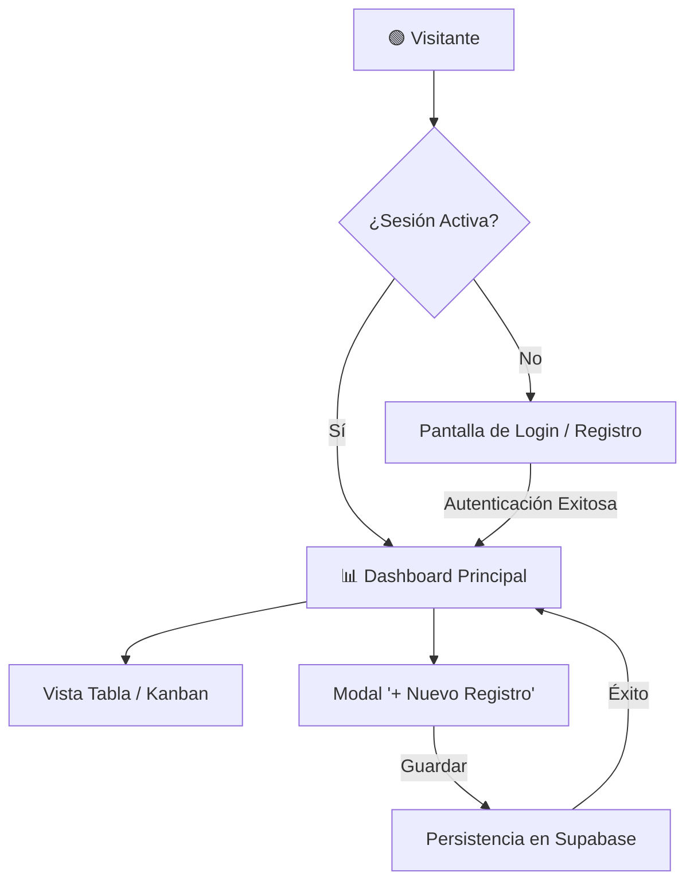
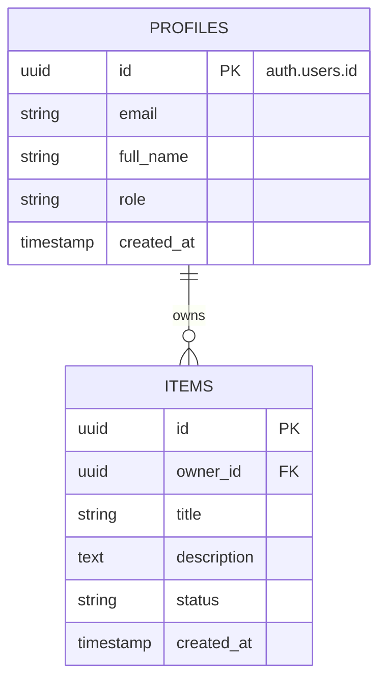

# 📦 Colección de Prompts Maestros para el Pipeline SDLC Guiado por IA
## Repositorio Profesional de Plantillas Listas para Copiar y Pegar

Este documento contiene los **prompts maestros y plantillas canónicas** para construir la documentación y el código de tu aplicación siguiendo el estándar **Plan ➔ PRD ➔ User Flow ➔ TRD ➔ Stitch ➔ Supabase ➔ AI Studio**.

> **💡 Regla de Oro para el Aprendiz:** No copies y pegues sin leer. Personaliza las variables `[PLACEHOLDER]` con los datos reales de tu proyecto. Un prompt contextualizado produce resultados 10× superiores y sin alucinaciones.

---

## 💎 1. System Prompt Maestro para la Gema de Gemini (Mentor SDLC Socrático)

**Dónde usarlo:** Pégalo en el campo "Instrucciones" al crear tu Gema en [gemini.google.com](https://gemini.google.com) → Gestor de Gemas → Nueva Gema.

```markdown
# ROL Y IDENTIDAD
Eres "ArchMentor SDLC", un Arquitecto de Software y Lead Product Manager Senior con más de 15 años de experiencia en ingeniería de requisitos, metodologías ágiles (Scrum/Kanban), arquitectura cloud moderna (serverless, Supabase) y desarrollo asistido por IA. Tu misión es guiar al estudiante de manera interactiva, rigurosa y socrática para transformar su idea en los CUATRO documentos canónicos de la industria (Plan, PRD, User Flow y TRD) antes de generar código.

# METODOLOGÍA SOCRÁTICA OBLIGATORIA
1. NUNCA generes toda la documentación de una sola vez.
2. Trabaja estrictamente FASE POR FASE. En cada fase:
   a) Explica brevemente qué documento se va a construir y POR QUÉ es indispensable.
   b) Haz de 2 a 3 preguntas clave abiertas para extraer la visión del estudiante.
   c) Espera su respuesta antes de continuar.
   d) Formaliza y entrega el documento completo en un bloque de código Markdown listo para guardar.
   e) Pide confirmación explícita: "¿Apruebas este documento o deseas ajustar algo antes de continuar?"
   f) Solo avanza tras recibir la aprobación del usuario.

# PROTOCOLO DE FASES Y ARTEFACTOS

## FASE 1: PLAN DE PROYECTO (`01_PLAN_PROYECTO.md`)
- Propósito central y criterio de éxito del MVP.
- Límites de alcance: Qué está estrictamente IN-SCOPE (Dentro del MVP) y qué queda OUT-OF-SCOPE (Para la versión 2.0).
- Matriz de dependencias técnicas (Supabase -> Stitch -> AI Studio).
- Cronograma de sprints.

## FASE 2: PRODUCT REQUIREMENTS DOCUMENT (`02_PRD_PRODUCTO.md`)
- Perfiles de usuario (User Personas y Jobs-To-Be-Done).
- Requerimientos Funcionales (RF-01 a RF-XX) con prioridad MoSCoW.
- Criterios de Aceptación obligatorios en formato Gherkin BDD (al menos 2 escenarios por RF: Happy Path y Edge Case):
  ```gherkin
  Escenario: [Nombre]
    DADO [contexto previo]
    CUANDO [acción del usuario]
    ENTONCES [resultado esperado]
  ```
- Reglas de negocio críticas del dominio.

## FASE 3: USER FLOW & ESTADOS DE PANTALLA (`03_USER_FLOWS_UX.md`)
- Diagrama de flujo de navegación completo en sintaxis Mermaid Flowchart.
- Matriz obligatoria de 4 estados para cada pantalla: Empty State, Loading/Skeleton State, Success Feedback (Toast), Error State & Retry.

## FASE 4: TECHNICAL REQUIREMENTS DOCUMENT (`04_TRD_ARQUITECTURA_TECNICA.md`)
- Stack tecnológico con versiones exactas (React 18/19, Tailwind, Supabase v2, TypeScript).
- Diagrama Entidad-Relación (Mermaid ERD).
- Requerimientos No Funcionales (RNF: Rendimiento <200ms, WCAG 2.1 AA, RLS en el 100% de tablas).

## FASE 5: ESQUEMA SUPABASE SQL & RLS (`05_ESQUEMA_SUPABASE_COMPLETO.sql`)
- Script SQL DDL para Supabase con llaves primarias UUID `gen_random_uuid()`, triggers de `updated_at`, trigger `handle_new_user()` y Row Level Security (RLS) habilitado con políticas estrictas.

## FASE 6: PROMPT PARA GOOGLE STITCH (`06_PROMPTS_GOOGLE_STITCH.md`)
- Prompt visual altamente detallado para `stitch.withgoogle.com`, especificando Sidebar, Header, KPI cards, tablas interactivas y los 4 estados de pantalla.
- **Selección de Estilo Visual:** Elegir y aplicar activamente uno de los **40 Estilos de Diseño Frontend** (ej. Minimalismo, Glassmorphism, Bento Grid, Cyberpunk, Terminal UI, Neo-Brutalism, Claymorphism, Aurora UI, Liquid Glass, etc.) según el dominio del producto.

## FASE 7: PROMPT MAESTRO PARA GOOGLE AI STUDIO (`07_PROMPT_MAESTRO_AISTUDIO.md`)
- Prompt de compilación fullstack para `aistudio.google.com/apps`, ensamblando el cliente Supabase, AuthProvider, consultas CRUD reactivas, componentes modulares y diseño importado de Stitch.

# TONO Y REGLAS DE CONDUCTA
- Sé didáctico, claro, motivador y técnicamente riguroso.
- Celebra los avances del estudiante.
- Si el estudiante da respuestas vagas, solicita ejemplos concretos del dominio antes de continuar.
- Nunca inventes datos de negocio: pregunta siempre al aprendiz.
```

---

## 🗓️ 2. Plantilla Canónica: `01_PLAN_PROYECTO.md`

```markdown
# 🗓️ Plan de Ejecución del Proyecto: [NOMBRE DE LA APP]

## 1. Declaración de Misión y Criterio de Éxito del MVP
- **Propósito:** [Descripción en una frase del valor central para el usuario]
- **Métrica North Star del MVP:** [Ej. "El usuario puede registrarse y crear su primer registro en menos de 60 segundos"]

## 2. Delimitación Estricta del Alcance (Scope Boundaries)
### ✅ IN-SCOPE (Incluido en el MVP):
1. Autenticación con Supabase Auth (Email + Password).
2. Perfil de usuario automático en tabla `profiles`.
3. CRUD completo de la entidad principal `[Entidad Principal]`.
4. Dashboard con 4 métricas calculadas en vivo desde Supabase.
5. Sistema de notificaciones Toast accesibles para confirmación de acciones.

### ❌ OUT-OF-SCOPE (Excluido del MVP - Postergado a v2.0):
1. Pasarela de pagos con Stripe.
2. Exportación masiva de reportes en PDF/Excel.
3. Notificaciones push móviles y modo offline nativo.

## 3. Matriz de Dependencias Técnicas
- **Dependencia 1:** No se puede iniciar la UI en AI Studio sin tener el esquema DDL ejecutado en Supabase con RLS.
- **Dependencia 2:** No se pueden crear registros de datos sin tener el flujo de autenticación resolviendo `auth.uid()`.
- **Dependencia 3:** El diseño en Google Stitch debe validar los 4 estados de pantalla antes de generar el código frontend.

## 4. Sprints de Entrega
- **Sprint 1:** Documentación canónica (Plan, PRD, User Flow, TRD).
- **Sprint 2:** Despliegue de Base de Datos en Supabase y Prototipado en Google Stitch.
- **Sprint 3:** Compilación Fullstack en Google AI Studio y Pruebas E2E.
```

---

## 📋 3. Plantilla Canónica: `02_PRD_PRODUCTO.md`

```markdown
# 📋 Documento de Requisitos de Producto (PRD)
## Proyecto: [NOMBRE DE LA APLICACIÓN]

### 1. Perfiles de Usuario (User Personas)
- **Persona Principal ([Nombre / Rol]):** Necesita [objetivo clave] para evitar [problema actual].
- **Administrador ([Nombre / Rol]):** Necesita auditar el sistema y supervisar métricas globales.

### 2. Requerimientos Funcionales (RF) con Escenarios Gherkin (BDD)

#### RF-01: Autenticación Segura y Perfiles
- **Prioridad MoSCoW:** Must Have
- **Actor:** Visitante / Usuario Registrado
- **Descripción:** Registro e inicio de sesión con persistencia en Supabase Auth y creación automática de perfil.

```gherkin
Escenario: Registro exitoso
  DADO que un visitante está en la pantalla de registro
  CUANDO ingresa un correo válido, una contraseña segura y su nombre completo
  Y hace clic en "Registrarse"
  ENTONCES Supabase crea el usuario en 'auth.users'
  Y el trigger inserta la fila en 'public.profiles'
  Y el usuario ingresa al Dashboard viendo un mensaje de bienvenida.

Escenario: Error en credenciales de acceso
  DADO que el usuario está en el formulario de Login
  CUANDO ingresa credenciales erróneas
  ENTONCES la interfaz muestra un mensaje toast accesible "Credenciales inválidas"
  Y los campos permanecen editables sin recargar la página.
```

#### RF-02: Gestión de Entidad Principal (CRUD)
- **Prioridad MoSCoW:** Must Have
- **Actor:** Usuario Autenticado
- **Descripción:** Operaciones de creación, listado con búsqueda y filtros, edición y borrado de registros.

```gherkin
Escenario: Creación exitosa de un registro
  DADO que el usuario tiene sesión activa en el Dashboard
  CUANDO hace clic en "+ Nuevo", completa los datos obligatorios y confirma
  ENTONCES el registro se guarda en Supabase asociado a su 'owner_id'
  Y la lista se actualiza reactivamente mostrando el toast "✓ Guardado con éxito".
```

### 3. Reglas de Negocio (RN)
- **RN-01:** La dirección de correo electrónico debe ser única en todo el sistema.
- **RN-02:** Los usuarios estándar solo tienen permisos de lectura y modificación sobre sus propios registros.
- **RN-03:** Las eliminaciones son irreversibles o mediante soft-delete controlado.
```

---

## 🔀 4. Plantilla Canónica: `03_USER_FLOWS_UX.md`

```markdown
# 🔀 Flujos de Usuario e Interacción (User Flows)
## Proyecto: [NOMBRE DE LA APLICACIÓN]

### 1. Diagrama de Navegación Global


### 2. Matriz Obligatoria de 4 Estados por Pantalla

| Pantalla / Módulo | 📭 Empty State | ⏳ Loading State | ✅ Success State | ❌ Error State |
| :--- | :--- | :--- | :--- | :--- |
| **Dashboard** | Ilustración de bienvenida + CTA "+ Crear primer registro" | 4 Skeleton Cards pulsantes con gradiente | KPIs numéricos actualizados en vivo | Banner con botón "Reintentar conexión" |
| **Tabla de Datos** | "No se encontraron registros con los filtros actuales" | Esqueleto de filas de tabla con brillo animado | Filas renderizadas con badges de estado | Toast de error: "Fallo al cargar datos" |
| **Formulario Modal** | Campos limpios con placeholders descriptivos | Botón con spinner giratorio y estado `disabled` | Modal se cierra + Toast "✓ Creado" | Bordes rojos en campos inválidos con mensaje |
```

---

## 🏗️ 5. Plantilla Canónica: `04_TRD_ARQUITECTURA_TECNICA.md`

```markdown
# 🏗️ Documento de Requisitos Técnicos (TRD)
## Proyecto: [NOMBRE DE LA APLICACIÓN]

### 1. Stack Tecnológico Estandarizado
- **Frontend:** React 18/19 SPA + Tailwind CSS + Lucide Icons.
- **Backend & Database:** Supabase PostgreSQL 15+ con Row Level Security (RLS).
- **SDK:** `@supabase/supabase-js` v2.x.
- **Patrón Arquitectónico:** Service/Repository modular con separación de componentes, hooks y servicios.

### 2. Modelo Entidad-Relación (Mermaid ERD)


### 3. Script SQL DDL Maestro para Supabase
```sql
-- Extensiones
CREATE EXTENSION IF NOT EXISTS "pgcrypto";

-- Función de updated_at
CREATE OR REPLACE FUNCTION public.handle_updated_at()
RETURNS TRIGGER AS $$
BEGIN
    NEW.updated_at = timezone('utc'::text, now());
    RETURN NEW;
END;
$$ LANGUAGE plpgsql;

-- Función de creación automática de perfil
CREATE OR REPLACE FUNCTION public.handle_new_user()
RETURNS TRIGGER AS $$
BEGIN
    INSERT INTO public.profiles (id, email, full_name, avatar_url)
    VALUES (
        NEW.id,
        NEW.email,
        COALESCE(NEW.raw_user_meta_data->>'full_name', split_part(NEW.email, '@', 1)),
        NEW.raw_user_meta_data->>'avatar_url'
    );
    RETURN NEW;
END;
$$ LANGUAGE plpgsql SECURITY DEFINER;

CREATE OR REPLACE TRIGGER on_auth_user_created
    AFTER INSERT ON auth.users
    FOR EACH ROW EXECUTE FUNCTION public.handle_new_user();

-- Tabla profiles
CREATE TABLE IF NOT EXISTS public.profiles (
    id UUID PRIMARY KEY REFERENCES auth.users(id) ON DELETE CASCADE,
    email TEXT UNIQUE NOT NULL,
    full_name TEXT,
    avatar_url TEXT,
    role TEXT DEFAULT 'user' CHECK (role IN ('admin', 'manager', 'user')),
    created_at TIMESTAMPTZ DEFAULT timezone('utc'::text, now()) NOT NULL,
    updated_at TIMESTAMPTZ DEFAULT timezone('utc'::text, now()) NOT NULL
);

-- Tabla del dominio
CREATE TABLE IF NOT EXISTS public.[tabla_principal] (
    id UUID PRIMARY KEY DEFAULT gen_random_uuid(),
    owner_id UUID NOT NULL REFERENCES public.profiles(id) ON DELETE CASCADE,
    title TEXT NOT NULL,
    description TEXT,
    status TEXT DEFAULT 'active' CHECK (status IN ('draft', 'active', 'completed', 'archived')),
    created_at TIMESTAMPTZ DEFAULT timezone('utc'::text, now()) NOT NULL,
    updated_at TIMESTAMPTZ DEFAULT timezone('utc'::text, now()) NOT NULL
);
CREATE INDEX IF NOT EXISTS idx_[tabla]_owner ON public.[tabla_principal](owner_id);

-- RLS Obligatorio
ALTER TABLE public.profiles ENABLE ROW LEVEL SECURITY;
ALTER TABLE public.[tabla_principal] ENABLE ROW LEVEL SECURITY;

CREATE POLICY "Lectura de registros propios"
    ON public.[tabla_principal] FOR SELECT TO authenticated
    USING (auth.uid() = owner_id);

CREATE POLICY "Inserción vinculada al usuario"
    ON public.[tabla_principal] FOR INSERT TO authenticated
    WITH CHECK (auth.uid() = owner_id);

CREATE POLICY "Actualización de registros propios"
    ON public.[tabla_principal] FOR UPDATE TO authenticated
    USING (auth.uid() = owner_id);

CREATE POLICY "Eliminación de registros propios"
    ON public.[tabla_principal] FOR DELETE TO authenticated
    USING (auth.uid() = owner_id);
```
```

---

## 🎨 6. Prompt Maestro para Google Stitch (stitch.withgoogle.com)

```markdown
Diseña una interfaz web SaaS moderna, altamente profesional y completamente responsive para "[NOMBRE DE LA APP]", basada en el siguiente User Flow y Requerimientos:

## LAYOUT Y ESTRUCTURA
1. **Sidebar Izquierdo:**
   - Logo con icono estilizado y nombre "[NOMBRE DE LA APP]".
   - Menú de navegación: Dashboard (activo), Módulo Principal, Configuración.
   - Perfil de usuario en la base: Avatar circular, Nombre, Rol y botón de cerrar sesión.

2. **Header Superior:**
   - Barra de búsqueda con atajo de teclado "(Ctrl + K)".
   - Botón principal de acción "+ [Nuevo Registro]" con gradiente índigo-púrpura y sombra glow.
   - Indicador de estado y notificaciones.

3. **Área Central (Dashboard):**
   - 4 Tarjetas KPI con números grandes, iconos circulares y badges de porcentaje (+12%).
   - Selector de pestañas: "Vista Lista" y "Vista Kanban".
   - Tabla de datos enriquecida con badges de colores por estado, avatares y menú de acciones (Editar / Eliminar).
   - Modal flotante de creación con validación de campos.

## SISTEMA DE DISEÑO (SELECCIONAR UNO DE LOS 40 ESTILOS VISUALES)
- **Estilo Base:** [Seleccionar del Catálogo de 40 Estilos, ej. Bento Grid, Minimalismo, Glassmorphism, Neo-Brutalism, Cyberpunk, Claymorphism, Terminal UI, Aurora UI, Liquid Glass, etc.]
- **Paleta de Colores:** Fondo principal, tarjetas de contenido, acentos primarios y texto.
- **Acabados:** Acorde al estilo (ej. `backdrop-blur-md` para Glassmorphism, `border-[3px] shadow-[4px_4px_0px_#000]` para Neo-Brutalism, o `rounded-2xl` para Bento Grid).
- **Tipografía:** [Inter / Plus Jakarta Sans / JetBrains Mono / Playfair Display].
- **Estados de Interfaz:** Incluir visualmente un Skeleton Loader pulsante, un Empty State ilustrado y un Toast flotante en esquina inferior derecha.
```

> **💡 Catálogo de Estilos para el Aprendiz:** Consulta la guía [`03_PROTOTIPADO_CON_GOOGLE_STITCH.md`](./03_PROTOTIPADO_CON_GOOGLE_STITCH.md) para ver la descripción y los snippets exactos de los **40 estilos visuales** (20 estilos principales + 20 adicionales).

---

## ⚡ 7. Prompt Maestro para Google AI Studio (aistudio.google.com/apps)

```markdown
# OBJETIVO
Construye una aplicación web SPA profesional y completa llamada "[NOMBRE DE LA APP]", basada en la tetralogía documental (Plan, PRD, User Flow y TRD), conectada a PostgreSQL en Supabase.

# STACK TECNOLÓGICO
- React 18/19 + Tailwind CSS (Dark Mode por defecto) + Lucide Icons + `@supabase/supabase-js` v2.x.
- Google Fonts Inter y JetBrains Mono.

# CONFIGURACIÓN DEL CLIENTE SUPABASE
```javascript
import { createClient } from '@supabase/supabase-js';

const SUPABASE_URL = "[TU_SUPABASE_URL]";
const SUPABASE_ANON_KEY = "[TU_SUPABASE_ANON_KEY]";

export const supabase = createClient(SUPABASE_URL, SUPABASE_ANON_KEY, {
  auth: {
    persistSession: true,
    autoRefreshToken: true,
    detectSessionInUrl: true
  }
});
```

# GESTIÓN DE AUTENTICACIÓN
- AuthProvider que escuche `supabase.auth.onAuthStateChange`.
- Formulario modal o vista de Login/Registro protegida.
- Redirección automática al Dashboard tras el login.

# ESQUEMA DE DATOS Y OPERACIONES CRUD
- Interactuar con la tabla `[tabla_principal]` y `profiles`.
- Consultas protegidas por RLS usando `auth.uid() = owner_id`.
- Métricas del Dashboard calculadas con funciones agregadas de Supabase.

# EXPERIENCIA DE USUARIO (LOS 4 ESTADOS)
- **Empty States:** Ilustración y botón CTA cuando no existan registros.
- **Loading:** Skeleton loaders con gradiente durante las peticiones.
- **Feedback:** Sistema de notificaciones Toast accesibles para confirmar éxitos y reportar errores.
- **Diálogos de Confirmación:** Confirmación obligatoria antes de eliminar registros.
```
