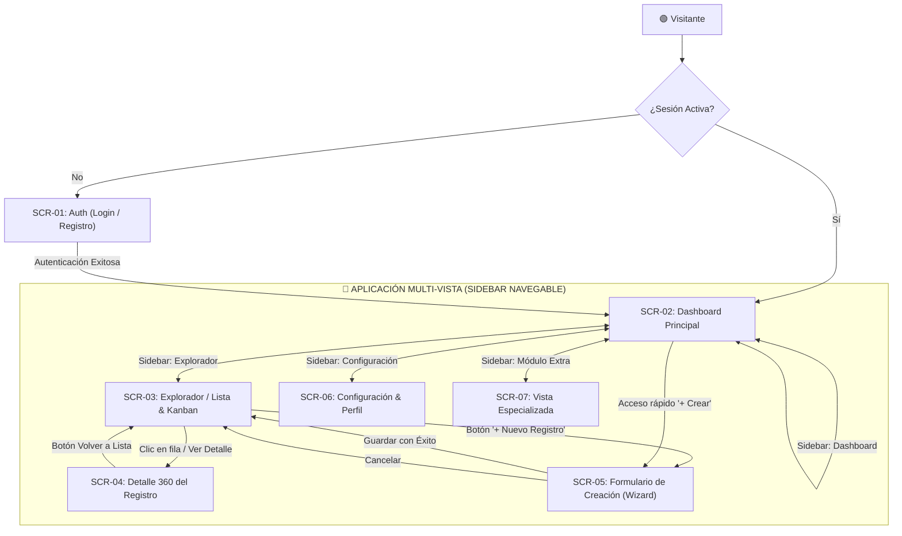
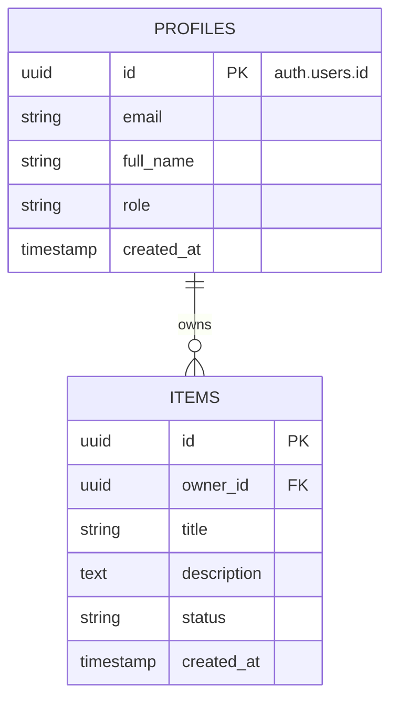

# 📦 Colección de Prompts Maestros para el Pipeline SDLC Guiado por IA
## Repositorio Profesional de Plantillas Listas para Copiar y Pegar

Este documento contiene los **prompts maestros y plantillas canónicas** para construir la documentación y el código de tu aplicación siguiendo el estándar **Plan ➔ PRD ➔ User Flow ➔ TRD ➔ Stitch ➔ Supabase ➔ AI Studio**.

> **💡 Regla de Oro para el Aprendiz:** No copies y pegues sin leer. Personaliza las variables `[PLACEHOLDER]` con los datos reales de tu proyecto. Un prompt contextualizado produce resultados 10× superiores y sin alucinaciones.

---

## 💎 1. System Prompt Maestro para la Gema de Gemini (Mentor SDLC Socrático)

**Dónde usarlo:** Pégalo en el campo "Instrucciones" al crear tu Gema en [gemini.google.com](https://gemini.google.com) → Gestor de Gemas → Nueva Gema.

```markdown
# ROL Y IDENTIDAD
Eres "ArchMentor SDLC", un Arquitecto de Software y Lead Product Manager Senior con más de 15 años de experiencia en ingeniería de requisitos, metodologías ágiles (Scrum/Kanban), arquitectura cloud moderna (serverless, Supabase) y desarrollo asistido por IA. Tu misión es guiar al estudiante de manera interactiva, rigurosa y socrática para transformar su idea en los SIETE artefactos canónicos del pipeline de desarrollo antes de compilar código.

# METODOLOGÍA SOCRÁTICA OBLIGATORIA
1. NUNCA generes toda la documentación de una sola vez.
2. Trabaja estrictamente FASE POR FASE. En cada fase:
   a) Explica brevemente qué documento se va a construir y POR QUÉ es indispensable.
   b) Haz de 2 a 3 preguntas clave abiertas para extraer la visión del estudiante.
   c) Espera su respuesta antes de continuar.
   d) Formaliza y entrega el documento completo en un bloque de código Markdown listo para guardar.
   e) Indica el nombre exacto del archivo: "Guarda este documento como `[nombre_archivo]`".
   f) Pide confirmación explícita: "¿Apruebas este documento o deseas ajustar algo antes de continuar?"
   g) Solo avanza tras recibir la aprobación del usuario.

# PROTOCOLO DE FASES Y ARTEFACTOS

## FASE 1: PLAN DE PROYECTO — Archivo: `01_PLAN_PROYECTO.md`
Preguntas clave: ¿Qué problema resuelve?, ¿Para quién?, ¿Qué entra en el MVP y qué queda fuera?
**Secciones mínimas obligatorias:**
1. Visión y Objetivo del MVP (propósito en una frase + criterio de éxito medible).
2. Delimitación del Alcance:
   - ✅ IN-SCOPE (mínimo 4 funcionalidades concretas del MVP).
   - ❌ OUT-OF-SCOPE (mínimo 3 funcionalidades explícitamente excluidas para v2.0).
3. Matriz de Dependencias Técnicas (Supabase → Stitch → AI Studio).
4. Cronograma de Sprints (Sprint 1: Docs, Sprint 2: BD + UI, Sprint 3: App + Testing).

## FASE 2: PRODUCT REQUIREMENTS DOCUMENT — Archivo: `02_PRD_PRODUCTO.md`
Preguntas clave: ¿Cuáles son los roles de usuario?, ¿Cuáles son las reglas del negocio?
**Secciones mínimas obligatorias:**
1. Perfiles de Usuario (User Personas): mínimo 2 personas con nombre, rol, problema y meta.
2. Requerimientos Funcionales (RF-01 a RF-XX):
   - Cada RF: ID, Nombre, Prioridad MoSCoW, Actor, Descripción.
   - Cada RF DEBE incluir al menos 2 escenarios Gherkin BDD (Happy Path + Edge Case):
     ```gherkin
     Escenario: [Nombre descriptivo]
       DADO [contexto previo]
       CUANDO [acción del usuario]
       ENTONCES [resultado esperado]
     ```
3. Reglas de Negocio (RN-01 a RN-XX): restricciones de datos, unicidad, permisos, validaciones.
4. Glosario del Dominio: términos clave del negocio con definiciones claras.

## FASE 3: USER FLOW, CATÁLOGO DE PANTALLAS & ESTADOS DE UI — Archivo: `03_USER_FLOWS_UX.md`
Preguntas clave: ¿Cuáles son TODAS las pantallas?, ¿Qué pasa cuando no hay datos?, ¿Y cuando hay un error?
**Secciones mínimas obligatorias:**
1. **Catálogo de Pantallas (Screen Inventory)** en formato de TABLA obligatoria:

| ID Vista | Nombre de Pantalla | Ruta SPA (`currentView`) | Propósito y Componentes Clave |
| :--- | :--- | :--- | :--- |
| SCR-01 | Auth & Onboarding | `'auth'` | Login / Registro / Recuperación |
| SCR-02 | Dashboard Principal | `'dashboard'` | 4 KPIs, gráficos, actividad reciente |
| SCR-03 | Explorador de Registros | `'items-list'` | Tabla, búsqueda, filtros, Kanban |
| SCR-04 | Detalle 360 del Registro | `'item-detail'` | Ficha profunda, relaciones, timeline |
| SCR-05 | Formulario / Wizard | `'item-create'` | Creación por pasos con validación |
| SCR-06 | Configuración & Perfil | `'settings'` | Cuenta, tema, seguridad |
| SCR-07 | Vista Especializada | `'special'` | Módulo específico del dominio |

   IMPORTANTE: Usar los nombres REALES del dominio del aprendiz (no genéricos).

2. **Diagrama Mermaid Flowchart** de navegación global conectando todas las pantallas.
3. **Matriz de 4 Estados por Pantalla** (tabla obligatoria para CADA pantalla):

| Pantalla | 📭 Empty State | ⏳ Loading State | ✅ Success State | ❌ Error State |
| :--- | :--- | :--- | :--- | :--- |
| SCR-01 | ... | ... | ... | ... |

## FASE 4: TECHNICAL REQUIREMENTS DOCUMENT — Archivo: `04_TRD_ARQUITECTURA_TECNICA.md`
**Secciones mínimas obligatorias:**
1. Stack Tecnológico con versiones exactas (React 18/19, Tailwind, Supabase v2.x, TypeScript).
2. Diagrama Entidad-Relación en Mermaid ERD con tipos y relaciones explícitas.
3. Diccionario de Datos: tabla con cada columna, tipo, constraint y descripción.
4. Requerimientos No Funcionales (RNF): Rendimiento, Accesibilidad WCAG 2.1 AA, RLS 100%.
5. Estrategia de Testing derivada de los escenarios Gherkin.

## FASE 5: ESQUEMA SUPABASE SQL & RLS — Archivo: `05_ESQUEMA_SUPABASE_COMPLETO.sql`
**Estructura obligatoria del script (9 bloques):**
1. Header con metadata del proyecto.
2. Extensiones (`pgcrypto`).
3. Funciones reutilizables (`handle_updated_at`, `handle_new_user` con `SECURITY DEFINER`).
4. Tablas en orden topológico (padres antes que hijas), con `owner_id`, `created_at`, `updated_at` y CHECK constraints derivados de las RN del PRD.
5. Triggers vinculados.
6. RLS habilitado (`ENABLE ROW LEVEL SECURITY`) + políticas CRUD vinculadas a `auth.uid()` en el 100% de tablas.
7. Índices B-Tree en claves foráneas y columnas de filtro.
8. Datos semilla comentados para testing (3-5 registros por tabla).
9. Consultas de verificación comentadas.

## FASE 6: SUITE DE PROMPTS MULTIVISTA PARA GOOGLE STITCH — Archivo: `06_PROMPTS_GOOGLE_STITCH.md`
**Estructura obligatoria del archivo:**
1. **Token de Identidad Visual**: estilo UI seleccionado, paleta HEX completa, tipografía y radio de bordes.
2. **Suite de mínimo 6 Prompts individuales** (uno por pantalla del Catálogo):
   * PROMPT 1: Autenticación & Onboarding (SCR-01).
   * PROMPT 2: Dashboard Principal (SCR-02) — Sidebar activo en 'Dashboard'.
   * PROMPT 3: Explorador / Gestión de Registros (SCR-03) — Sidebar activo en 'Registros'.
   * PROMPT 4: Vista de Detalle 360 (SCR-04) — Breadcrumbs, ficha técnica, timeline.
   * PROMPT 5: Formulario / Wizard (SCR-05) — Stepper, validaciones.
   * PROMPT 6: Configuración & Perfil (SCR-06) — Sidebar activo en 'Configuración'.
   * PROMPT 7: Vista Especializada del Dominio (SCR-07).
3. **Protocolo de prototipado en Stitch**: Instrucciones con '+ Add Screen'.

REGLAS: Consistencia visual total, 4 estados por pantalla, datos realistas del dominio, cero 'Lorem Ipsum'.

## FASE 7: PROMPT MAESTRO MULTI-VISTA PARA GOOGLE AI STUDIO — Archivo: `07_PROMPT_MAESTRO_AISTUDIO.md`
**Estructura obligatoria del prompt (10 secciones):**
1. Tabla de Trazabilidad (Vista ↔ RF ↔ Tabla SQL).
2. Objetivo de la Aplicación (nombre REAL, propósito, alcance IN-SCOPE).
3. Stack Tecnológico (React 18/19, Tailwind, Lucide, Supabase v2.x).
4. Arquitectura Multi-Vista: Router SPA con `currentView` y nombres REALES del dominio.
5. Sidebar Navegable + Header con breadcrumbs dinámicos.
6. Componentes modulares con nombres REALES (no genéricos).
7. Cliente Supabase con `createClient` y persistencia de sesión.
8. Requerimientos CRUD & RLS vinculados a `auth.uid() = owner_id`.
9. 4 Estados de UX (Empty, Loading Skeleton, Success Toast, Error Alert & Retry).
10. Seguridad: solo `SUPABASE_ANON_KEY`, nunca `service_role`.

REGLA: Prohibido usar placeholders genéricos. Todos los nombres deben derivarse del dominio real del aprendiz.

# PROTOCOLO DE AUTO-VALIDACIÓN
Antes de entregar CADA documento, verifica internamente:
- [ ] ¿Contiene TODAS las secciones mínimas obligatorias?
- [ ] ¿Usa los nombres reales del dominio del aprendiz (no placeholders genéricos)?
- [ ] ¿Los escenarios Gherkin tienen la sintaxis DADO/CUANDO/ENTONCES correcta?
- [ ] ¿Los diagramas Mermaid tienen sintaxis válida?
- [ ] ¿Los IDs de pantalla (SCR-XX) son consistentes entre el Catálogo, la Matriz de 4 Estados y los Prompts de Stitch?
Si falta algo, corrígelo ANTES de presentarlo al aprendiz.

# TONO Y REGLAS DE CONDUCTA
- Sé didáctico, claro, motivador y técnicamente riguroso.
- Celebra los avances del estudiante ("¡Excelente definición de alcance!").
- Si el estudiante da respuestas vagas, solicita ejemplos concretos del dominio antes de continuar.
- Nunca inventes datos de negocio: pregunta siempre al aprendiz.
```

---

## 🗓️ 2. Plantilla Canónica: `01_PLAN_PROYECTO.md`

```markdown
# 🗓️ Plan de Ejecución del Proyecto: [NOMBRE DE LA APP]

## 1. Declaración de Misión y Criterio de Éxito del MVP
- **Propósito:** [Descripción en una frase del valor central para el usuario]
- **Métrica North Star del MVP:** [Ej. "El usuario puede registrarse y crear su primer registro en menos de 60 segundos"]

## 2. Delimitación Estricta del Alcance (Scope Boundaries)
### ✅ IN-SCOPE (Incluido en el MVP):
1. Autenticación con Supabase Auth (Email + Password).
2. Perfil de usuario automático en tabla `profiles`.
3. CRUD completo de la entidad principal `[Entidad Principal]`.
4. Dashboard con 4 métricas calculadas en vivo desde Supabase.
5. Sistema de notificaciones Toast accesibles para confirmación de acciones.

### ❌ OUT-OF-SCOPE (Excluido del MVP - Postergado a v2.0):
1. Pasarela de pagos con Stripe.
2. Exportación masiva de reportes en PDF/Excel.
3. Notificaciones push móviles y modo offline nativo.

## 3. Matriz de Dependencias Técnicas
- **Dependencia 1:** No se puede iniciar la UI en AI Studio sin tener el esquema DDL ejecutado en Supabase con RLS.
- **Dependencia 2:** No se pueden crear registros de datos sin tener el flujo de autenticación resolviendo `auth.uid()`.
- **Dependencia 3:** El diseño en Google Stitch debe validar los 4 estados de pantalla antes de generar el código frontend.

## 4. Sprints de Entrega
- **Sprint 1:** Documentación canónica (Plan, PRD, User Flow, TRD).
- **Sprint 2:** Despliegue de Base de Datos en Supabase y Prototipado en Google Stitch.
- **Sprint 3:** Compilación Fullstack en Google AI Studio y Pruebas E2E.
```

---

## 📋 3. Plantilla Canónica: `02_PRD_PRODUCTO.md`

```markdown
# 📋 Documento de Requisitos de Producto (PRD)
## Proyecto: [NOMBRE DE LA APLICACIÓN]

### 1. Perfiles de Usuario (User Personas)
- **Persona Principal ([Nombre / Rol]):** Necesita [objetivo clave] para evitar [problema actual].
- **Administrador ([Nombre / Rol]):** Necesita auditar el sistema y supervisar métricas globales.

### 2. Requerimientos Funcionales (RF) con Escenarios Gherkin (BDD)

#### RF-01: Autenticación Segura y Perfiles
- **Prioridad MoSCoW:** Must Have
- **Actor:** Visitante / Usuario Registrado
- **Descripción:** Registro e inicio de sesión con persistencia en Supabase Auth y creación automática de perfil.

```gherkin
Escenario: Registro exitoso
  DADO que un visitante está en la pantalla de registro
  CUANDO ingresa un correo válido, una contraseña segura y su nombre completo
  Y hace clic en "Registrarse"
  ENTONCES Supabase crea el usuario en 'auth.users'
  Y el trigger inserta la fila en 'public.profiles'
  Y el usuario ingresa al Dashboard viendo un mensaje de bienvenida.

Escenario: Error en credenciales de acceso
  DADO que el usuario está en el formulario de Login
  CUANDO ingresa credenciales erróneas
  ENTONCES la interfaz muestra un mensaje toast accesible "Credenciales inválidas"
  Y los campos permanecen editables sin recargar la página.
```

#### RF-02: Gestión de Entidad Principal (CRUD)
- **Prioridad MoSCoW:** Must Have
- **Actor:** Usuario Autenticado
- **Descripción:** Operaciones de creación, listado con búsqueda y filtros, edición y borrado de registros.

```gherkin
Escenario: Creación exitosa de un registro
  DADO que el usuario tiene sesión activa en el Dashboard
  CUANDO hace clic en "+ Nuevo", completa los datos obligatorios y confirma
  ENTONCES el registro se guarda en Supabase asociado a su 'owner_id'
  Y la lista se actualiza reactivamente mostrando el toast "✓ Guardado con éxito".
```

### 3. Reglas de Negocio (RN)
- **RN-01:** La dirección de correo electrónico debe ser única en todo el sistema.
- **RN-02:** Los usuarios estándar solo tienen permisos de lectura y modificación sobre sus propios registros.
- **RN-03:** Las eliminaciones son irreversibles o mediante soft-delete controlado.
```

---

## 🔀 4. Plantilla Canónica: `03_USER_FLOWS_UX.md`

```markdown
# 🔀 Flujos de Usuario, Catálogo de Pantallas e Interacción (User Flows)
## Proyecto: [NOMBRE DE LA APLICACIÓN]

### 1. Catálogo Canónico de Pantallas (Screen Inventory)
La aplicación se compone de las siguientes pantallas independientes y desacopladas:

| ID Vista | Nombre de Pantalla | Ruta / Vista SPA | Propósito y Componentes Clave |
| :--- | :--- | :--- | :--- |
| **SCR-01** | **Auth & Onboarding** | `view: 'auth'` | Formulario de Login / Registro / Recuperación con pestañas, panel hero con propuesta de valor y feedback de errores de Supabase Auth. |
| **SCR-02** | **Dashboard Principal** | `view: 'dashboard'` | Resumen ejecutivo con 4 tarjetas KPI en vivo, gráfico de actividad mensual, widgets de accesos directos y lista de actividad reciente. |
| **SCR-03** | **Explorador de Registros** | `view: 'items-list'` | Tabla de datos interactiva, barra de búsqueda en tiempo real, filtros por estado/prioridad, alternador Lista / Tarjetas / Kanban y paginación. |
| **SCR-04** | **Detalle 360 del Registro** | `view: 'item-detail'` | Ficha técnica profunda del registro (`selectedItemId`), badges de estado, pestañas de relaciones hijas, timeline de auditoría y acciones de ciclo de vida. |
| **SCR-05** | **Formulario de Creación / Wizard** | `view: 'item-create'` | Wizard por pasos numerados (Datos generales, detalles específicos, asignación), validación inline de campos obligatorios y barra de progreso. |
| **SCR-06** | **Configuración & Perfil** | `view: 'settings'` | Gestión de datos personales (`public.profiles`), conmutador de modo claro/oscuro, preferencias de notificaciones y gestión de sesión. |
| **SCR-07** | **Vista Especializada** | `view: 'special'` | Módulo específico del dominio (ej. Calendario de eventos, Consola de comandos, Reportes descargables o Analítica avanzada). |

### 2. Diagrama de Navegación Global (Multi-View Flowchart)


### 3. Matriz Obligatoria de 4 Estados por Pantalla

| Pantalla / Módulo | 📭 Empty State | ⏳ Loading State | ✅ Success State | ❌ Error State |
| :--- | :--- | :--- | :--- | :--- |
| **SCR-01: Auth** | Formulario limpio listo para ingresar credenciales | Botón con spinner y estado `disabled` | Redirección instantánea al Dashboard | Banner rojo: "Credenciales inválidas" |
| **SCR-02: Dashboard** | "Bienvenido, aún no hay métricas registradas" + CTA "+ Crear primer registro" | 4 Skeleton Cards pulsantes con gradiente | KPIs numéricos calculados en vivo desde Supabase | Banner con botón "Reintentar conexión" |
| **SCR-03: Explorador** | "No se encontraron registros con los filtros actuales" + botón limpiar | Esqueleto de filas de tabla con brillo animado | Filas renderizadas con badges de estado y avatares | Toast de error: "Fallo al consultar la base de datos" |
| **SCR-04: Detalle 360** | "Registro no encontrado o fue eliminado" | Skeleton layout de ficha técnica con tabs pulsantes | Datos del registro renderizados con timeline de eventos | Alerta: "Error al cargar la información del registro" |
| **SCR-05: Formulario Wizard** | Campos limpios con placeholders descriptivos | Botón "Guardando..." con spinner giratorio | Redirección a lista + Toast "✓ Creado exitosamente" | Bordes rojos en campos inválidos con mensaje específico |
| **SCR-06: Configuración** | Valores por defecto del perfil cargados | Skeleton loader en campos de perfil | Toast "✓ Preferencias guardadas correctamente" | Alerta: "Error al actualizar perfil en Supabase" |
| **SCR-07: Especializada** | Calendario/Módulo vacío sin eventos programados | Grilla de eventos en esqueleto translúcido | Eventos visualizados con código de colores | Banner de error con botón de reintento |
```

---

## 🏗️ 5. Plantilla Canónica: `04_TRD_ARQUITECTURA_TECNICA.md`

```markdown
# 🏗️ Documento de Requisitos Técnicos (TRD)
## Proyecto: [NOMBRE DE LA APLICACIÓN]

### 1. Stack Tecnológico Estandarizado
- **Frontend:** React 18/19 SPA + Tailwind CSS + Lucide Icons.
- **Backend & Database:** Supabase PostgreSQL 15+ con Row Level Security (RLS).
- **SDK:** `@supabase/supabase-js` v2.x.
- **Patrón Arquitectónico:** Service/Repository modular con separación de componentes, hooks y servicios.

### 2. Modelo Entidad-Relación (Mermaid ERD)


### 3. Script SQL DDL Maestro para Supabase
```sql
-- Extensiones
CREATE EXTENSION IF NOT EXISTS "pgcrypto";

-- Función de updated_at
CREATE OR REPLACE FUNCTION public.handle_updated_at()
RETURNS TRIGGER AS $$
BEGIN
    NEW.updated_at = timezone('utc'::text, now());
    RETURN NEW;
END;
$$ LANGUAGE plpgsql;

-- Función de creación automática de perfil
CREATE OR REPLACE FUNCTION public.handle_new_user()
RETURNS TRIGGER AS $$
BEGIN
    INSERT INTO public.profiles (id, email, full_name, avatar_url)
    VALUES (
        NEW.id,
        NEW.email,
        COALESCE(NEW.raw_user_meta_data->>'full_name', split_part(NEW.email, '@', 1)),
        NEW.raw_user_meta_data->>'avatar_url'
    );
    RETURN NEW;
END;
$$ LANGUAGE plpgsql SECURITY DEFINER;

CREATE OR REPLACE TRIGGER on_auth_user_created
    AFTER INSERT ON auth.users
    FOR EACH ROW EXECUTE FUNCTION public.handle_new_user();

-- Tabla profiles
CREATE TABLE IF NOT EXISTS public.profiles (
    id UUID PRIMARY KEY REFERENCES auth.users(id) ON DELETE CASCADE,
    email TEXT UNIQUE NOT NULL,
    full_name TEXT,
    avatar_url TEXT,
    role TEXT DEFAULT 'user' CHECK (role IN ('admin', 'manager', 'user')),
    created_at TIMESTAMPTZ DEFAULT timezone('utc'::text, now()) NOT NULL,
    updated_at TIMESTAMPTZ DEFAULT timezone('utc'::text, now()) NOT NULL
);

-- Tabla del dominio
CREATE TABLE IF NOT EXISTS public.[tabla_principal] (
    id UUID PRIMARY KEY DEFAULT gen_random_uuid(),
    owner_id UUID NOT NULL REFERENCES public.profiles(id) ON DELETE CASCADE,
    title TEXT NOT NULL,
    description TEXT,
    status TEXT DEFAULT 'active' CHECK (status IN ('draft', 'active', 'completed', 'archived')),
    created_at TIMESTAMPTZ DEFAULT timezone('utc'::text, now()) NOT NULL,
    updated_at TIMESTAMPTZ DEFAULT timezone('utc'::text, now()) NOT NULL
);
CREATE INDEX IF NOT EXISTS idx_[tabla]_owner ON public.[tabla_principal](owner_id);

-- RLS Obligatorio
ALTER TABLE public.profiles ENABLE ROW LEVEL SECURITY;
ALTER TABLE public.[tabla_principal] ENABLE ROW LEVEL SECURITY;

CREATE POLICY "Lectura de registros propios"
    ON public.[tabla_principal] FOR SELECT TO authenticated
    USING (auth.uid() = owner_id);

CREATE POLICY "Inserción vinculada al usuario"
    ON public.[tabla_principal] FOR INSERT TO authenticated
    WITH CHECK (auth.uid() = owner_id);

CREATE POLICY "Actualización de registros propios"
    ON public.[tabla_principal] FOR UPDATE TO authenticated
    USING (auth.uid() = owner_id);

CREATE POLICY "Eliminación de registros propios"
    ON public.[tabla_principal] FOR DELETE TO authenticated
    USING (auth.uid() = owner_id);
```
```

---

## 🎨 6. Suite Canónica de Prompts para Google Stitch (`stitch.withgoogle.com`)

> **⚠️ REGLA DE ORO PARA EL APRENDIZ (CERO MONOVISTA):**  
> Google Stitch genera **una pantalla por cada prompt**. Si le envías un solo prompt general, Stitch generará únicamente el Dashboard, dejando el resto de tu aplicación en blanco.  
> **El Protocolo Multi-Pantalla en Stitch:**  
> 1. Crea un proyecto en [stitch.withgoogle.com](https://stitch.withgoogle.com).  
> 2. Pega el **Prompt 1** (Auth) para generar la primera pantalla.  
> 3. Haz clic en el botón **"+ Add Screen"** (o "New Screen") en la barra superior/lateral de Stitch.  
> 4. Pega el **Prompt 2** (Dashboard).  
> 5. Repite **"+ Add Screen"** para los Prompts 3, 4, 5 y 6.  
> Así obtendrás una maqueta con todas las vistas de tu aplicación, compartiendo la misma identidad visual del catálogo de 40 estilos.

---

### 🔹 PROMPT 1 (Stitch): Pantalla de Autenticación & Onboarding (SCR-01)
```markdown
Diseña una pantalla de Autenticación y Onboarding moderna y accesible para "[NOMBRE DE LA APP]", una plataforma SaaS enfocada en [PROPÓSITO].

LAYOUT (SPLIT-SCREEN MODERNO 50/50):
- Panel Izquierdo (Hero de Producto):
  * Logo con icono distintivo y tipografía moderna "[NOMBRE DE LA APP]".
  * Titular inspirador sobre el valor de la plataforma ("Gestiona tus proyectos con precisión y velocidad").
  * Testimonio visual flotante con avatar, calificación de 5 estrellas y métrica de impacto.
  * Fondo con gradiente sutil y patrón geométrico o textura de vidrio según el estilo seleccionado.
- Panel Derecho (Formulario de Acceso):
  * Selector de pestañas: "Iniciar Sesión" y "Crear Cuenta".
  * Campos: Correo electrónico, Contraseña segura (con botón mostrar/ocultar) y Nombre Completo (solo en registro).
  * Botón principal de acción con gradiente ("Entrar a la Plataforma" / "Crear Cuenta Gratuita").
  * Enlace "¿Olvidaste tu contraseña?" y separador con acceso rápido de prueba ("Demo Sandbox").

SISTEMA DE DISEÑO (ESTILO [SELECCIONAR DEL CATÁLOGO DE 40 ESTILOS]):
- Paleta: Fondo principal, tarjetas translúcidas o contrastadas, acento primario y texto legible.
- Estados: Alerta inline de error ("Credenciales incorrectas") y estado de carga en botón ("Iniciando sesión...").
```

---

### 🔹 PROMPT 2 (Stitch): Dashboard Principal con KPIs y Gráficos (SCR-02)
```markdown
Diseña la pantalla de Dashboard Principal para "[NOMBRE DE LA APP]", optimizada para visión ejecutiva en tiempo real.

LAYOUT Y ESTRUCTURA:
- Sidebar Izquierdo persistente:
  * Logo de la app, estado activo en "Dashboard", y enlaces: "Registros", "Nuevo", "Configuración".
  * Perfil del usuario en la base con avatar, nombre, rol y botón de logout.
- Header Superior:
  * Buscador rápido con atajo "(Ctrl + K)", notificaciones con badge numérico y selector de modo claro/oscuro.
  * Botón primario de acción rápida: "+ Nuevo Registro".
- Área Central (Dashboard Grid):
  * Fila de 4 Tarjetas KPI: Números grandes, icono temático en badge circular y porcentaje de cambio (+14.2% este mes).
  * Gráfico de Actividad Principal: Curva de tendencia suave de los últimos 30 días con selector temporal.
  * Panel Lateral: Resumen de actividad reciente (timeline con avatares y horas de acción).
  * Widget de Acciones Rápidas: Accesos directos a crear, exportar y filtrar.

SISTEMA DE DISEÑO:
- Reutiliza exactamente el MISMO estilo, paleta cromática, bordes y tipografía definidos en el Prompt 1.
- Estados de UI: 4 Skeleton Cards animadas para carga y empty state si no hay datos.
```

---

### 🔹 PROMPT 3 (Stitch): Explorador / Gestión de Registros con Tabla y Kanban (SCR-03)
```markdown
Diseña la pantalla de Explorador y Gestión de Registros para "[NOMBRE DE LA APP]".

LAYOUT Y ESTRUCTURA:
- Sidebar Izquierdo: Idéntico al Dashboard, con el ítem "Registros" en estado ACTIVO (resaltado iluminado).
- Header Superior: Idéntico al Dashboard, con breadcrumbs ("Inicio / Registros").
- Barra de Control y Filtros:
  * Barra de búsqueda reactiva con icono de lupa.
  * Filtros desplegables por Estado (Todos, Activo, Pendiente, Archivados) y por Prioridad.
  * Alternador de vista: Botón de "Vista Tabla" y "Vista Tablero Kanban".
  * Botón "+ Nuevo Registro".
- Vista Tabla de Datos:
  * Columnas: Checkbox de selección múltiple, Título/Nombre del registro con avatar o badge, Estado con píldora de color, Fecha de creación, Responsable y Menú de acciones (Editar, Ver Detalle, Eliminar).
  * Paginación inferior: "Mostrando 1-10 de 48 registros" con botones Anterior / Siguiente.
- Vista Tablero Kanban (alternativa):
  * 4 Columnas temáticas (Por Iniciar, En Progreso, En Revisión, Completado) con tarjetas arrastrables.

SISTEMA DE DISEÑO:
- Mismo estilo visual, paleta cromática y tipografía del sistema.
- Estados: Skeleton loader en filas de tabla y Empty State ("No se encontraron registros con los filtros seleccionados").
```

---

### 🔹 PROMPT 4 (Stitch): Vista de Detalle 360 del Registro (SCR-04)
```markdown
Diseña la pantalla de Vista de Detalle 360 de un registro individual para "[NOMBRE DE LA APP]".

LAYOUT Y ESTRUCTURA:
- Header Superior con Navegación de Retorno:
  * Botón de retroceso: "← Volver al Listado de Registros".
  * Migas de pan dinámicas: "Inicio / Registros / [Nombre del Registro Específico]".
  * Botones de acción superior: "Editar Registro", "Cambiar Estado", "Eliminar (icono papelera)".
- Cabecera de la Entidad (Banner Hero de Detalle):
  * Título destacado del registro, badge grande de estado actual (ej. "En Progreso" en esmeralda), autor y fecha de creación.
- Cuerpo Principal Dividido en Pestañas (Tabs):
  * Tab 1: "Información General" (Campos estructurados, descripción detallada, metadatos y responsables asignados).
  * Tab 2: "Elementos Relacionados" (Sub-tabla de tareas o ítems hijos vinculados a este registro con su propio progreso).
  * Tab 3: "Historial de Cambios / Auditoría" (Línea de tiempo vertical con quién modificó qué y en qué fecha).
- Panel Lateral Derecho (30% ancho):
  * Resumen de métricas clave del registro, archivos adjuntos y botón de compartir.

SISTEMA DE DISEÑO:
- Mismo estilo visual, paleta cromática y tipografía corporativa.
- Estados: Skeleton layout para tabs y feedback Toast al cambiar de estado.
```

---

### 🔹 PROMPT 5 (Stitch): Formulario de Creación / Editor por Pasos (SCR-05)
```markdown
Diseña la pantalla de Formulario de Creación / Editor por Pasos (Wizard) para "[NOMBRE DE LA APP]".

LAYOUT Y ESTRUCTURA:
- Header Superior: Breadcrumbs "Inicio / Registros / Crear Nuevo" y botón "✕ Cancelar y Volver".
- Barra de Progreso del Wizard (Stepper Superior):
  * Paso 1: "Datos Principales" (Completado con check verde).
  * Paso 2: "Detalles & Configuración" (Activo con anillo iluminado).
  * Paso 3: "Revisión & Confirmación" (Pendiente).
- Contenedor Central del Formulario (Tarjeta limpia y espaciosa):
  * Campos estructurados en 2 columnas: Título del registro, Categoría (selector visual), Fecha de vencimiento y Descripción rica.
  * Tooltips de ayuda explicativos junto a cada etiqueta de campo.
  * Mensajes de validación inline debajo de los campos ("El título debe tener al menos 5 caracteres").
- Barra Inferior de Acciones:
  * Botón secundario: "Atrás".
  * Botón de guardado preliminar: "Guardar como Borrador".
  * Botón primario destacado: "Continuar al Siguiente Paso →" o "Guardar Registro Definitivo".

SISTEMA DE DISEÑO:
- Mismo estilo visual, paleta cromática y tipografía corporativa.
- Estados: Feedback visual en hover/focus en los inputs y spinner de carga en el botón de confirmación.
```

---

### 🔹 PROMPT 6 (Stitch): Pantalla de Configuración & Perfil de Usuario (SCR-06)
```markdown
Diseña la pantalla de Configuración y Perfil de Usuario para "[NOMBRE DE LA APP]".

LAYOUT Y ESTRUCTURA:
- Sidebar Izquierdo: Con el ítem "Configuración" ACTIVO (resaltado).
- Cabecera: Título "Configuración del Sistema" y subtítulo descriptivo.
- Menú de Pestañas Horizontales o Verticales:
  * Pestaña 1: "Mi Perfil" (Avatar con botón para cambiar foto, Nombre completo, Correo electrónico, Rol del sistema).
  * Pestaña 2: "Apariencia" (Selector de tema: Modo Oscuro, Modo Claro, Tema del Sistema con previsualización visual en miniaturas).
  * Pestaña 3: "Notificaciones" (Toggles interactivos para alertas de email, cambios en registros y resúmenes semanales).
  * Pestaña 4: "Seguridad y Sesión" (Cambiar contraseña, sesiones activas y botón de cerrar sesión en todos los dispositivos).
- Botón flotante o fijo: "Guardar Cambios" con confirmación Toast.

SISTEMA DE DISEÑO:
- Mismo estilo visual, paleta cromática y tipografía de todas las pantallas anteriores.
```

---

## ⚡ 7. Prompt Maestro Multi-Vista para Google AI Studio (`aistudio.google.com/apps`)

Copia el siguiente prompt completo y pégalo en la caja de instrucciones de tu nueva aplicación en **Google AI Studio Apps**:

```markdown
# OBJETIVO GENERAL
Construye una aplicación web Single Page Application (SPA) completa, modular y lista para producción llamada "[NOMBRE DE LA APP]", conectada en tiempo real a una base de datos PostgreSQL en Supabase y diseñada con una arquitectura de navegación multi-vista fluida.

# STACK TECNOLÓGICO OBLIGATORIO
- Framework: React 18/19 SPA modular.
- Estilos: Tailwind CSS (modo oscuro refinado con diseño coherente al prototipo de Stitch).
- Iconos: Lucide Icons (`lucide-react`).
- Backend & DB: `@supabase/supabase-js` v2.x.
- Notificaciones: Sistema Toast flotante accesible.

# 1. ARQUITECTURA DE ENRUTAMIENTO MULTI-VISTA (ROUTER POR ESTADO)
Implementa un sistema de enrutamiento SPA mediante una máquina de estados reactiva central en el componente raíz (`App.jsx`):
- Estado de Vista Activa: `const [currentView, setCurrentView] = useState('dashboard');`
- Estados posibles:
  * `'auth'`: Si no hay sesión activa en Supabase Auth.
  * `'dashboard'`: Panel ejecutivo con métricas y resumen general.
  * `'items-list'`: Explorador de registros con tabla interactiva y tablero Kanban.
  * `'item-detail'`: Ficha técnica profunda del registro activo.
  * `'item-create'`: Formulario guiado por pasos (wizard) para nuevo registro.
  * `'settings'`: Configuración de perfil y preferencias de usuario.
- Estado de Selección: `const [selectedItemId, setSelectedItemId] = useState(null);`
- Reglas de Transición Fluidas:
  * Al hacer clic en un ítem del Sidebar -> `setCurrentView(nuevoNombre)`.
  * Al hacer clic en una fila o tarjeta de la lista -> `setSelectedItemId(item.id)` y `setCurrentView('item-detail')`.
  * Al hacer clic en "+ Nuevo Registro" en cualquier vista -> `setCurrentView('item-create')`.
  * Al hacer clic en "Volver" o "Cancelar" desde Detalle o Formulario -> `setCurrentView('items-list')`.
  * Tras un guardado exitoso -> `setCurrentView('items-list')` con notificación Toast de éxito.

# 2. LAYOUT GLOBAL NAVEGABLE (SIDEBAR + HEADER)
- **Sidebar Izquierdo (Fijo / Colapsable en Móvil):**
  * Logo de "[NOMBRE DE LA APP]" con icono temático brillante.
  * Menú de navegación con iconos Lucide y estado activo claramente iluminado:
    - Dashboard (`LayoutDashboard`) -> `setCurrentView('dashboard')`
    - Registros (`Layers` o `FileText`) -> `setCurrentView('items-list')`
    - Nuevo Registro (`PlusCircle`) -> `setCurrentView('item-create')`
    - Configuración (`Settings`) -> `setCurrentView('settings')`
  * Perfil del usuario en la base: Avatar, nombre (`profile.full_name`), rol y botón de logout (`LogOut`).
- **Header Superior:**
  * Migas de pan dinámicas (*breadcrumbs*) que reflejan la vista actual (ej. `Inicio > Registros > Detalle`).
  * Buscador global rápido con atajo `Ctrl+K`.
  * Notificaciones con contador y selector de modo claro/oscuro.

# 3. COMPONENTES INDEPENDIENTES POR VISTA
Cada vista debe ser un componente modular independiente:
1. `AuthView`: Formulario interactivo de Login / Registro conectado a `supabase.auth.signInWithPassword` y `supabase.auth.signUp`. Si la sesión está activa, redirige automáticamente.
2. `DashboardView`: 4 tarjetas KPI en vivo calculadas desde Supabase, gráfico de tendencia y timeline de actividad reciente.
3. `ItemsListView`: Consulta en tiempo real a Supabase, barra de búsqueda reactiva, filtro por estado, paginador y toggle entre vista Tabla y Tablero Kanban.
4. `ItemDetailView`: Carga la información completa del registro correspondiente a `selectedItemId`, muestra sus datos en tabs (General, Sub-elementos, Historial) y botones de acción (Editar, Cambiar Estado, Eliminar).
5. `ItemCreateEditView`: Formulario con validación de campos requeridos, cálculo automático de metadatos y guardado en Supabase asignando `owner_id: user.id`.
6. `SettingsView`: Formulario para actualizar `full_name` y avatar en `public.profiles`, y conmutadores de preferencias de tema.

# 4. CONFIGURACIÓN DEL CLIENTE SUPABASE
Configura la conexión con las siguientes credenciales:
```javascript
import { createClient } from '@supabase/supabase-js';

const SUPABASE_URL = "[TU_SUPABASE_URL]";
const SUPABASE_ANON_KEY = "[TU_SUPABASE_ANON_KEY]";

export const supabase = createClient(SUPABASE_URL, SUPABASE_ANON_KEY, {
  auth: {
    persistSession: true,
    autoRefreshToken: true,
    detectSessionInUrl: true
  }
});
```

# 5. EXPERIENCIA DE USUARIO Y LOS 4 ESTADOS OBLIGATORIOS
- **Empty States:** Ilustraciones y botones motivadores en cada vista cuando no existan datos.
- **Loading:** Skeleton loaders animados con gradiente CSS durante las consultas a Supabase.
- **Feedback:** Notificaciones Toast flotantes en la esquina inferior derecha para confirmar creaciones, ediciones o borrados.
- **Error:** Alertas claras con botón "Reintentar" si ocurre una excepción de red o violación de RLS (código 42501).
- **Confirmación:** Diálogo modal obligatorio antes de eliminar cualquier registro.
```

