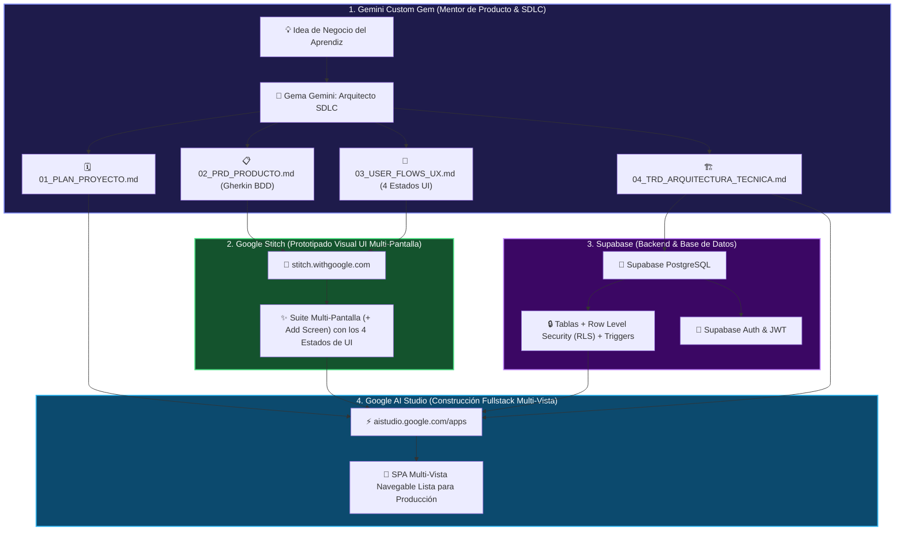

# 🚀 Guía Maestra: Desarrollo Guiado por IA
## Pipeline Profesional de Ingeniería de Software: Gemini Gems ➔ Google Stitch ➔ Google AI Studio ➔ Supabase

Bienvenido a la **Guía Completa de Desarrollo Guiado por IA**. Esta metodología permite transformar una simple idea de software en una **aplicación web profesional, con interfaz moderna, arquitectura limpia y base de datos relacional segura en Supabase**, utilizando la **Tetralogía Documental Canónica (Plan, PRD, User Flow y TRD)** y las herramientas de IA generativa de Google.

> **🎯 Público Objetivo:** Aprendices de desarrollo de software, estudiantes de ingeniería, emprendedores técnicos y cualquier persona que quiera construir aplicaciones web reales usando IA como copiloto estructurado.

---

## 🗺️ El Pipeline de Desarrollo en 4 Etapas



---

## 📦 La Cadena Canónica de los 7 Artefactos

La metodología se estructura en torno a una **cadena secuencial de 7 artefactos estandarizados**:

1. **🗓️ `01_PLAN_PROYECTO.md`:** Alcance estricto del MVP (In-Scope vs Out-of-Scope), dependencias técnicas y cronograma de sprints.
2. **📋 `02_PRD_PRODUCTO.md`:** Perfiles de usuario (User Personas), Requerimientos Funcionales (RF) con escenarios Gherkin BDD y reglas de negocio.
3. **🔀 `03_USER_FLOWS_UX.md`:** Catálogo de 5 a 8 pantallas (Screen Inventory), diagramas Mermaid de navegación y los 4 estados de pantalla (*Empty, Loading, Success, Error*).
4. **🏗️ `04_TRD_ARQUITECTURA_TECNICA.md`:** Stack con versiones exactas, Diagrama Entidad-Relación (Mermaid ERD), diccionario de datos y Requerimientos No Funcionales (RNF).
5. **🗄️ `05_ESQUEMA_SUPABASE_COMPLETO.sql`:** Script SQL DDL con `gen_random_uuid()`, triggers automáticos (`handle_updated_at`, `handle_new_user`), índices B-Tree y Row Level Security (RLS) habilitado al 100%.
6. **🎨 `06_PROMPTS_GOOGLE_STITCH.md`:** Suite multivista de prompts individuales para prototipar pantalla por pantalla en Google Stitch con token de identidad visual y los 4 estados.
7. **⚡ `07_PROMPT_MAESTRO_AISTUDIO.md`:** Prompt de compilación fullstack React SPA multi-vista para Google AI Studio con enrutador SPA y conexión en tiempo real a Supabase.

---

## 🎯 Guía Definitiva de Enrutamiento: ¿Qué Documento va a Cada Herramienta?

> **⚠️ Regla de Oro para el Aprendiz:** No todos los documentos se suben a todas las herramientas. Cada plataforma externa tiene un propósito único y requiere **un único artefacto específico**:

```mermaid
flowchart TD
    subgraph ARTEFACTOS["📦 TUS 7 ARTEFACTOS GENERADOS"]
        D1["01_PLAN_PROYECTO.md"]
        D2["02_PRD_PRODUCTO.md"]
        D3["03_USER_FLOWS_UX.md"]
        D4["04_TRD_ARQUITECTURA_TECNICA.md"]
        D5["05_ESQUEMA_SUPABASE_COMPLETO.sql"]
        D6["06_PROMPTS_GOOGLE_STITCH.md"]
        D7["07_PROMPT_MAESTRO_AISTUDIO.md"]
    end

    subgraph GEMAS["💎 GEMAS DE GEMINI (gemini.google.com)"]
        K["Sección 'Conocimientos' (Knowledge)"]
        D1 -. Se suben para transferir contexto .-o K
        D2 -. entre Gemas de la cadena .-o K
        D3 -. (NO se ejecutan como código) .-o K
        D4 -. .-o K
    end

    subgraph SUPABASE["🐘 SUPABASE (supabase.com/dashboard)"]
        SQL_ED["SQL Editor -> New Query -> RUN"]
        D5 ==>|1. Copiar y Ejecutar Script SQL| SQL_ED
        SQL_ED --> DB_READY["✅ Tablas + RLS 100% + Triggers Creados"]
    end

    subgraph STITCH["🎨 GOOGLE STITCH (stitch.withgoogle.com)"]
        ST_PROMPT["Generador de Pantallas (+ Add Screen)"]
        D6 ==>|2. Copiar Prompt a Prompt| ST_PROMPT
        ST_PROMPT --> UI_READY["✅ Prototipo Visual Multi-Pantalla Completo"]
    end

    subgraph AISTUDIO["⚡ GOOGLE AI STUDIO (aistudio.google.com/apps)"]
        AI_APP["New App -> Caja de Instrucciones del Sistema"]
        D7 ==>|3. Inyectar Credenciales y Compilar| AI_APP
        DB_READY -. Conexión en Tiempo Real .-o AI_APP
        AI_APP --> APP_LIVE["🚀 Web App React SPA Navegable y Funcional"]
    end

    style ARTEFACTOS fill:#1e293b,stroke:#64748b,color:#fff
    style GEMAS fill:#1e1b4b,stroke:#818cf8,color:#fff
    style SUPABASE fill:#14532d,stroke:#4ade80,color:#fff
    style STITCH fill:#3b0764,stroke:#c084fc,color:#fff
    style AISTUDIO fill:#0c4a6e,stroke:#38bdf8,color:#fff
```

### 📋 Matriz Rápida de Enrutamiento para el Aprendiz

| Herramienta Externa | URL | 📄 Documento Exacto a Usar | ¿Cómo se Ingresa? (Acción) | ❌ Error Común a Evitar |
| :--- | :--- | :--- | :--- | :--- |
| **Google Stitch** | [stitch.withgoogle.com](https://stitch.withgoogle.com) | **`06_PROMPTS_GOOGLE_STITCH.md`** | **Copiar y pegar texto**. Se pega el `PROMPT 1` (Auth), se hace clic en `+ Add Screen`, se pega el `PROMPT 2` (Dashboard), y así sucesivamente para cada pantalla. | **NO intentes subir el archivo `.md` completo** ni pegues el SQL o el PRD. Stitch solo procesa un prompt de pantalla a la vez. |
| **Supabase** | [supabase.com/dashboard](https://supabase.com/dashboard) | **`05_ESQUEMA_SUPABASE_COMPLETO.sql`** | **Copiar y ejecutar SQL**. Entra a *SQL Editor ➔ New Query*, pega el código SQL completo y presiona **Run**. | **NO pegues texto Markdown (`.md`)** en Supabase. Solo se ejecuta código SQL puro. |
| **Google AI Studio** | [aistudio.google.com/apps](https://aistudio.google.com/apps) | **`07_PROMPT_MAESTRO_AISTUDIO.md`** | **Inyectar credenciales y compilar**. Abre el archivo, reemplaza `[TU_SUPABASE_URL]` y `[TU_SUPABASE_ANON_KEY]` con tus datos de Supabase, copia todo y pégalo en la caja de instrucciones de la nueva App. | **NO pegues el prompt sin reemplazar las claves** de Supabase ni intentes pegar el SQL aquí: el backend debe estar ya ejecutado en Supabase. |
| **Gemas de Gemini** | [gemini.google.com](https://gemini.google.com) | `01_PLAN`, `02_PRD`, `03_USER_FLOWS`, `04_TRD` | **Subir a 'Conocimientos' (Knowledge)** al crear o editar cada Gema de la cadena. | No confundir "Conocimientos en Gemini" con "Subir a la herramienta final". En Gemini los archivos sirven como memoria para la IA. |

---

### 🔍 Detalle Paso a Paso por Herramienta

#### 1️⃣ ¿Qué hacer en Google Stitch (`stitch.withgoogle.com`)?
* **Documento a usar:** Únicamente **`06_PROMPTS_GOOGLE_STITCH.md`**.
* **Procedimiento:**
  1. Entra a [stitch.withgoogle.com](https://stitch.withgoogle.com) y crea un nuevo proyecto (*New Project*).
  2. Abre `06_PROMPTS_GOOGLE_STITCH.md` en tu editor de texto.
  3. Copia el bloque marcado como **`PROMPT 1: Pantalla de Autenticación & Acceso (SCR-01)`** y pégalo en Stitch. Presiona enter para generar la vista de login.
  4. En la barra superior/lateral de Stitch, haz clic en el botón **`+ Add Screen`** (o *New Screen*).
  5. Copia el **`PROMPT 2: Dashboard Principal (SCR-02)`** y pégalo en esa nueva pantalla.
  6. Repite el clic en **`+ Add Screen`** para pegar sucesivamente los Prompts 3, 4, 5, 6 y 7.
  7. **Resultado:** Tendrás tu maqueta interactiva completa con todas las vistas compartiendo el mismo sistema de diseño (Bento Grid, Glassmorphism, etc.).

#### 2️⃣ ¿Qué hacer en Supabase (`supabase.com/dashboard`)?
* **Documento a usar:** Únicamente **`05_ESQUEMA_SUPABASE_COMPLETO.sql`**.
* **Procedimiento:**
  1. Entra a [supabase.com/dashboard](https://supabase.com/dashboard) e ingresa a tu proyecto.
  2. En el menú lateral izquierdo, haz clic en el icono **SQL Editor** (o presiona `s` luego `q`).
  3. Haz clic en **"New Query"** (o en el botón `+`).
  4. Abre `05_ESQUEMA_SUPABASE_COMPLETO.sql`, copia todo su contenido y pégalo en el editor SQL.
  5. Haz clic en el botón verde **"Run"** (o presiona `Ctrl + Enter`).
  6. **Verificación:** Ve a **Table Editor** en el menú lateral y confirma que las tablas (ej. `profiles`, `projects`, `tasks`) aparecen con el candado verde 🔒 que indica que **Row Level Security (RLS)** está activo.
  7. **Configuración esencial:** Ve a `Authentication ➔ Providers ➔ Email` y pon **Confirm email** en **OFF** (esto te permitirá registrarte y probar sin necesidad de verificar correos reales).
  8. **Copia tus credenciales:** Ve a `Project Settings ➔ API` y copia la **Project URL** y la clave **`anon public`**. Las necesitarás para el siguiente paso.

#### 3️⃣ ¿Qué hacer en Google AI Studio (`aistudio.google.com/apps`)?
* **Documento a usar:** Únicamente **`07_PROMPT_MAESTRO_AISTUDIO.md`**.
* **Procedimiento:**
  1. Abre `07_PROMPT_MAESTRO_AISTUDIO.md` en tu editor de código.
  2. Busca las líneas de credenciales de Supabase:
     ```javascript
     const SUPABASE_URL = "[TU_SUPABASE_URL]";
     const SUPABASE_ANON_KEY = "[TU_SUPABASE_ANON_KEY]";
     ```
  3. Reemplaza `[TU_SUPABASE_URL]` con tu URL real (ej. `https://xyzcompany.supabase.co`) y `[TU_SUPABASE_ANON_KEY]` con tu clave pública `anon` copiada de Supabase.
  4. Entra a [aistudio.google.com/apps](https://aistudio.google.com/apps) y haz clic en **"Create App"** (o *New Application*).
  5. Copia **TODO** el contenido de `07_PROMPT_MAESTRO_AISTUDIO.md` (con las credenciales ya reemplazadas) y pégalo en el campo de instrucciones o prompt de AI Studio.
  6. Presiona el botón de compilar/ejecutar (*Run / Build*).
  7. **Resultado:** Google AI Studio construirá la aplicación SPA completa en React con Tailwind CSS, Lucide Icons, navegación multi-vista funcional entre todas las pantallas de Stitch, y conectada en vivo a tu base de datos Supabase con autenticación y RLS.

---

## 📋 Requisitos Previos

Antes de empezar, asegúrate de tener acceso a:

| Herramienta | URL | Propósito |
| :--- | :--- | :--- |
| **Google Gemini** | [gemini.google.com](https://gemini.google.com) | Crear Gemas personalizadas (Tutores IA) |
| **Google Stitch** | [stitch.withgoogle.com](https://stitch.withgoogle.com/?pli=1) | Prototipado visual de interfaces UI |
| **Google AI Studio** | [aistudio.google.com/apps](https://aistudio.google.com/apps) | Construcción de la aplicación web |
| **Supabase** | [supabase.com](https://supabase.com) | Base de datos PostgreSQL + Auth + RLS |

---

## 📚 Estructura de Documentación

### 🔗 Flujo de Gemas, Conocimientos y Directivas Agénticas
| Archivo | Descripción |
| :--- | :--- |
| [`AGENTS.md`](./AGENTS.md) | **Directiva Maestra de Desarrollo e Integración Agéntica** bajo el marco PIC 2026 (System Brief, Operational Rules, Harness Config y Persistence Loop). |
| [`CADENA_DE_GEMAS_Y_CONOCIMIENTOS.md`](./CADENA_DE_GEMAS_Y_CONOCIMIENTOS.md) | Flujo encadenado de 4 Gemas en Gemini usando la sección 'Conocimientos' (Knowledge) con los 4 documentos. |
| [`PROMPTS_MAESTROS_SDLC.md`](./PROMPTS_MAESTROS_SDLC.md) | Repositorio completo de prompts y plantillas profesionales para Plan, PRD, User Flow, TRD, Stitch y AI Studio. |

### 📖 Guías del Pipeline (Fases 1-7)
| # | Archivo | Fase del Pipeline |
| :--- | :--- | :--- |
| 01 | [`01_CREACION_GEMA_GEMINI.md`](./01_CREACION_GEMA_GEMINI.md) | Creación y configuración de la Gema Tutora en Gemini (System Prompt Maestro). |
| 02 | [`02_INGENIERIA_REQUISITOS_Y_ARQUITECTURA.md`](./02_INGENIERIA_REQUISITOS_Y_ARQUITECTURA.md) | La Tetralogía Documental: Plan, PRD, User Flow y TRD con criterios Gherkin y modelos ERD. |
| 03 | [`03_PROTOTIPADO_CON_GOOGLE_STITCH.md`](./03_PROTOTIPADO_CON_GOOGLE_STITCH.md) | Metodología de prompts visuales para `stitch.withgoogle.com`, catálogo maestro de 40 estilos frontend y 4 estados de UI. |
| 04 | [`04_CONSTRUCCION_APP_AISTUDIO_Y_SUPABASE.md`](./04_CONSTRUCCION_APP_AISTUDIO_Y_SUPABASE.md) | Prompt Maestro para construir la app completa en `aistudio.google.com/apps`. |
| 05 | [`05_SUPABASE_DATABASE_Y_BACKEND.md`](./05_SUPABASE_DATABASE_Y_BACKEND.md) | Script SQL DDL completo para Supabase: tablas, triggers, RLS y funciones. |
| 06 | [`06_FASE_IMPORTACION_STITCH_A_AISTUDIO.md`](./06_FASE_IMPORTACION_STITCH_A_AISTUDIO.md) | Guía de exportación de Stitch e importación en Google AI Studio. |
| 07 | [`07_FASE_CONEXION_SUPABASE_VARIABLES_ENTORNO.md`](./07_FASE_CONEXION_SUPABASE_VARIABLES_ENTORNO.md) | Configuración de `SUPABASE_URL` y `SUPABASE_ANON_KEY` en el frontend. |

### 🏢 Guías Avanzadas
| Archivo | Tema |
| :--- | :--- |
| [`08_CASO_ESTUDIO_COMPLETO_END_TO_END.md`](./08_CASO_ESTUDIO_COMPLETO_END_TO_END.md) | Caso real completo "HealthPulse Telemed" con todos los artefactos generados. |
| [`09_HERRAMIENTAS_SDLC_COMPLETO.md`](./09_HERRAMIENTAS_SDLC_COMPLETO.md) | Ecosistema profesional: Testing (Playwright/Vitest), CI/CD (GitHub Actions), Despliegue (Vercel), Observabilidad (Sentry/PostHog). |
| [`10_VISION_HOLISTICA_Y_7_FASES_SDLC.md`](./10_VISION_HOLISTICA_Y_7_FASES_SDLC.md) | Visión macro del software, pensamiento sistémico y comparativa Antes vs Hoy con IA. |
| [`11_ARQUITECTURA_MODULAR_ESCALABILIDAD_Y_MANTENIMIENTO.md`](./11_ARQUITECTURA_MODULAR_ESCALABILIDAD_Y_MANTENIMIENTO.md) | Arquitectura Feature-Driven, patrones de diseño, prevención de God Files, bug triage y escalabilidad en Supabase. |
| [`12_EVALUADOR_CALIDAD_SDLC_CANVAS.md`](./12_EVALUADOR_CALIDAD_SDLC_CANVAS.md) | Herramienta en Canvas para auditar, evaluar y detectar vacíos en la documentación SDLC completa antes de codificar. |

---

## 🌐 Aplicación Web Educativa Interactiva

Este repositorio incluye una aplicación web completa con teoría interactiva, ejercicios con retroalimentación, generadores automáticos de artefactos y simuladores paso a paso.

### Para ejecutar la aplicación:
```powershell
# Ejecuta el script de inicio en PowerShell:
.\start-windows.ps1
```
La aplicación se abrirá automáticamente en: **`http://localhost:8148`**

---

## 🎯 Objetivos de Aprendizaje

Al completar esta guía, el aprendiz será capaz de:

1. ✅ Dominar la **Tetralogía Documental Canónica**: Redactar **Plan**, **PRD**, **User Flow** y **TRD** de nivel profesional.
2. ✅ Diseñar **Instrucciones de Sistema (System Prompts)** profesionales para convertir modelos de IA en mentores estructurados (Gemas de Gemini).
3. ✅ Traducir requerimientos en **interfaces visuales profesionales** usando Google Stitch con prompts descriptivos y los 4 estados de pantalla (Empty, Loading, Success, Error).
4. ✅ Construir **bases de datos relacionales seguras en Supabase** con Row Level Security (RLS), triggers y funciones PL/pgSQL.
5. ✅ Orquestar la **generación de código frontend moderno** en Google AI Studio conectado en tiempo real a Supabase.
6. ✅ Comprender el **ciclo de vida completo del software (SDLC)** y cómo la IA transformó cada fase.
7. ✅ Aplicar **arquitectura modular** (Feature-Driven), patrones de diseño (Service/Hook) y estrategias de escalabilidad profesional.
8. ✅ Crear y utilizar **herramientas interactivas en Canvas** para auditar y evaluar la completitud de la documentación técnica antes del desarrollo.
